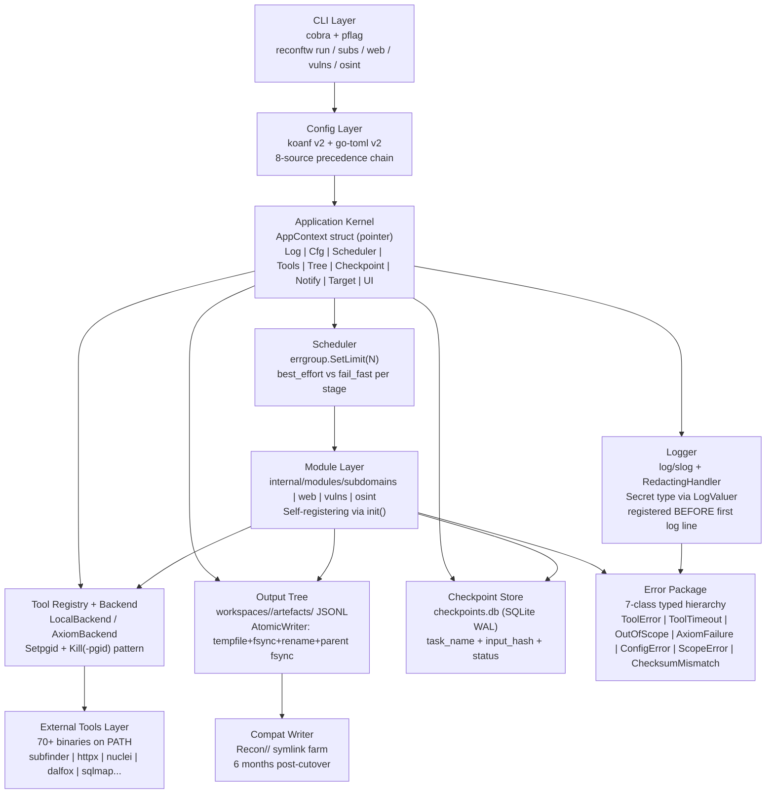

# 0002 — Architecture v2 Design for reconFTW

* Status: Accepted
* Date: 2026-05-28
* Deciders: six2dez (solo maintainer, project owner)
* Tags: architecture, v2.0, go, toml, interfaces, output-tree, cli, testing, logging

## Context

Phase 2 locks every contract the rest of the v2.0 rewrite depends on. This document is
the source of truth for all architecture decisions that Phase 3 (Foundation Kernel) and
every subsequent phase will build against. Language is locked as Go per ADR 0001
(`.planning/decisions/0001-language.md`, Status: Accepted). Requirements ARCH-01 through
ARCH-12 defined in `.planning/REQUIREMENTS.md` §"Architecture v2 Design (Deliverable #2)"
are all addressed here: TOML config schema (ARCH-02), output tree layout (ARCH-03), compat
symlink layer (ARCH-04), `Task` / `Backend` / `AppContext` interface signatures (ARCH-05,
ARCH-06, ARCH-07), 7-class error hierarchy (ARCH-08), failure isolation policy (ARCH-09),
CLI surface (ARCH-10), test ring policy (ARCH-11), and logging policy with type-level
secret tagging (ARCH-12). After sign-off this document is BINDING per D-05; amendments
require an inline amendment block per D-06.

## Decision

The v2.0 architecture for reconFTW is specified in 12 numbered sections (§1 through §12)
below. Each section addresses one or more ARCH-NN requirements and provides Go interface
or type snippets, TOML samples, and validation rules sufficient for Phase 3 to begin
implementation without additional design decisions. After sign-off these contracts are
BINDING (D-05): interface signatures (`Task` / `Backend` / `AppContext`) and the error
class hierarchy are fixed. Breaking changes require an inline amendment block in this file
following the format: `Amended: YYYY-MM-DD | Section: §N | Reason: …` (D-06). Non-breaking
additions (new methods, new error types, new AppContext fields) do not require an amendment.

## TL;DR

reconFTW v2.0 locks 12 architecture contracts in this ADR; all Phase 3-12 implementers
read this one file. **§2** documents the complete TOML config schema: all ~290-310 v1
`reconftw.cfg` flags are mapped to a clean v2-native hierarchy (`[subdomains.passive]`,
`[web.fuzz]`, `[axiom]`, etc.) plus a `[legacy]` alias table for backward compat; per-key
validation rules (type, range, regex, allowlist, mutex groups) are locked here for Phase 3
to implement. **§3** specifies the new `workspaces/<target-id>/` output tree with typed JSONL
artefacts, SQLite checkpoints, and `AtomicWriter`-only write semantics (tempfile + fsync +
rename + parent-fsync). **§4** defines the `CompatWriter` that maintains `Recon/<domain>/`
symlinks for 6 months post-cutover via `LifecycleAware.OnEnd()` hooks. **§5** is the
dependency kernel: three BINDING interfaces — `Task` (6 methods), `Backend` (4 methods),
`AppContext` (9 fields) — are the sole runtime contracts; no package-level globals anywhere.
**§6** establishes a 7-class typed error hierarchy (`ToolError`, `ToolTimeout`, `OutOfScope`,
`AxiomFailure`, `ConfigError`, `ScopeError`, `ChecksumMismatch`) with sentinel anchors for
`errors.Is` and typed structs for `errors.As`. **§7** makes `failure_policy` config-driven
per module group: `subdomains = fail_fast`; `web/vulns/osint = best_effort`; the
`Scheduler` uses `errgroup.SetLimit(N)` with `errgroup.WithContext` for fail-fast stages.
**§8** defines a subcommand-first CLI; all v1 short flags become deprecated aliases via
`cobra.MarkDeprecated()` and are removed at v2.2.0 (2 minor versions). **§9** mandates four
test rings (unit / integration / smoke / property-based) with `MockBackend` / `MockCheckpoint`
/ `MockOutputTree` test infrastructure built in Phase 3 before any module; all rings use
`goleak` for goroutine hygiene. **§10** requires two-layer secret redaction: `Secret` string
type with `LogValue()` returning `"***"` (Layer 1) and `RedactingHandler` sink (Layer 2);
secrets registered before the first log line. **§11** describes the 4-check pre-sign
verification gate (ARCH-NN grep, TOML parse, Go compile, glossary count) at
`.planning/decisions/verify-0002.sh`. **§12** establishes the amendment log format (D-06)
and the D-07 breaking-change threshold that governs when an amendment is required.

## Glossary

One-line definitions for every new term used in interface signatures and section headings.
Listed alphabetically.

**AppContext** — dependency kernel struct passed by pointer to every `Task.Run()`; wired
once at startup in `cmd/reconftw/main.go`; holds all 9 kernel components (Log, Cfg,
Scheduler, Tools, Tree, Checkpoint, Notify, Target, UI).

**AtomicWriter** — write pattern: create tempfile in same directory → write + fsync →
`rename(2)` over target → fsync parent directory; the only sanctioned write path for
artefact files in `workspaces/<target>/artefacts/`.

**AxiomFailure** — error class for Axiom infrastructure failure (SSH timeout, fleet
unreachable); distinct from `ToolError`; triggers failover to `LocalBackend`.

**Backend** — interface abstracting local subprocess execution (`LocalBackend`) from
distributed Axiom execution (`AxiomBackend`); 4 methods: `Exec`, `Stream`,
`HealthCheck`, `Capacity`.

**ChecksumMismatch** — error class returned by the installer when a downloaded binary
or script does not match its expected SHA-256 hash.

**CompatWriter** — writes bash-shape files to `_compat/` as a `LifecycleAware.OnEnd()`
hook after each successful task; maintains the `Recon/<domain>/` symlink farm for 6
months post-cutover.

**ConfigError** — error class for config load/validation failures; carries file:line:key
context; `Message` MUST NOT contain raw secret values.

**failure_policy** — `"best_effort"` or `"fail_fast"` configured per module group in
`[scheduler.overrides]`; `fail_fast` cancels sibling tasks on first error via
`errgroup.WithContext`; `best_effort` logs errors as warnings and continues.

**FailurePolicy** — the Go type alias for `failure_policy` values: `PolicyBestEffort` and
`PolicyFailFast` constants in `internal/core/scheduler`.

**OutOfScope** — error returned by `OutputTree.Append` when a finding fails scope check;
prevents out-of-scope data from being written to artefact files.

**Result** — outcome struct returned by `Task.Run()`: `Status` + `Duration` + `Outputs`
(paths written) + `Stats` (optional counters).

**ScopeError** — error class for domain/IP input validation failures (metacharacters, bad
CIDR); distinct from `OutOfScope` which is a write-time artefact rejection.

**Scheduler** — bounded concurrency engine wrapping `errgroup.SetLimit(N)` +
`failure_policy` dispatch; the `runStage` method is the fail-fast vs best-effort fork.

**Secret** — `type Secret string` with `LogValue() slog.Value` returning `"***"`; used
for all credential fields in `Config`, `AppContext`, and `Tool` structs; no `String()`
method (intentional — prevents accidental `fmt.Sprintf` exposure).

**Status** — task terminal state enum: `done` | `errored` | `cancelled` | `skipped`;
written to `checkpoints.db` by the Scheduler on task completion.

**Task** — smallest schedulable unit of recon work; self-registers via `init()`; declares
`DependsOn` for DAG ordering; implements 6 methods: `Name`, `Module`, `Description`,
`Enabled`, `DependsOn`, `Run`.

**ToolError** — error class for non-zero tool exit codes; carries tool name, exit code,
and last 1 KB of stderr; implements `Is(ErrTool)` sentinel bridge.

**ToolTimeout** — error class for per-task context deadline exceeded; carries tool name
and configured timeout; implements `Is(ErrTimeout)` sentinel bridge.

## Reading Order

Use the guide below to read the minimum required sections for your phase.

**If implementing Phase 3 (Foundation Kernel):** read §2 (config struct shape and
validation rules to implement), §3 (output tree to build), §4 (compat writer contract),
§5 (interfaces to implement), §10 (logger bootstrap order — CRITICAL: logger before
config load) first. Then §6 (error types to implement) and §9 (test infrastructure to
build before any module).

**If implementing Phase 4-7 (module ports — subdomains / web / vulns / osint):** read
§5 (`Task` interface — what you are implementing), §7 (`failure_policy` — which policy
applies to your module group), §6 (error types you must return) first. Then §3 (where
and how to write artefacts via `OutputTree.Append`).

**If implementing Phase 8 (MCP server):** read §5 (`Backend.Stream()` — the channel you
multiplex), §8 (CLI surface for the `reconftw mcp` subcommand) first.

**If implementing Phase 9 (composite modes):** read §8 (CLI subcommand surface), §7
(`failure_policy` per mode — `recon` uses subdomains fail-fast; `all` inherits all
overrides) first.

**If implementing Phase 11 (installer + migrator):** read §2 (the TOML target schema the
migrator must emit) and §2.4 (the D-11 drop list) first.

**If implementing Phase 12 (cutover):** read §4 (compat layer lifecycle and 6-month
timeline), §8 (deprecated flag removal at v2.2.0) first.

## §1 Overview & System Diagram

<!-- ARCH-01 -->

### §1.1 System Architecture Diagram

The diagram below shows all 12 architectural nodes and the dependency edges between them.
Read top-to-bottom: the CLI parses flags and resolves config; the Application Kernel wires
all components and passes `*AppContext` to every Task; the Scheduler dispatches Tasks to the
Module Layer; Modules call Backend for tool execution and write artefacts to the Output Tree.



### §1.2 Recommended Project Structure

The layout below maps directly to the ARCH-NN requirements. Each `internal/core/` sub-package
is the implementation home for one or more contract sections. Phase 3 creates this tree;
all subsequent phases add Task implementations under `internal/modules/`.

```text
cmd/reconftw/
├── main.go                  # signal.NotifyContext + AppContext.Boot() + cobra.Execute()
└── modules.go               # blank imports to trigger module init() registrations

internal/
├── core/
│   ├── errors/              # ARCH-08: 7-class typed error hierarchy
│   ├── log/                 # ARCH-12: Secret type + RedactingHandler + logger factory
│   ├── config/              # ARCH-02: Config struct (koanf), 8-source loader, validator
│   ├── task/                # ARCH-05: Task interface + Registry
│   ├── scheduler/           # ARCH-09: Scheduler (errgroup + semaphore + failure_policy)
│   ├── backend/             # ARCH-06: Backend interface + LocalBackend + AxiomBackend
│   ├── output/              # ARCH-03/04: OutputTree + AtomicWriter + CompatWriter
│   ├── checkpoint/          # ARCH-03: SQLite checkpoint store (modernc/sqlite)
│   ├── appctx/              # ARCH-07: AppContext struct (wiring kernel)
│   ├── notifier/            # Notifier interface + stubs
│   └── ui/                  # Dot-fill UI (port of lib/ui.sh verbatim)
└── modules/
    ├── subdomains/          # Task implementations (self-register via init())
    ├── web/
    ├── vulns/
    └── osint/

interfaces_check/            # D-14: standalone build target for Go snippet compile check
├── main.go                  # imports core/task, core/backend, core/appctx; verifies signatures

.planning/decisions/
└── 0002-architecture-v2.md  # THE deliverable
```

### §1.3 Contract Map

The table below maps each section to its ARCH-NN requirement(s), the Phase 3 package that
implements the contract, and the downstream phases that consume it.

| Section | ARCH-NN | Phase 3 Component | Phase 4+ Consumer |
|---------|---------|-------------------|-------------------|
| §2 TOML Schema | ARCH-02 | `internal/config` + `config.Load()` | Phase 11 migrator |
| §3 Output Tree | ARCH-03 | `internal/output OutputTree` | Phase 4-7 `Task.Run()` |
| §4 Compat Layer | ARCH-04 | `internal/output CompatWriter` | Phase 12 cutover window |
| §5 Interfaces | ARCH-05/06/07 | `internal/core/{task,backend,appctx}` | Phase 4-12 Task impl. |
| §6 Error Hierarchy | ARCH-08 | `internal/core/errors` | Phase 4-12 error handling |
| §7 Failure Policy | ARCH-09 | `internal/scheduler` | Phase 4-12 module groups |
| §8 CLI Surface | ARCH-10 | `cmd/reconftw/main.go` + cobra | Phase 9 composite modes |
| §9 Test Policy | ARCH-11 | `internal/core/testutil` + CI | All phases |
| §10 Logging Policy | ARCH-12 | `internal/core/log` | All phases |

## §2 TOML Configuration Schema

<!-- ARCH-02 -->

_Requirement:_ ARCH-02 — TOML config schema fully specified (every section name, v2-native
hierarchy, `[legacy]` aliases for all ~290-310 translatable v1 flags, per-key validation
rules, and migrator drop-list). Decisions D-09, D-10, D-11, D-12 are all implemented in
this section.

### §2.1 Schema Authoring Notes

All ~290-310 translatable v1 `reconftw.cfg` flags have a documented v2 TOML home (D-09).
The schema is organised in a clean v2-native hierarchical structure (`[subdomains.passive]`,
`[web.fuzz]`, `[axiom]`, `[notifications.slack]`, `[advanced.tools.<tool>]`, etc.) AND
every v1 `UPPER_CASE` flag is reachable via a `[legacy]` table alias (D-10). The
`[legacy]` table is generated by the v2 migrator; it is not intended for new users.

Flags that have no v2 analog (bash-specific globals: computed vars, shell introspection,
bash redirect handles) are NOT in the schema. The migrator detects these in the user's
v1 config and emits a `MIGRATION-WARNINGS.md` entry per dropped flag (D-11). The full
drop list is in §2.4.

Every key in this schema has validation rules documented in §2.5 (D-12). Type, range,
regex pattern, required/optional, default value, and mutex-exclusive groups are all locked
here. Phase 3 config loader IMPLEMENTS the rules; it does NOT invent them.

**Library mandate:** NEVER use `spf13/viper` — key lowercasing breaks the legacy alias
table (`legacy.HTTPX_RATELIMIT` becomes unreachable after viper lowercases it). Always use
`knadh/koanf/v2` (see `RESEARCH.md §Pitfall 1`).

Section grouping order (operational first, integration second, advanced and legacy last):
`[concurrency]` → `[subdomains.*]` → `[web.*]` → `[vulns.*]` → `[osint.*]` →
`[notifications.*]` → `[axiom]` → `[mcp]` → `[scheduler]` → `[output]` → `[advanced.*]`
→ `[legacy]`

### §2.2 V2-Native TOML Schema

The sample below is the complete v2 schema. Every key has a default value shown in-place
(the sample IS the default value documentation) and an inline comment showing the v1 flag
it replaces. Keys marked `# NEW` have no v1 equivalent.

```toml
# reconftw v2 configuration — full schema with defaults
# ARCH-02 | D-09 (all v1 flags covered) | D-10 (v2-native + legacy aliases)
# Generated by: .planning/decisions/0002-architecture-v2.md §2.2

# ─────────────────────────────────────────────
# CONCURRENCY
# ─────────────────────────────────────────────

[concurrency]
max_jobs             = 4        # was PARALLEL_MAX_JOBS
heartbeat_seconds    = 20       # was DNS_HEARTBEAT_INTERVAL_SECONDS (repurposed globally)
log_mode             = "summary"  # was PARALLEL_LOG_MODE (summary|tail|full)
tail_lines           = 20       # was PARALLEL_TAIL_LINES
job_timeout_seconds  = 0        # was PARALLEL_JOB_TIMEOUT_SECONDS (0 = no timeout)
kill_grace_seconds   = 10       # NEW: seconds between SIGTERM and SIGKILL on cancel

# ─────────────────────────────────────────────
# SUBDOMAINS
# ─────────────────────────────────────────────

[subdomains]
enabled = true                  # was SUBDOMAINS_GENERAL

[subdomains.passive]
enabled         = true          # was SUBPASSIVE
timeout_minutes = 180           # was SUBFINDER_ENUM_TIMEOUT

[subdomains.crt]
enabled = true                  # was SUBCRT
limit   = 999999                # was CTR_LIMIT
dns_time_fence_days = 0         # was DNS_TIME_FENCE_DAYS (0 = disabled)

[subdomains.analytics]
enabled = true                  # was SUBANALYTICS

[subdomains.brute]
enabled = true                  # was SUBBRUTE

[subdomains.scraping]
enabled = true                  # was SUBSCRAPING

[subdomains.permut]
enabled         = true          # was SUBPERMUTE
limit_bytes     = 2147483648    # was PERMUTATIONS_LIMIT (2 GB default)
ia_enabled      = true          # was SUBIAPERMUTE
regex_enabled   = true          # was SUBREGEXPERMUTE
wordlist_mode   = "auto"        # was PERMUTATIONS_WORDLIST_MODE (auto|full|short)
short_threshold = 100           # was PERMUTATIONS_SHORT_THRESHOLD

[subdomains.takeover]
enabled = true                  # was SUBTAKEOVER

[subdomains.asn]
enabled = true                  # was ASN_ENUM

[subdomains.recursive]
passive_enabled = false         # was SUB_RECURSIVE_PASSIVE
passive_depth   = 10            # was DEEP_RECURSIVE_PASSIVE
brute_enabled   = false         # was SUB_RECURSIVE_BRUTE

[subdomains.zone_transfer]
enabled = true                  # was ZONETRANSFER

[subdomains.s3_buckets]
enabled = true                  # was S3BUCKETS

[subdomains.reverse_ip]
enabled = false                 # was REVERSE_IP

[subdomains.ptr_sweep]
enabled  = false                # was PTR_SWEEP
max_ips  = 50000                # was PTR_SWEEP_MAX_IPS

[subdomains.srv_enum]
enabled = true                  # was SRV_ENUM

[subdomains.ns_delegation]
enabled = true                  # was NS_DELEGATION

[subdomains.scope]
only_resolved       = false     # was INSCOPE (was bool flag for inscope tool)
exclude_sensitive   = false     # was EXCLUDE_SENSITIVE
deep_wildcard_filter = false    # was DEEP_WILDCARD_FILTER
no_error_check      = false     # was SUBNOERROR

[subdomains.dns_resolve]
resolver            = "auto"    # was DNS_RESOLVER (auto|puredns|dnsx)
timeout_minutes     = 0         # was DNS_RESOLVE_TIMEOUT (0 = no hard timeout)
brute_timeout       = "0"       # was DNS_BRUTE_TIMEOUT (0 = no hard timeout)
puredns_public_limit    = 5000  # was PUREDNS_PUBLIC_LIMIT
puredns_trusted_limit   = 400   # was PUREDNS_TRUSTED_LIMIT
puredns_wildcardtest_limit  = 30   # was PUREDNS_WILDCARDTEST_LIMIT
puredns_wildcardbatch_limit = 1500000  # was PUREDNS_WILDCARDBATCH_LIMIT
dnsx_threads        = 100       # was DNSX_THREADS
dnsx_rate_limit     = 500       # was DNSX_RATE_LIMIT
generate_resolvers  = false     # was generate_resolvers
update_resolvers    = true      # was update_resolvers

[subdomains.tls_pivot]
enabled         = false         # was TLS_IP_PIVOTS
sni_batch_size  = 1000          # was TLS_IP_SNI_BATCH_SIZE
delta_probe     = true          # was TLS_IP_DELTA_PROBE

# ─────────────────────────────────────────────
# WEB
# ─────────────────────────────────────────────

[web]
# top-level web module (no direct v1 equivalent; submodules map individually)

[web.probe]
enabled             = true      # was WEBPROBEFULL
ports               = "80,443"  # was WEBPROBE_PORTS (uncommon ports appended from config file)
rate_limit          = 150       # was HTTPX_RATELIMIT
timeout_seconds     = 10        # was HTTPX_TIMEOUT
threads             = 0         # 0 = auto (was HTTPX_THREADS, derived from AVAILABLE_CORES * 12)
uncommon_enabled    = true      # NEW: probe uncommon ports from config/uncommon_ports_web.txt
uncommon_threads    = 0         # 0 = auto (was HTTPX_UNCOMMONPORTS_THREADS)
uncommon_timeout    = 10        # was HTTPX_UNCOMMONPORTS_TIMEOUT

[web.screenshots]
enabled = true                  # was WEBSCREENSHOT

[web.virtual_hosts]
enabled = false                 # was VIRTUALHOSTS

[web.favirecon]
enabled      = true             # was FAVIRECON
concurrency  = 50               # was FAVIRECON_CONCURRENCY
timeout      = 10               # was FAVIRECON_TIMEOUT
rate_limit   = 0                # was FAVIRECON_RATE_LIMIT
proxy        = ""               # was FAVIRECON_PROXY

[web.waf]
enabled = true                  # was WAF_DETECTION

[web.nuclei]
enabled           = true        # was NUCLEICHECK
rate_limit        = 150         # was NUCLEI_RATELIMIT
severity          = "info,low,medium,high,critical"  # was NUCLEI_SEVERITY
templates_path    = ""          # was NUCLEI_TEMPLATES_PATH (empty = default nuclei path)
extra_args        = ""          # was NUCLEI_EXTRA_ARGS

[web.nuclei_dast]
enabled           = true        # was NUCLEI_DAST
extra_args        = ""          # was NUCLEI_DAST_EXTRA_ARGS

[web.fuzz]
enabled             = true      # was FUZZ
rate_limit          = 0         # was FFUF_RATELIMIT (0 = unlimited)
threads             = 0         # 0 = auto (was FFUF_THREADS, derived from AVAILABLE_CORES * 10)
max_time_seconds    = 900       # was FFUF_MAXTIME
recursion_depth     = 2         # was FUZZ_RECURSION_DEPTH

[web.iis_shortname]
enabled = true                  # was IIS_SHORTNAME

[web.cms]
enabled = true                  # was CMS_SCANNER

[web.js]
enabled            = true       # was JSCHECKS
sub_extract        = true       # was JS_SUB_EXTRACT
getjswords_python  = "python3"  # was GETJSWORDS_PYTHON

[web.urls]
enabled          = true         # was URL_CHECK
passive_enabled  = true         # was URL_CHECK_PASSIVE
active_enabled   = true         # was URL_CHECK_ACTIVE
waymore_timeout  = "30m"        # was WAYMORE_TIMEOUT
waymore_limit    = 5000         # was WAYMORE_LIMIT
gf_patterns      = true         # was URL_GF
ext_classify     = true         # was URL_EXT

[web.wellknown]
enabled     = false             # was WELLKNOWN_PIVOTS
max_targets = 200               # was WELLKNOWN_MAX_TARGETS

[web.wordlist]
enabled            = true       # was WORDLIST
robots_enabled     = true       # was ROBOTSWORDLIST
password_dict      = true       # was PASSWORD_DICT
password_engine    = "cewler"   # was PASSWORD_DICT_ENGINE (cewler|pydictor)
password_max_targets = 50       # was PASSWORD_DICT_MAX_TARGETS
password_depth     = 1          # was PASSWORD_DICT_CEWLER_DEPTH
password_timeout   = 45         # was PASSWORD_DICT_CEWLER_TIMEOUT
password_min_len   = 5          # was PASSWORD_MIN_LENGTH
password_max_len   = 14         # was PASSWORD_MAX_LENGTH

[web.portscan]
enabled           = true        # was PORTSCANNER
passive_enabled   = true        # was PORTSCAN_PASSIVE
active_enabled    = true        # was PORTSCAN_ACTIVE
strategy          = "legacy"    # was PORTSCAN_STRATEGY (legacy|naabu_nmap)
udp_enabled       = false       # was PORTSCAN_UDP
geo_info          = true        # was GEO_INFO
cdn_check         = true        # was CDN_IP
cdn_bypass        = true        # was CDN_BYPASS

[web.portscan.naabu]
enabled  = true                 # was NAABU_ENABLE
rate     = 1000                 # was NAABU_RATE
ports    = "--top-ports 1000"   # was NAABU_PORTS

[web.portscan.service_fingerprint]
enabled     = true              # was SERVICE_FINGERPRINT
engine      = "nerva"           # was SERVICE_FINGERPRINT_ENGINE
timeout_ms  = 2000              # was SERVICE_FINGERPRINT_TIMEOUT_MS

[web.graphql]
enabled        = true           # was GRAPHQL_CHECK
deep_introspect = false         # was GQLSPECTION

[web.param_discovery]
enabled  = true                 # was PARAM_DISCOVERY

[web.grpc]
enabled = false                 # was GRPC_SCAN

[web.llm_probe]
enabled   = true                # was LLM_PROBE
augustus  = false               # was LLM_PROBE_AUGUSTUS

[web.cloud_enum]
s3_profile  = "optimized"       # was CLOUD_ENUM_S3_PROFILE (optimized|exhaustive)
s3_threads  = 20                # was CLOUD_ENUM_S3_THREADS

[web.katana]
headless_profile    = "off"     # was KATANA_HEADLESS_PROFILE (off|smart|full)
headless_smart_limit = 15       # was KATANA_HEADLESS_SMART_LIMIT
threads             = 0         # 0 = auto (was KATANA_THREADS, derived from AVAILABLE_CORES * 5)

# ─────────────────────────────────────────────
# VULNS
# ─────────────────────────────────────────────

[vulns]
enabled = false                 # was VULNS_GENERAL

[vulns.xss]
enabled = true                  # was XSS

[vulns.sqli]
enabled       = true            # was SQLI
sqlmap        = true            # was SQLMAP
ghauri        = false           # was GHAURI

[vulns.ssrf]
enabled            = true       # was SSRF_CHECKS
alt_match_regex    = '169\\.254\\.169\\.254|latest/meta-data|root:|127\\.0\\.0\\.1|localhost|gopher://|dict://|file://'  # was SSRF_ALT_MATCH_REGEX

[vulns.lfi]
enabled = true                  # was LFI

[vulns.ssti]
enabled = true                  # was SSTI
engine  = "TInjA"               # was SSTI_ENGINE (TInjA|SSTImap)

[vulns.crlf]
enabled = true                  # was CRLF_CHECKS

[vulns.smuggling]
enabled = true                  # was SMUGGLING

[vulns.cmdi]
enabled = true                  # was COMM_INJ

[vulns.cache]
enabled          = true         # was WEBCACHE
toxicache        = true         # was WEBCACHE_TOXICACHE

[vulns.bypass_4xx]
enabled = true                  # was BYPASSER4XX

[vulns.fuzz_params]
enabled = true                  # was FUZZPARAMS

[vulns.spray]
enabled      = true             # was SPRAY
engine       = "brutespray"     # was SPRAY_ENGINE (brutespray|brutus)
deep_only    = true             # was SPRAY_BRUTUS_ONLY_DEEP

[vulns.broken_links]
enabled  = true                 # was BROKENLINKS
engine   = "second-order"       # was BROKENLINKS_ENGINE (second-order|legacy)

[vulns.ssl]
enabled = true                  # was TEST_SSL

[vulns.metadata]
enabled = true                  # was METADATA

# ─────────────────────────────────────────────
# OSINT
# ─────────────────────────────────────────────

[osint]
enabled = true                  # was OSINT

[osint.google_dorks]
enabled = true                  # was GOOGLE_DORKS

[osint.github]
enabled       = true            # was GITHUB_DORKS / GITHUB_REPOS
leaks_enabled = true            # was GITHUB_LEAKS
threads       = 5               # was GHLEAKS_THREADS
secrets_engine = "hybrid"       # was SECRETS_ENGINE (gitleaks|titus|noseyparker|hybrid)
scan_git_history = true         # was SECRETS_SCAN_GIT_HISTORY
validate_secrets = false        # was SECRETS_VALIDATE

[osint.github.actions_audit]
enabled                  = true  # was GITHUB_ACTIONS_AUDIT
include_all_artifact_secrets = true  # was GATO_INCLUDE_ALL_ARTIFACT_SECRETS

[osint.cloud]
enabled = true                  # was CLOUD_ENUM

[osint.emails]
enabled = true                  # was EMAILS

[osint.postman]
enabled       = true            # was API_LEAKS_POSTLEAKS
threads       = 10              # was POSTLEAKS_THREADS
include       = ""              # was POSTLEAKS_INCLUDE
exclude       = ""              # was POSTLEAKS_EXCLUDE

[osint.api_leaks]
enabled = true                  # was API_LEAKS

[osint.swagger]
enabled = true                  # was THIRD_PARTIES (encompasses SwaggerSpy + misconfig-mapper)

[osint.spoofy]
enabled = true                  # was SPOOF

[osint.mail_hygiene]
enabled = true                  # was MAIL_HYGIENE

[osint.msft]
enabled = false                 # was (no direct v1 flag; msftrecon not wired in v1 OSINT)

[osint.domain_info]
enabled = true                  # was DOMAIN_INFO

[osint.ip_info]
enabled = true                  # was IP_INFO

[osint.ipv6]
enabled = true                  # was IPV6_SCAN

# ─────────────────────────────────────────────
# NOTIFICATIONS
# ─────────────────────────────────────────────

[notifications]
enabled           = false       # was NOTIFICATION
soft_enabled      = false       # was SOFT_NOTIFICATION
events            = ["on-critical-finding", "on-scan-complete", "on-failure"]  # NEW: event filter

[notifications.slack]
channel     = ""                # was slack_channel
webhook_url = ""                # was slack_auth (SECRET — logged as ***)

[notifications.telegram]
bot_token = ""                  # was (from secrets.cfg) telegram_key (SECRET — logged as ***)
chat_id   = ""                  # was (from secrets.cfg) telegram_chat_id

[notifications.discord]
webhook_url = ""                # was discord_url (SECRET — logged as ***)

# ─────────────────────────────────────────────
# AXIOM
# ─────────────────────────────────────────────

[axiom]
enabled          = false        # was AXIOM (CLI flag only in v1; now a config key too)
fleet_name       = "reconFTW"   # was AXIOM_FLEET_NAME
fleet_count      = 10           # was AXIOM_FLEET_COUNT
fleet_regions    = "eu-central" # was AXIOM_FLEET_REGIONS
shutdown_on_end  = true         # was AXIOM_FLEET_SHUTDOWN
auto_fix_hostkey = true         # was AXIOM_AUTO_FIX_HOSTKEY
fleet_launch     = true         # was AXIOM_FLEET_LAUNCH
extra_args       = ""           # was AXIOM_EXTRA_ARGS

# ─────────────────────────────────────────────
# MCP  (NEW — no v1 equivalent)
# ─────────────────────────────────────────────

[mcp]  # mcp.enabled defaults to false — MCP is new (MCP-07), not present in v1
enabled   = false               # was not in v1; set mcp.enabled = true to activate MCP server
api_key   = ""                  # was not in v1; RECONFTW_MCP_API_KEY env preferred (SECRET)
transport = "stdio"             # NEW: stdio|http
port      = 8765                # NEW: only relevant when transport = "http"

# ─────────────────────────────────────────────
# SCHEDULER (failure_policy per module group)
# ─────────────────────────────────────────────

[scheduler]
failure_policy = "best_effort"  # NEW: best_effort|fail_fast (global default)

[scheduler.overrides]
subdomains = "fail_fast"        # was CONTINUE_ON_TOOL_ERROR inverse for subdomain spine
web        = "best_effort"      # was CONTINUE_ON_TOOL_ERROR (true → best_effort)
vulns      = "best_effort"      # was CONTINUE_ON_TOOL_ERROR
osint      = "best_effort"      # was CONTINUE_ON_TOOL_ERROR

# ─────────────────────────────────────────────
# OUTPUT
# ─────────────────────────────────────────────

[output]
verbosity          = 1          # was OUTPUT_VERBOSITY (0=quiet, 1=normal, 2=verbose)
export_format      = ""         # was EXPORT_FORMAT (json|html|csv|all; empty = disabled)
asset_store        = true       # was ASSET_STORE
report_only        = false      # was REPORT_ONLY
hotlist_top        = 50         # was HOTLIST_TOP
chunk_limit        = 2000       # was CHUNK_LIMIT
remove_tmp         = false      # was REMOVETMP
remove_log         = false      # was REMOVELOG
preserve_called_fn = true       # was PRESERVE
send_zip_notify    = false      # was SENDZIPNOTIFY
structured_logging = false      # was STRUCTURED_LOGGING
min_disk_space_gb  = 2          # was MIN_DISK_SPACE_GB

[output.log_rotation]
max_files   = 10                # was MAX_LOG_FILES
max_age_days = 30               # was MAX_LOG_AGE_DAYS

# ─────────────────────────────────────────────
# AI
# ─────────────────────────────────────────────

[ai]
executable      = "python3"     # was AI_EXECUTABLE
model           = "llama3:8b"   # was AI_MODEL
report_type     = "md"          # was AI_REPORT_TYPE (md|txt)
report_profile  = "bughunter"   # was AI_REPORT_PROFILE (executive|brief|bughunter)
prompts_file    = ""            # was AI_PROMPTS_FILE (empty = default prompts.json)
max_chars_per_file   = 50000    # was AI_MAX_CHARS_PER_FILE
max_files_per_category = 200    # was AI_MAX_FILES_PER_CATEGORY
redact          = true          # was AI_REDACT
allow_model_pull = false        # was AI_ALLOW_MODEL_PULL
strict          = false         # was AI_STRICT

# ─────────────────────────────────────────────
# INTEGRATIONS
# ─────────────────────────────────────────────

[integrations.faraday]
enabled     = false             # was FARADAY
workspace   = "reconftw"        # was FARADAY_WORKSPACE

[integrations.proxy]
enabled     = false             # was PROXY
url         = "http://127.0.0.1:8080/"  # was proxy_url

# ─────────────────────────────────────────────
# INCREMENTAL / MONITOR
# ─────────────────────────────────────────────

[incremental]
enabled            = false      # was INCREMENTAL_MODE

[monitor]
enabled            = false      # was MONITOR_MODE
interval_minutes   = 60         # was MONITOR_INTERVAL_MIN
max_cycles         = 0          # was MONITOR_MAX_CYCLES (0 = forever)
min_severity       = "high"     # was MONITOR_MIN_SEVERITY
alert_suppression  = true       # was ALERT_SUPPRESSION

# ─────────────────────────────────────────────
# ADAPTIVE RATE LIMITING
# ─────────────────────────────────────────────

[adaptive_rate]
enabled          = false        # was ADAPTIVE_RATE_LIMIT
min_rate         = 10           # was MIN_RATE_LIMIT
max_rate         = 500          # was MAX_RATE_LIMIT
backoff_factor   = 0.5          # was RATE_LIMIT_BACKOFF_FACTOR
increase_factor  = 1.2          # was RATE_LIMIT_INCREASE_FACTOR

# ─────────────────────────────────────────────
# CACHE
# ─────────────────────────────────────────────

[cache]
max_age_days            = 30    # was CACHE_MAX_AGE_DAYS
max_age_days_resolvers  = 7     # was CACHE_MAX_AGE_DAYS_RESOLVERS
max_age_days_wordlists  = 30    # was CACHE_MAX_AGE_DAYS_WORDLISTS
max_age_days_tools      = 14    # was CACHE_MAX_AGE_DAYS_TOOLS
refresh                 = false # was CACHE_REFRESH

# ─────────────────────────────────────────────
# PATHS (wordlists, resolvers, tokens, API keys)
# ─────────────────────────────────────────────

[paths]
data_dir         = ""           # was DATA_DIR (empty = ${SCRIPTPATH}/data)
wordlists_dir    = ""           # was WORDLISTS_DIR (empty = ${DATA_DIR}/wordlists)
patterns_dir     = ""           # was PATTERNS_DIR (empty = ${DATA_DIR}/patterns)
fuzz_wordlist    = ""           # was fuzz_wordlist
lfi_wordlist     = ""           # was lfi_wordlist
ssti_wordlist    = ""           # was ssti_wordlist
subs_wordlist    = ""           # was subs_wordlist
subs_wordlist_big = ""          # was subs_wordlist_big
headers_inject   = ""           # was headers_inject
resolvers        = ""           # was resolvers
resolvers_trusted = ""          # was resolvers_trusted
github_tokens    = ""           # was GITHUB_TOKENS
gitlab_tokens    = ""           # was GITLAB_TOKENS
nuclei_templates = ""           # was NUCLEI_TEMPLATES_PATH

[paths.resolvers_download]
url             = "https://raw.githubusercontent.com/trickest/resolvers/main/resolvers.txt"
trusted_url     = "https://gist.githubusercontent.com/six2dez/ae9ed7e5c786461868abd3f2344401b6/raw/trusted_resolvers.txt"
connect_timeout = 10            # was RESOLVER_DOWNLOAD_CONNECT_TIMEOUT
max_time        = 120           # was RESOLVER_DOWNLOAD_MAX_TIME
retry           = 2             # was RESOLVER_DOWNLOAD_RETRY
retry_delay     = 2             # was RESOLVER_DOWNLOAD_RETRY_DELAY

# ─────────────────────────────────────────────
# API KEYS (all SECRET type — opaque, max=256)
# ─────────────────────────────────────────────

[api_keys]
shodan    = ""                  # was SHODAN_API_KEY (env var preferred: SHODAN_API_KEY)
whoisxml  = ""                  # was WHOISXML_API
pdcp      = ""                  # was PDCP_API_KEY
xss_server = ""                 # was XSS_SERVER
collab_server = ""              # was COLLAB_SERVER

# ─────────────────────────────────────────────
# ADVANCED: per-tool overrides
# Inherits defaults from top-level sections; values here OVERRIDE the top-level.
# [advanced.tools.<toolname>] pattern — Phase 3 implements merge order.
# ─────────────────────────────────────────────

[advanced]
deep           = false          # was DEEP
deep_limit     = 500            # was DEEP_LIMIT
deep_limit2    = 1500           # was DEEP_LIMIT2
diff           = false          # was DIFF
quick_rescan   = false          # was QUICK_RESCAN
show_commands  = false          # was SHOW_COMMANDS
install_golang = true           # was install_golang
upgrade_tools  = true           # was upgrade_tools
upgrade_before_running = false  # was upgrade_before_running
header         = "User-Agent: Mozilla/5.0 (X11; Linux x86_64; rv:128.0) Gecko/20100101 Firefox/128.0"  # was HEADER
perf_profile   = "balanced"     # was PERF_PROFILE (low|balanced|max)

[advanced.tools.subfinder]
timeout_minutes = 180           # was SUBFINDER_ENUM_TIMEOUT (duplicates subdomains.passive.timeout_minutes; override wins)

[advanced.tools.nuclei]
rate_limit  = 150               # was NUCLEI_RATELIMIT
severity    = "info,low,medium,high,critical"  # was NUCLEI_SEVERITY
flags       = ""                # was NUCLEI_EXTRA_ARGS

[advanced.tools.ffuf]
rate_limit        = 0           # was FFUF_RATELIMIT
threads           = 0           # was FFUF_THREADS (0 = auto)
max_time_seconds  = 900         # was FFUF_MAXTIME
flags             = " -mc all -fc 404 -sf -noninteractive -of json"  # was FFUF_FLAGS

[advanced.tools.httpx]
rate_limit          = 150       # was HTTPX_RATELIMIT
timeout_seconds     = 10        # was HTTPX_TIMEOUT
threads             = 0         # was HTTPX_THREADS (0 = auto)
flags               = ""        # NEW: extra httpx args

[advanced.tools.puredns]
resolvers_file = ""             # was resolvers (path key — nopath_traversal validated)

[advanced.tools.gf]
patterns_dir = ""               # was PATTERNS_DIR (path key — nopath_traversal validated)

[advanced.tools.dalfox]
threads = 0                     # was DALFOX_THREADS (0 = auto)

[advanced.tools.dnstake]
threads = 0                     # was DNSTAKE_THREADS (0 = auto)

[advanced.tools.tlsx]
threads = 1000                  # was TLSX_THREADS

[advanced.tools.xnlinkfinder]
depth = 3                       # was XNLINKFINDER_DEPTH

[advanced.tools.dnsvalidator]
threads = 200                   # was DNSVALIDATOR_THREADS

[advanced.tools.interlace]
threads = 10                    # was INTERLACE_THREADS

[advanced.tools.brutespray]
concurrence = 0                 # was BRUTESPRAY_CONCURRENCE (0 = auto)

[advanced.tools.gotator]
flags = " -depth 1 -numbers 3 -mindup -adv -md"  # was GOTATOR_FLAGS

[advanced.tools.tinja]
rate_limit    = 0               # was TInjA_RATELIMIT
timeout       = 15              # was TInjA_TIMEOUT

[advanced.tools.sstimap]
level   = 1                     # was SSTIMAP_LEVEL
delay   = 0                     # was SSTIMAP_DELAY
legacy  = false                 # was SSTIMAP_LEGACY
generic = false                 # was SSTIMAP_GENERIC

[advanced.tools.second_order]
config  = ""                    # was SECOND_ORDER_CONFIG (path key)
depth   = 1                     # was SECOND_ORDER_DEPTH
threads = 10                    # was SECOND_ORDER_THREADS
insecure = false                # was SECOND_ORDER_INSECURE

[advanced.tools.toxicache]
threads    = 70                 # was TOXICACHE_THREADS
user_agent = "Mozilla/5.0 (X11; Linux x86_64; rv:128.0) Gecko/20100101 Firefox/128.0"  # was TOXICACHE_USER_AGENT

[advanced.tools.brutus]
usernames = ""                  # was BRUTUS_USERNAMES
passwords = ""                  # was BRUTUS_PASSWORDS
key_file  = ""                  # was BRUTUS_KEY_FILE (path key)

[advanced.tools.arjun]
threads = 10                    # was ARJUN_THREADS

[advanced.tools.axiom]
resolvers_path         = "/home/op/lists/resolvers.txt"         # was AXIOM_RESOLVERS_PATH
resolvers_trusted_path = "/home/op/lists/resolvers_trusted.txt" # was AXIOM_RESOLVERS_TRUSTED_PATH
post_start             = ""     # was AXIOM_POST_START (path key)

[advanced.timing_estimates]
# Estimated durations (seconds) for skipped heavy modules — used in progress ETA
nuclei    = 600                 # was TIME_EST_NUCLEI
fuzz      = 900                 # was TIME_EST_FUZZ
urlchecks = 300                 # was TIME_EST_URLCHECKS
jschecks  = 300                 # was TIME_EST_JSCHECKS
api       = 300                 # was TIME_EST_API
gql       = 180                 # was TIME_EST_GQL
param     = 240                 # was TIME_EST_PARAM
grpc      = 120                 # was TIME_EST_GRPC
iis       = 60                  # was TIME_EST_IIS

[advanced.parallel_batch_sizes]
# Effective concurrency still capped by concurrency.max_jobs
osint_group1    = 5             # was PAR_OSINT_GROUP1_SIZE
osint_group2    = 5             # was PAR_OSINT_GROUP2_SIZE
sub_passive     = 4             # was PAR_SUB_PASSIVE_GROUP_SIZE
sub_dep_active  = 3             # was PAR_SUB_DEP_ACTIVE_GROUP_SIZE
sub_post_active = 2             # was PAR_SUB_POST_ACTIVE_GROUP_SIZE
sub_brute       = 2             # was PAR_SUB_BRUTE_GROUP_SIZE
web_detect      = 3             # was PAR_WEB_DETECT_GROUP_SIZE
vulns_group1    = 4             # was PAR_VULNS_GROUP1_SIZE
vulns_group2    = 4             # was PAR_VULNS_GROUP2_SIZE
vulns_group4    = 3             # was PAR_VULNS_GROUP4_SIZE

[advanced.parallel_ui]
mode             = "clean"      # was PARALLEL_UI_MODE (clean|balanced|trace)
show_eta         = true         # was PARALLEL_PROGRESS_SHOW_ETA
show_active      = true         # was PARALLEL_PROGRESS_SHOW_ACTIVE
compact_active_max = 4          # was PARALLEL_PROGRESS_COMPACT_ACTIVE_MAX
trace_slow_seconds = 30         # was PARALLEL_TRACE_SLOW_SECONDS

# ─────────────────────────────────────────────
# LEGACY: v1 UPPER_CASE aliases
# Generated by migrator — NOT for new users.
# These commented entries show the migration pattern.
# When both a legacy key and a v2-native key are set,
# v2-native ALWAYS wins (see §2.3).
# ─────────────────────────────────────────────

[legacy]
# PARALLEL_MAX_JOBS = 4                 ← maps to concurrency.max_jobs
# PARALLEL_LOG_MODE = "summary"         ← maps to concurrency.log_mode
# PARALLEL_TAIL_LINES = 20              ← maps to concurrency.tail_lines
# PARALLEL_HEARTBEAT_SECONDS = 20       ← maps to concurrency.heartbeat_seconds
# SUBDOMAINS_GENERAL = true             ← maps to subdomains.enabled
# SUBPASSIVE = true                     ← maps to subdomains.passive.enabled
# SUBFINDER_ENUM_TIMEOUT = 180          ← maps to subdomains.passive.timeout_minutes
# SUBCRT = true                         ← maps to subdomains.crt.enabled
# CTR_LIMIT = 999999                    ← maps to subdomains.crt.limit
# SUBBRUTE = true                       ← maps to subdomains.brute.enabled
# SUBPERMUTE = true                     ← maps to subdomains.permut.enabled
# PERMUTATIONS_LIMIT = 2147483648       ← maps to subdomains.permut.limit_bytes
# SUBTAKEOVER = true                    ← maps to subdomains.takeover.enabled
# WEBPROBEFULL = true                   ← maps to web.probe.enabled
# HTTPX_RATELIMIT = 150                 ← maps to web.probe.rate_limit
# HTTPX_TIMEOUT = 10                    ← maps to web.probe.timeout_seconds
# FUZZ = true                           ← maps to web.fuzz.enabled
# FFUF_RATELIMIT = 0                    ← maps to web.fuzz.rate_limit
# FFUF_MAXTIME = 900                    ← maps to web.fuzz.max_time_seconds
# NUCLEICHECK = true                    ← maps to web.nuclei.enabled
# NUCLEI_RATELIMIT = 150                ← maps to web.nuclei.rate_limit
# NUCLEI_SEVERITY = "info,low,medium,high,critical"  ← maps to web.nuclei.severity
# JSCHECKS = true                       ← maps to web.js.enabled
# URL_CHECK = true                      ← maps to web.urls.enabled
# WAF_DETECTION = true                  ← maps to web.waf.enabled
# VULNS_GENERAL = false                 ← maps to vulns.enabled
# XSS = true                            ← maps to vulns.xss.enabled
# SQLI = true                           ← maps to vulns.sqli.enabled
# SSRF_CHECKS = true                    ← maps to vulns.ssrf.enabled
# LFI = true                            ← maps to vulns.lfi.enabled
# SSTI = true                           ← maps to vulns.ssti.enabled
# CRLF_CHECKS = true                    ← maps to vulns.crlf.enabled
# SMUGGLING = true                      ← maps to vulns.smuggling.enabled
# COMM_INJ = true                       ← maps to vulns.cmdi.enabled
# WEBCACHE = true                       ← maps to vulns.cache.enabled
# OSINT = true                          ← maps to osint.enabled
# GOOGLE_DORKS = true                   ← maps to osint.google_dorks.enabled
# GITHUB_DORKS = true                   ← maps to osint.github.enabled
# GITHUB_LEAKS = true                   ← maps to osint.github.leaks_enabled
# CLOUD_ENUM = true                     ← maps to osint.cloud.enabled
# EMAILS = true                         ← maps to osint.emails.enabled
# SPOOF = true                          ← maps to osint.spoofy.enabled
# NOTIFICATION = false                  ← maps to notifications.enabled
# AXIOM_FLEET_NAME = "reconFTW"         ← maps to axiom.fleet_name
# AXIOM_FLEET_COUNT = 10                ← maps to axiom.fleet_count
# AXIOM_FLEET_REGIONS = "eu-central"    ← maps to axiom.fleet_regions
# AXIOM_FLEET_SHUTDOWN = true           ← maps to axiom.shutdown_on_end
# SHODAN_API_KEY = ""                   ← maps to api_keys.shodan
# WHOISXML_API = ""                     ← maps to api_keys.whoisxml
# PDCP_API_KEY = ""                     ← maps to api_keys.pdcp
# OUTPUT_VERBOSITY = 1                  ← maps to output.verbosity
# DEEP = false                          ← maps to advanced.deep
# DIFF = false                          ← maps to advanced.diff
```

### §2.3 Legacy Table Pattern and Collision Resolution

The `[legacy]` table entries are generated by the v2 migrator from a user's existing
`reconftw.cfg`. They are NOT intended for new v2 users. The entries are written as comments
in the sample above; when the migrator runs, it produces an active (uncommented) `[legacy]`
block alongside the v2-native form:

```toml
# Generated by: reconftw migrate --from reconftw.cfg --to config.toml
# Legacy aliases (generated) — remove after verifying v2 native keys work correctly.
[legacy]
HTTPX_RATELIMIT = 150   # migrated from reconftw.cfg line 356
```

**Collision resolution (koanf merge order):**

When both a `[legacy]` key and the corresponding v2-native key are set in the same config
file, the v2-native key **always wins**. The koanf loader achieves this by loading the
`[web.*]` namespace AFTER `[legacy.*]` in the merge sequence, so the v2-native value
overwrites the legacy value regardless of key ordering in the TOML file.

If both are present and have different values, the config loader emits a WARN at startup:

```text
WARN config: legacy.HTTPX_RATELIMIT=50 and web.probe.rate_limit=200 both set
     — using web.probe.rate_limit=200 (v2-native wins per §2.3)
```

The WARN is emitted per colliding key; no WARN is emitted when values are equal.
This collision detection is implemented in the config loader's post-unmarshal validator
(Phase 3 implementation). The ADR locks the policy; Phase 3 tests it with
`TestLegacyOverridePrecedence` (Ring 1 unit test, no I/O).

### §2.4 D-11 Drop List

The following v1 flags have no v2 TOML analog. They are bash-specific globals, computed
runtime values, or shell introspection artifacts. The migrator detects them in the user's
v1 `reconftw.cfg`, does NOT write them to the v2 TOML, and instead appends a warning entry
to `MIGRATION-WARNINGS.md` in the target workspace.

| v1 Flag | Reason for Drop | Migrator Warning Text |
|---------|-----------------|----------------------|
| `AVAILABLE_CORES` | Bash runtime computation (`nproc \|\| sysctl`); v2 uses `runtime.NumCPU()` automatically | "AVAILABLE_CORES dropped — v2 auto-detects CPU count via runtime.NumCPU(); no user action needed." |
| `FFUF_THREADS` (computed) | Derived as `AVAILABLE_CORES * 10`; v2 uses `web.fuzz.threads = 0` (auto) | "FFUF_THREADS dropped — set web.fuzz.threads in config.toml; 0 = auto-scale." |
| `HTTPX_THREADS` (computed) | Derived as `AVAILABLE_CORES * 12`; v2 uses `web.probe.threads = 0` (auto) | "HTTPX_THREADS dropped — set web.probe.threads in config.toml; 0 = auto-scale." |
| `KATANA_THREADS` (computed) | Derived as `AVAILABLE_CORES * 5`; v2 uses `web.katana.threads = 0` (auto) | "KATANA_THREADS dropped — set web.katana.threads in config.toml; 0 = auto-scale." |
| `BRUTESPRAY_CONCURRENCE` (computed) | Derived as `AVAILABLE_CORES * 2`; v2 uses `advanced.tools.brutespray.concurrence = 0` | "BRUTESPRAY_CONCURRENCE dropped — set advanced.tools.brutespray.concurrence; 0 = auto-scale." |
| `DNSTAKE_THREADS` (computed) | Derived as `AVAILABLE_CORES * 10`; v2 auto-scales | "DNSTAKE_THREADS dropped — set advanced.tools.dnstake.threads; 0 = auto-scale." |
| `DALFOX_THREADS` (computed) | Derived as `AVAILABLE_CORES * 15`; v2 auto-scales | "DALFOX_THREADS dropped — set advanced.tools.dalfox.threads; 0 = auto-scale." |
| `HTTPX_UNCOMMONPORTS_THREADS` (computed) | Derived as `AVAILABLE_CORES * 25`; v2 auto-scales | "HTTPX_UNCOMMONPORTS_THREADS dropped — set web.probe.uncommon_threads; 0 = auto-scale." |
| `DEBUG_STD` | Bash redirect syntax (`&>/dev/null`); v2 uses slog level | "DEBUG_STD dropped — use output.verbosity = 0 for quiet mode." |
| `DEBUG_ERROR` | Bash redirect syntax (`2>/dev/null`); v2 uses slog level | "DEBUG_ERROR dropped — use output.verbosity = 0 or log level = error." |
| `profile_shell` | Bash shell detection (`$(basename ${SHELL})rc`); not applicable in Go binary | "profile_shell dropped — not applicable in Go binary." |
| `tools` | Bash path prefix convention (`$HOME/Tools`); v2 resolves binaries via PATH at startup | "tools= dropped — v2 resolves external binaries via PATH; set GOPATH/GOBIN in environment." |
| `reconftw_version` | Bash git introspection; v2 embeds version via `-ldflags "-X main.Version=..."`; not a user-facing config key | Silently dropped — not a user flag. |
| `_detected_shell` | Internal bash runtime var; not a user-facing config key | Silently dropped — not a user flag. |
| `GOROOT` / `GOPATH` | Go environment; set via OS environment, not config file | "GOROOT/GOPATH dropped from config — set as OS environment variables." |
| `TLS_PORTS` | Loaded from a config file path at runtime (`cat tls_ports.txt`); v2 reads the file directly | "TLS_PORTS dropped — v2 reads config/tls_ports.txt directly; no config key needed." |
| `UNCOMMON_PORTS_WEB` | Loaded from a config file path at runtime; v2 reads the file directly | "UNCOMMON_PORTS_WEB dropped — v2 reads config/uncommon_ports_web.txt directly." |
| `WEBPROBE_PORTS` (assembled) | Assembled from static + dynamic parts; v2 uses `web.probe.ports` which the loader assembles | "WEBPROBE_PORTS dropped — set web.probe.ports; uncommon ports are appended automatically." |

### §2.5 Per-Key Validation Rules

Validation is implemented via `go-playground/validator/v10` struct tags on the config
struct, plus custom validators registered at startup. Every key listed below has its
validation rule locked in this ADR. Phase 3 IMPLEMENTS; it does not invent these rules.

**ARCH-02 requirement:** All keys in the schema must have documented validation (D-12).
The table below covers all security-critical categories; less critical string/bool keys
default to `omitempty` or no constraint beyond their Go type.

| Key | Type | Validation Tag | Default | Security Reason |
|-----|------|---------------|---------|-----------------|
| `concurrency.max_jobs` | `int` | min=1,max=64 | `4` | DoS prevention — unlimited goroutines could exhaust OS thread limit |
| `concurrency.job_timeout_seconds` | `int` | min=0,max=86400 | `0` | 0 = no timeout; 86400 cap prevents accidental infinite hang from misconfiguration |
| `concurrency.kill_grace_seconds` | `int` | min=1,max=300 | `10` | Grace must be positive; 300s cap prevents runaway wait on broken tool |
| `concurrency.log_mode` | `string` | oneof=summary,tail,full | `"summary"` | Allowlist prevents injection via log output mode string |
| `web.probe.rate_limit` | `int` | min=0,max=10000 | `150` | 0 = unlimited; 10000 cap prevents accidental DoS against target server |
| `web.probe.timeout_seconds` | `int` | min=1,max=300 | `10` | Minimum 1 prevents zero-timeout silent failure; cap prevents hung connections |
| `web.fuzz.threads` | `int` | min=0,max=500 | `0` (auto) | 0 = auto-scale; 500 cap per XCUT-01 perf budget; prevents resource exhaustion |
| `web.fuzz.max_time_seconds` | `int` | min=0,max=86400 | `900` | 0 = no limit; cap prevents runaway fuzz job |
| `web.nuclei.rate_limit` | `int` | min=0,max=10000 | `150` | Same as probe rate — DoS prevention |
| `web.nuclei.severity` | `string` | nuclei_severity (custom CSV allowlist: info,low,medium,high,critical) | `"info,low,medium,high,critical"` | Allowlist prevents template filter injection via severity string |
| `subdomains.permut.limit_bytes` | `int64` | min=0,max=10737418240 | `2147483648` | 10 GB hard cap; prevents accidental disk exhaustion on large permutation wordlists |
| `subdomains.crt.limit` | `int` | min=1,max=9999999 | `999999` | Lower bound 1 prevents empty result; upper cap prevents memory exhaustion on large crt.sh result sets |
| `subdomains.dns_resolve.puredns_public_limit` | `int` | min=0,max=100000 | `5000` | 0 = unlimited (VPS only); cap prevents DNS amplification on public resolvers |
| `axiom.fleet_count` | `int` | min=1,max=1000 | `10` | Fleet provisioning safety cap — prevents accidental large fleet spin-up |
| `mcp.port` | `int` | min=1024,max=65535 | `8765` | Unprivileged ports only; blocks accidental binding to well-known service ports |
| `mcp.transport` | `string` | oneof=stdio,http | `"stdio"` | Allowlist prevents injection via transport string |
| `mcp.api_key` | `Secret` (string) | omitempty,min=16,max=256 | `""` | min=16 enforces non-trivial key length; max=256 length cap only; opaque value, no structural validation |
| `notifications.slack.webhook_url` | `Secret` (string) | `omitempty,url,startswith=https` | `""` | Must be HTTPS — prevents file:// or gopher:// injection; redacted in logs via Secret type |
| `notifications.telegram.bot_token` | `Secret` (string) | `omitempty,max=256` | `""` | Length cap only; opaque value |
| `notifications.discord.webhook_url` | `Secret` (string) | `omitempty,url,startswith=https` | `""` | Same as Slack — HTTPS allowlist; Secret type |
| `api_keys.shodan` | `Secret` (string) | `omitempty,max=256` | `""` | Opaque; length cap only; no structural validation (API key content is provider-defined) |
| `api_keys.whoisxml` | `Secret` (string) | `omitempty,max=256` | `""` | Same as shodan |
| `api_keys.pdcp` | `Secret` (string) | `omitempty,max=256` | `""` | Same as shodan |
| `api_keys.xss_server` | `string` | `omitempty,url` | `""` | URL scheme validation; any scheme allowed (http or https collab server) |
| `api_keys.collab_server` | `string` | `omitempty,url` | `""` | URL scheme validation |
| `paths.*` (any file path key) | `string` | `omitempty,nopath_traversal` | `""` | Custom `nopath_traversal` validator rejects any path containing `..` path segments — prevents config-driven path traversal attacks (T-02-02-01) |
| `integrations.proxy.url` | `string` | `omitempty,url,oneof_scheme=http https` | `"http://127.0.0.1:8080/"` | Scheme allowlist blocks file:// gopher:// injection (T-02-02-02) |
| `output.verbosity` | `int` | `min=0,max=2` | `1` | Allowlist of valid verbosity levels |
| `advanced.tools.nuclei.rate_limit` | `int` | `min=0,max=10000` | `150` | Per-tool rate cap mirrors top-level web.nuclei.rate_limit |
| `scheduler.failure_policy` | `string` | `oneof=best_effort fail_fast` | `"best_effort"` | Allowlist prevents invalid policy names at startup |
| `monitor.min_severity` | `string` | `oneof=critical high medium low info` | `"high"` | Allowlist prevents injection via severity string in monitor alerts |

**Custom validators (registered at Phase 3 config loader startup):**

| Validator Tag | Implementation | Protects |
|---------------|---------------|---------|
| `nopath_traversal` | Rejects any string containing `..` as a path component (e.g. `../../etc/passwd`) | All file-path keys (wordlists, resolvers, token files) — T-02-02-01 |
| `nuclei_severity` | Splits on `,`, checks each element against `{info,low,medium,high,critical}` allowlist | `web.nuclei.severity` — prevents template filter injection |
| `oneof_scheme=http https` | Parses URL scheme, rejects if not in allowlist | Proxy and collaborator URL keys — T-02-02-02 |

#### MUTEX GROUPS

Two mutex conditions are enforced by the config validator's struct-level validator
(not per-key validation tags — these require multi-key awareness):

**Mutex Group 1 — Legacy + v2-native collision:**
When `legacy.KEY` and the corresponding v2-native key are both present in the same
config with different values:
- v2-native key wins (koanf merge order, §2.3)
- Config validator emits `WARN` at startup per colliding key
- No error is returned; the scan proceeds with v2-native value

**Mutex Group 2 — Parent disabled, child enabled:**
When `vulns.enabled = false` AND any `[vulns.*].enabled = true` (e.g. `vulns.xss.enabled`):
- Sub-flags are silently ignored (not an error — user may have a shared config with
  partial overrides)
- Config validator emits `WARN` at startup: "vulns.xss.enabled=true ignored because
  vulns.enabled=false"
- Same pattern applies to `subdomains.enabled = false` + sub-modules, `osint.enabled = false`
  + sub-modules, etc.

#### PITFALLS NOTE

1. **Viper lowercasing trap:** NEVER use `spf13/viper` as the config library. Viper
   silently lowercases all TOML keys. A `[legacy]` table entry like `HTTPX_RATELIMIT`
   becomes `httpx_ratelimit` after viper loads it — the legacy alias lookup breaks.
   Always use `knadh/koanf/v2` (see `RESEARCH.md §Pitfall 1` and §2.1 above).

2. **Secret values in error chains:** `ConfigError.Message` MUST NEVER include the raw
   value of a `Secret` field. When validation fails on a secret key (e.g. `mcp.api_key`
   is too short), the error message says `"mcp.api_key: value too short (min=16)"` — NOT
   `"mcp.api_key: value 'abc' too short"`. See `RESEARCH.md §Pitfall 2` and §10 (Logging
   Policy) for the Secret type and RedactingHandler patterns.

## §3 Output Tree Layout

<!-- ARCH-03 -->

_Requirement:_ ARCH-03 — Output tree layout fully specified: workspaces/<target-id>/
directory structure, all file schemas, checkpoints.db schema with idempotency rule, and
AtomicWriter contract. These contracts replace bash's `Recon/<domain>/` layout; see §4
for the compat bridge.

### §3.1 Directory Structure

**target-id definition:** `target-id` is the slug of the sanitized domain, IP, or CIDR
input — lowercase, scheme stripped, shell metacharacters rejected. Equivalent to Go's
implementation of `sanitize_domain()` from v1 `lib/validation.sh`. Examples:
`hackerone.com`, `192.168.1.0-24`, `api.example.com`.

```text
workspaces/
└── <target-id>/                          # one directory per unique target input
    ├── manifest.json                     # workspace metadata (see §3.3)
    ├── checkpoints.db                    # SQLite WAL: task idempotency (see §3.4)
    ├── state.db                          # incremental/monitor baselines + diff state
    ├── inputs/
    │   ├── config.snapshot.toml          # resolved effective config (secrets redacted, for audit)
    │   └── wordlists.lock                # sha256 of each wordlist file used in this run
    ├── artefacts/
    │   ├── subdomains.jsonl              # one JSON object per line — see §3.2
    │   ├── hosts.jsonl                   # probed+alive hosts with metadata
    │   ├── urls.jsonl                    # discovered URLs (passive + active)
    │   ├── findings.jsonl                # vulnerability findings (SARIF-compatible)
    │   └── notes.jsonl                   # human notes / hotlist entries
    ├── raw/
    │   ├── subfinder/                    # raw per-tool stdout (forensics + replay)
    │   ├── nuclei/                       # nuclei raw output (template hits, debug)
    │   ├── screenshots/                  # gowitness / eyewitness screenshot files
    │   └── <toolname>/                   # one subdirectory per tool that produces raw output
    ├── reports/
    │   ├── report.html                   # rendered HTML recon summary
    │   ├── findings.sarif                # SARIF 2.1.0 findings export
    │   └── report.json                   # machine-readable summary
    ├── logs/
    │   ├── run-<timestamp>.jsonl         # structured slog output for this run (RFC3339 ts)
    │   └── debug.log                     # human-readable debug log (verbosity=2 equivalent)
    └── _compat/                          # compat writer output — bash-shape files (see §4)
        ├── subdomains/
        ├── webs/
        ├── vulns/
        ├── nuclei_output/                # direct symlink → raw/nuclei/
        ├── screenshots/                  # direct symlink → raw/screenshots/
        └── osint/
```

**`state.db`** stores baselines for incremental and monitor modes: previous-run subdomain
counts, finding fingerprints (SHA-256 of rule_id+host+url), and alert-suppression hashes.
It is separate from `checkpoints.db` to allow independent clearing — users can force a
full rescan by deleting `checkpoints.db` without losing the monitor-mode alert history.

**`inputs/config.snapshot.toml`** is written by the config loader at workspace init. All
`Secret` type fields are redacted before writing (same `Secret` type + `Redactor` used for
logging — see §10). Raw API key values are never written to disk in the snapshot.

### §3.2 Artefact JSONL Schemas

All artefact files use newline-delimited JSON (JSONL). Each line is a self-contained JSON
object. AtomicWriter (§3.5) is the **only** write path — direct appends are forbidden.

| File | Schema | Notes |
|------|--------|-------|
| `subdomains.jsonl` | `{"subdomain":"x.e.com","source":"subfinder","first_seen":"<RFC3339>","resolved":true}` | `source` = tool name; `resolved` = DNS lookup succeeded |
| `hosts.jsonl` | `{"host":"x.e.com","ip":"1.2.3.4","cdn":false,"asn":"AS12345","status":200,"title":"...","tech":["nginx","php"]}` | Only alive HTTP/HTTPS hosts; `cdn` = cdncheck result |
| `urls.jsonl` | `{"url":"https://x.e.com/path","status":200,"source":"katana","first_seen":"<RFC3339>"}` | `source` = discovery tool (katana, waymore, passive) |
| `findings.jsonl` | `{"rule_id":"nuclei:cve-2023-1234","severity":"high","confidence":"medium","host":"x.e.com","url":"https://x.e.com/vuln","evidence":"...","tool":"nuclei","timestamp":"<RFC3339>"}` | SARIF-compatible field names; `confidence` = high/medium/low/unknown |
| `notes.jsonl` | `{"note":"Manual finding: admin panel exposed","created_at":"<RFC3339>","tags":["hotlist","manual"]}` | Human-authored via CLI or reconftw-web; `tags` includes `"hotlist"` for top-N display |

**Deduplication:** The OutputTree layer deduplicates on append. For `subdomains.jsonl`,
the key is `subdomain`. For `findings.jsonl`, the key is `(rule_id, host, url)`. Duplicate
lines are dropped with a WARN log; no error is returned to the caller.

**Out-of-scope guard:** `OutputTree.Append()` checks every record against the configured
scope before writing. Records outside scope return `OutOfScope` error class (§6). Task
code cannot bypass this boundary. This closes threat T-02-03-02.

### §3.3 manifest.json Schema

Written by `WorkspaceInit()` at scan start. Updated by `WorkspaceFinalize()` at scan end.
The file uses standard JSON (not JSONL). Example with all fields populated:

```json
{
  "workspace_version": "2.0",
  "target": "hackerone.com",
  "target_id": "hackerone.com",
  "started_at": "2026-05-28T09:00:00Z",
  "finished_at": "2026-05-28T12:34:56Z",
  "config_hash": "sha256:abcd1234...",
  "tool_versions": {
    "subfinder":  "v2.6.6",
    "httpx":      "v1.6.7",
    "nuclei":     "v3.2.4",
    "ffuf":       "v2.1.0",
    "katana":     "v1.1.0"
  }
}
```

| Field | Type | Description |
|-------|------|-------------|
| `workspace_version` | string (semver) | Schema version of this workspace, e.g. `"2.0"` |
| `target` | string | The input target exactly as provided by the user |
| `target_id` | string | Slugged target-id (result of `sanitize_domain()` equivalent) |
| `started_at` | string (RFC3339) | Timestamp when `WorkspaceInit()` was called |
| `finished_at` | string (RFC3339) or `null` | Set by `WorkspaceFinalize()`; `null` if run is incomplete |
| `config_hash` | string | SHA-256 of `inputs/config.snapshot.toml` (hex-encoded, `"sha256:..."` prefix) |
| `tool_versions` | object | Tool name → version string; populated at startup by ToolRegistry querying each binary's `--version` output |

**manifest.json** is written atomically (AtomicWriter §3.5) on both init and finalize.
`tool_versions` is populated only for tools that successfully respond to a `--version`
query at startup. Tools that fail version detection are omitted with a WARN log.

### §3.4 checkpoints.db Schema

SQLite database in WAL mode. Used by the Scheduler for task-level idempotency.

**Table: `tasks`**

```sql
CREATE TABLE IF NOT EXISTS tasks (
    task_name    TEXT    NOT NULL,  -- dot-namespaced e.g. "subdomains.passive"
    target       TEXT    NOT NULL,  -- target_id value
    input_hash   TEXT    NOT NULL,  -- SHA-256 of relevant inputs (config slice + wordlist hashes)
    status       TEXT    NOT NULL,  -- "done" | "errored" | "cancelled" | "skipped"
    started_at   TEXT,              -- RFC3339, set when task begins
    finished_at  TEXT,              -- RFC3339, set by Scheduler on task completion
    duration_ms  INTEGER,           -- wall-clock milliseconds
    output_paths TEXT,              -- JSON array of artefact file paths written by this task
    error_class  TEXT,              -- populated on status="errored" (ToolError, ToolTimeout, etc.)
    PRIMARY KEY (task_name, target, input_hash)
);
```

**Idempotency rule:**
- If a row exists with `(task_name, target, input_hash)` and `status = "done"`, the
  Scheduler **skips** the task without running it. A SKIP badge is emitted.
- If the row exists but `status = "errored"` or `"cancelled"`, the Scheduler re-runs
  the task (error recovery).
- If no row exists, the task runs normally.

**Re-run trigger:** `input_hash` is computed as `SHA-256(config_slice_json + wordlists.lock_content)` where `config_slice_json` is the subset of the resolved config relevant to that task (e.g., `subdomains.passive.*` fields for the `subdomains.passive` task). When config changes, wordlists are updated, or scope changes, the hash changes → new row → task re-runs. This replaces v1's bash `touch "$called_fn_dir/.${fn}"` sentinel files with a content-addressed checkpoint that is atomic, queryable, and crash-safe.

**Scheduler read/write ordering:**
1. `BEGIN IMMEDIATE` transaction
2. Check for existing `done` row → skip if found
3. Insert `status="in-progress"` row (or update existing non-done row)
4. `COMMIT`
5. Run task
6. `UPDATE tasks SET status=?, finished_at=?, duration_ms=?, output_paths=? WHERE ...`

SQLite WAL mode ensures concurrent reads do not block writes and a crash mid-task leaves
the row in `"in-progress"` state, which the Scheduler treats as `"cancelled"` on next
startup (safe re-run).

### §3.5 AtomicWriter Contract

**Canonical implementation:** `spike/go/internal/output/atomic.go`

The AtomicWriter enforces a mandatory 4-step write pattern for all artefact files. This
pattern is the ONLY sanctioned write path for files in `artefacts/` and `reports/`. Direct
`os.WriteFile`, unbuffered `os.OpenFile`, or append-only writes are **forbidden** by design.
Violation closes threat T-02-03-01.

**4-step pattern:**

1. **Create tempfile in the same directory as the target** — same filesystem guarantees
   that `rename(2)` never crosses a filesystem boundary (cross-device rename would fail or
   silently produce a copy-and-delete, which is not atomic).
2. **Write all content + `fsync` the tempfile** — ensures data bytes are on persistent
   storage before the rename. A crash after write but before fsync means the tempfile may
   contain a partial write; the rename never happens, so the target is unaffected.
3. **`rename(2)` the tempfile over the target** — on POSIX filesystems (Linux ext4/xfs,
   macOS APFS), `rename(2)` is atomic with respect to the directory entry. A reader that
   opens the target at any point either sees the old complete file or the new complete file;
   it never sees a torn write.
4. **`fsync` the parent directory** — **the often-missed critical step.** Without this step,
   a crash between the rename and the directory update (which the OS flushes lazily) can
   leave the directory still pointing to the old inode. The rename survives a clean shutdown
   but not a power failure without parent-dir fsync.

Go's `os.Rename` calls `rename(2)` directly on POSIX — it is atomic. The `os.CreateTemp`
call with the same directory as the target guarantees same-filesystem placement.

**Usage rule:** Every call to `OutputTree.Append(artefact, records)` batches records and
flushes via AtomicWriter on each append. The `OutputTree` type owns the AtomicWriter; task
code calls `Append()` and never touches the filesystem directly.

## §4 Compat Symlink Layer

<!-- ARCH-04 -->

_Requirement:_ ARCH-04 — The compat symlink layer maintains `Recon/<domain>/` as the v1
output contract for users whose downstream scripts, parsers, and CI pipelines depend on it.
This contract is upheld for **6 months post v2.0 GA cutover** per CUT-08, then dropped per
the documented timeline in MIGRATION.md. This section specifies the AtomicSymlink pattern,
compat directory layout, representative v1→v2 file mappings, and lifecycle policy.

### §4.1 AtomicSymlink Pattern

Symlink creation uses the same atomic temp-then-rename approach as file writes. On POSIX
(Linux ext4/xfs, macOS APFS), `symlink(2)` + `rename(2)` is atomic when both paths are on
the same filesystem. Go's `os.Rename` calls `rename(2)` directly — POSIX-correct on macOS;
the BSD `mv -T` portability concern is irrelevant when using Go stdlib.

**macOS APFS note:** APFS supports atomic `rename(2)` for both regular files and symlinks.
`os.Rename` on macOS calls the native `rename(2)` syscall directly — no intermediate copy.

```go
// internal/core/output/compat.go
// Source: .planning/phases/02-architecture-v2-design/02-RESEARCH.md §Compat Symlink Layer
// Atomic symlink: create temp symlink → rename over existing.
// On POSIX (Linux ext4, macOS APFS), symlink(2) + rename(2) is atomic
// when both paths are on the same filesystem.
// Go's os.Rename on POSIX calls rename(2) directly — atomic.
func AtomicSymlink(target, link string) error {
    // Temp path in same directory as link (same filesystem guaranteed).
    dir := filepath.Dir(link)
    tmp, err := os.CreateTemp(dir, ".symlink-tmp.*")
    if err != nil { return err }
    tmpName := tmp.Name()
    tmp.Close()
    os.Remove(tmpName) // remove file placeholder — we need only the name slot

    if err := os.Symlink(target, tmpName); err != nil { return err }
    return os.Rename(tmpName, link) // atomic swap — overwrites any existing symlink
}
```

`AtomicSymlink` is idempotent: calling it twice with the same arguments overwrites the
previous symlink atomically. No stale or broken symlink state is possible — a reader that
opens `Recon/<domain>/` at any point sees either the old complete tree or the new complete
tree. This closes threat T-02-03-03.

### §4.2 Compat Directory Structure

The compat writer produces the `_compat/` subdirectory inside the workspace, then points
`Recon/<domain>` at it via a top-level directory symlink.

```text
workspaces/<target-id>/_compat/
├── subdomains/
│   ├── all.txt           (plain list — .subdomain field extracted from artefacts/subdomains.jsonl)
│   └── alive.txt         (plain list — .host field extracted from artefacts/hosts.jsonl)
├── webs/
│   └── webs.txt          (plain list — .url field extracted from artefacts/hosts.jsonl)
├── vulns/
│   └── findings.txt      (summary lines — formatted from artefacts/findings.jsonl)
├── nuclei_output/        (directory symlink → ../../raw/nuclei/)
├── screenshots/          (directory symlink → ../../raw/screenshots/)
└── osint/                (extracted from relevant artefacts — domain_info, emails, etc.)
```

**Top-level compat symlink** (created by `WorkspaceInit()` equivalent at scan start):

```text
Recon/<domain>  →  workspaces/<target-id>/_compat/
```

This single directory symlink makes `Recon/<domain>/subdomains/all.txt` resolve correctly
for any script that was reading the v1 `Recon/<domain>/subdomains/subdomains.txt` path
(after the compat writer maps it). For direct pass-through directories (`nuclei_output/`,
`screenshots/`), the compat writer uses a nested symlink pointing to the raw/ subdirectory
so no extraction step is needed.

### §4.3 Representative V1→V2 Mapping Table

The table below lists the 7 representative mappings that unblock Phase 3-4 planning. A
full file-by-file mapping (40+ v1 output types) will be completed in Phase 11 (Installer)
when the compat writer is implemented against the real tool output inventory.

| V1 Path | V2 Canonical | Compat Path |
|---------|-------------|-------------|
| `Recon/<d>/subdomains/subdomains.txt` | `artefacts/subdomains.jsonl` | `_compat/subdomains/all.txt` (extracted: `.subdomain` field) |
| `Recon/<d>/subdomains/subdomains_alive.txt` | `artefacts/hosts.jsonl` | `_compat/subdomains/alive.txt` (extracted: `.host` field) |
| `Recon/<d>/webs/webs.txt` | `artefacts/hosts.jsonl` | `_compat/webs/webs.txt` (extracted: `.url` field) |
| `Recon/<d>/vulns/` | `artefacts/findings.jsonl` | `_compat/vulns/findings.txt` (formatted summary lines) |
| `Recon/<d>/nuclei_output/` | `raw/nuclei/` | `_compat/nuclei_output/` (direct directory symlink) |
| `Recon/<d>/screenshots/` | `raw/screenshots/` | `_compat/screenshots/` (direct directory symlink) |
| `Recon/<d>/osint/` | `artefacts/` (various fields) | `_compat/osint/` (extracted from relevant artefacts) |

**Extraction principle:** Where V1 produced a plain-text list (one entry per line), the
compat writer reads the canonical JSONL artefact, extracts the relevant field using
`encoding/json`, and writes a plain-text file with one value per line via AtomicWriter.
Where V1 produced a directory of raw tool output, the compat writer uses a directory
symlink pointing directly to the `raw/<toolname>/` subdirectory — no extraction needed.

**Scope of full mapping:** The complete per-file mapping (all 40+ v1 output types across
`subdomains/`, `webs/`, `hosts/`, `vulns/`, `osint/`, `screenshots/`, `nuclei_output/`,
`.tmp/`, `.incremental/`) is implemented in Phase 11 with the compat writer.

### §4.4 Compat Writer Lifecycle

The compat writer runs as a `LifecycleAware.OnEnd()` hook registered on Tasks that produce
compat-relevant artefacts. The hook fires **after** each successful task completion
(`Result.Status == Done`). It reads the task's `Result.Outputs` paths, identifies which
artefact files were updated, and re-writes the corresponding compat files.

**Init-time symlink:** The top-level `Recon/<domain>` symlink is created by the workspace
initializer (`WorkspaceInit()`) when the workspace directory is first created. If the
symlink already exists and points to the correct target, it is left unchanged. If it points
elsewhere (stale from a previous run), `AtomicSymlink` overwrites it atomically.

**Idempotency:** All compat writer operations use `AtomicSymlink` and `AtomicWriter`.
Running the compat writer twice produces the same result — safe to call on retry or on
incremental rescan.

**Error isolation:** Compat writer failures do NOT fail the task. If the compat writer
returns an error, it is logged at WARN level with the task name and the specific compat
file path that failed. The scan continues. This matches the v1 posture where missing
`Recon/<domain>/` files never stopped the overall scan.

### §4.5 Timeline

The compat layer is maintained for **6 months** after v2.0 GA cutover. During this window:
- `Recon/<domain>/` continues to resolve for all v1 scripts unchanged
- The compat writer runs on every task completion
- No deprecation warnings are emitted to end users in this window

After the 6-month window (per CUT-08 in MIGRATION.md):
- The `Recon/<domain>` top-level symlink is no longer created by `WorkspaceInit()`
- The `_compat/` subdirectory is still written (for one additional minor version) but not
  exposed at the `Recon/<domain>/` mount point
- The compat writer is fully removed in the subsequent minor release

**User migration target:** Scripts that read `Recon/<domain>/subdomains/subdomains.txt`
must migrate to reading `workspaces/<target-id>/artefacts/subdomains.jsonl` (structured)
or `workspaces/<target-id>/_compat/subdomains/all.txt` (plain list, no symlink required)
within the 6-month window. MIGRATION.md documents both migration paths with examples.

## §5 Interface Signatures

<!-- ARCH-05, ARCH-06, ARCH-07 -->

This section specifies the three core binding contracts of the reconFTW v2.0 kernel:
the `Task` interface (ARCH-05), the `Backend` interface (ARCH-06), and the `AppContext`
struct (ARCH-07). All signatures are BINDING after sign-off per D-05. Breaking changes
(method rename, signature change, field removal) require an inline amendment block per
D-06. Non-breaking additions (new methods, new fields) do not.

### §5.1 Task Interface (ARCH-05)

The `Task` interface is the smallest schedulable unit of recon work. Every module
function in v1 (`sub_passive`, `nuclei_check`, `xss`, etc.) becomes a `Task`
implementation in v2. Tasks self-register via `init()` and are scheduled by the
`Scheduler` after dependency resolution and config-based enablement filtering.

```go
// internal/core/task/task.go
// Source: .planning/research/ARCHITECTURE.md §2a + spike/go/internal/passive/passive.go
package task

import (
	"context"
	"time"

	"github.com/six2dez/reconftw/internal/config"
	"github.com/six2dez/reconftw/internal/core/appctx"
)

// Task is the smallest schedulable unit of recon work. Implementors live in
// internal/modules/<domain>/ and self-register via init().
// BINDING: renaming a method, changing a method signature, or removing a method
// requires an ADR amendment (D-06). Adding new methods is non-breaking (D-07).
type Task interface {
	// Name returns the globally unique dot-namespaced task identifier.
	// Convention: "<module>.<action>" e.g. "subdomains.passive", "web.fuzz"
	Name() string

	// Module returns the owning module group for grouping and failure_policy lookup.
	// One of: "subdomains", "web", "vulns", "osint", "axiom"
	Module() string

	// Description returns a human-readable one-line description for UI badges.
	Description() string

	// Enabled reports whether this task should run given the resolved config.
	// Called by Scheduler before Run; return false → SKIP badge, no checkpoint written.
	Enabled(cfg *config.Config) bool

	// DependsOn returns names of tasks that must complete (status=done) before this
	// task may be scheduled. Empty slice = no dependencies (runs in parallel with peers).
	// Registry.Build() performs topological sort cycle detection; circular DependsOn
	// is a ConfigError, not a runtime error (see §6 and RESEARCH.md §Pitfall 3).
	DependsOn() []string

	// Run executes the task. ctx is cancellable; cancel = SIGINT or task timeout.
	// MUST respect ctx.Done() promptly; MUST NOT call os.Exit.
	// Returns (Result, nil) on success; (Result, error) on partial or full failure.
	// Non-nil error → Scheduler records status=errored or status=cancelled per policy.
	Run(ctx context.Context, app *appctx.AppContext) (Result, error)
}

// Result carries the outcome of a single task execution.
type Result struct {
	Status   Status            // done | errored | cancelled | skipped
	Duration time.Duration
	Outputs  []string          // paths written (for checkpoint.output_paths)
	Stats    map[string]int    // optional counters (e.g. "subdomains_found": 42)
}

// Status enumerates the terminal states a task may reach.
type Status string

const (
	StatusDone      Status = "done"
	StatusErrored   Status = "errored"
	StatusCancelled Status = "cancelled"
	StatusSkipped   Status = "skipped"
)

// Registry holds all registered tasks. Default is the process-singleton.
// Build() must be called once at startup to perform dependency resolution and
// topological sort cycle detection before the Scheduler accepts any submissions.
type Registry struct{ tasks map[string]Task }

// Default is the process-singleton task registry.
var Default = &Registry{tasks: map[string]Task{}}

// Register adds t to the registry. Panics on duplicate name (caught at startup).
// Called from each module package's init() function.
func Register(t Task) {
	if _, ok := Default.tasks[t.Name()]; ok {
		panic("reconftw: duplicate task registration: " + t.Name())
	}
	Default.tasks[t.Name()] = t
}

// LifecycleAware is an optional lifecycle extension that Tasks may implement.
// The Scheduler checks for this interface via type assertion before each Run.
// OnStart is called immediately before Run; OnEnd is called after Run completes
// (including on error or cancellation).
type LifecycleAware interface {
	OnStart(ctx context.Context, app *appctx.AppContext) error
	OnEnd(ctx context.Context, app *appctx.AppContext, r Result) error
}
```

### §5.2 Backend Interface (ARCH-06)

The `Backend` interface abstracts local subprocess execution from distributed
(Axiom) execution. `LocalBackend` wraps `exec.Cmd` with process-group isolation
(`Setpgid: true`, `Kill(-pgid)`) as proven in the Phase 1 spike at
`spike/go/internal/proc/proc.go`. `AxiomBackend` delegates to the Axiom fleet.
The Scheduler uses a `Backend` via `AppContext.Tools`; Tasks never call the Backend
directly — they call `app.Tools.Run(ctx, toolName, args)` which resolves the Tool
and dispatches to the appropriate Backend.

```go
// internal/core/backend/backend.go
// Source: .planning/research/ARCHITECTURE.md §6a + spike/go/internal/proc/proc.go
package backend

import (
	"context"
	"time"
)

// Event is a single streaming output unit from a running tool.
type Event struct {
	Line   []byte // raw stdout line (no trailing newline)
	Source string // tool name, e.g. "nuclei"
	IsErr  bool   // true if line came from stderr
}

// Result holds the complete output of a buffered Exec call.
type Result struct {
	Stdout   []byte
	Stderr   []byte
	ExitCode int
	Duration time.Duration
}

// Tool describes a single external binary. Resolved at startup by ToolRegistry
// via exec.LookPath and version detection.
type Tool struct {
	Name        string
	Path        string        // absolute path from exec.LookPath
	Version     string        // parsed from `tool --version` at health-check
	DefaultArgs []string
	Timeout     time.Duration // per-invocation timeout; 0 = no timeout
}

// Backend abstracts local subprocess execution from distributed (Axiom) execution.
// Implementations: LocalBackend (default), AxiomBackend (when axiom.enabled = true).
// BINDING: adding methods is non-breaking (D-07); renaming, removing, or changing
// method signatures requires an ADR amendment (D-06).
type Backend interface {
	// Exec runs tool with args, buffers stdout+stderr, returns when done.
	// Suitable for tools with bounded, short-lived output (subfinder, dnsx, crt).
	// The tool's process group is killed on ctx cancellation.
	Exec(ctx context.Context, t *Tool, args []string) (*Result, error)

	// Stream runs tool with args, yields stdout and stderr lines as Events on
	// the returned channel. Channel closes when tool exits (clean or error).
	// Suitable for long-running tools (nuclei, dalfox, katana).
	// Caller MUST drain the channel until closed to avoid goroutine leak.
	//
	// Phase 8 MCP server wraps this channel via SSE notifications; see
	// §MCP integration note. Backend.Stream() shape is sufficient for MCP —
	// no protocol-level change anticipated.
	Stream(ctx context.Context, t *Tool, args []string) (<-chan Event, error)

	// HealthCheck verifies the backend is operational (binaries reachable,
	// axiom fleet up and authenticated). Called at startup and by the
	// `reconftw health-check` subcommand. Returns nil if healthy.
	HealthCheck(ctx context.Context) error

	// Capacity returns the number of concurrent tool invocations this backend
	// supports. LocalBackend returns runtime.NumCPU() * 2; AxiomBackend returns
	// the configured fleet_count. Used by Scheduler as a hint for SetLimit(N).
	Capacity() int
}
```

### §5.3 AppContext (ARCH-07)

`AppContext` is the dependency kernel. It is wired once at startup in
`cmd/reconftw/main.go` and passed by pointer into every `Task.Run()`. There are
NO package-level globals in v2. The v1 bash codebase's biggest testability
problem is that all 80 module-enable flags, `$dir`, `$LOGFILE`, and `$DIFF` are
process-level globals — any module can corrupt any other. `AppContext` passed by
pointer is zero-overhead and makes every dependency explicit at the call site.

```go
// internal/core/appctx/appctx.go
// Source: .planning/research/ARCHITECTURE.md §2a §12
package appctx

import (
	"log/slog"

	"github.com/six2dez/reconftw/internal/checkpoint"
	"github.com/six2dez/reconftw/internal/config"
	"github.com/six2dez/reconftw/internal/core/backend"
	"github.com/six2dez/reconftw/internal/notifier"
	"github.com/six2dez/reconftw/internal/output"
	"github.com/six2dez/reconftw/internal/scheduler"
	"github.com/six2dez/reconftw/internal/ui"
)

// AppContext is the dependency kernel. Wired ONCE at startup in cmd/reconftw/main.go;
// passed by pointer into every Task.Run(). NO package-level globals permitted.
// BINDING: adding fields is non-breaking (D-07); removing or renaming fields requires
// an ADR amendment (D-06).
type AppContext struct {
	Log        *slog.Logger         // structured logger (RedactingHandler applied at construction)
	Cfg        *config.Config       // resolved and validated config (all 323 flags)
	Scheduler  *scheduler.Scheduler // bounded concurrency + failure_policy enforcement
	Tools      *backend.Runner      // wraps Backend + ToolRegistry; Tasks call app.Tools.Run()
	Tree       *output.OutputTree   // atomic JSONL writer + scope filter + compat layer
	Checkpoint *checkpoint.Store    // SQLite-backed checkpoint store (checkpoints.db)
	Notify     notifier.Notifier    // multi-channel notification dispatcher (Slack/Telegram/Discord)
	Target     *Target              // immutable scan target description
	UI         *ui.Printer          // terminal UI printer (badges, progress, verbosity-gated output)
}

// Target describes the scan target. Immutable after construction in main.go.
type Target struct {
	Domain  string   // sanitized domain, IP, or CIDR (validated by lib/validation)
	IsCIDR  bool
	IsIP    bool
	Scope   []string // wildcard patterns from scope file (e.g. "*.example.com")
	WorkDir string   // absolute path to workspaces/<target-id>/
}
```

**NO package-level globals.** See RESEARCH.md §AppContext Shape for the rationale —
global bash vars are the v1 testability anti-pattern this design explicitly rejects.

## §6 Error Class Hierarchy

<!-- ARCH-08 -->

reconFTW v2 uses a hybrid sentinel + typed-struct error taxonomy. The seven classes span
two use cases: (1) **decision errors** where the caller branches on the error type
(use `errors.As`) and (2) **signal errors** where the caller just re-tags or logs
(use `errors.Is`). Both are supported via the `Is()` sentinel bridge on each struct.

The `Is()` bridge allows `errors.Is(err, ErrTool)` without exposing `ToolError` to
callers that don't need the metadata. Callers that DO need metadata use
`errors.As(&te, err)`. This is the pattern recommended by the Go team in
"Working with Errors in Go 1.13".

> **PITFALL NOTE — secret leak via ConfigError:** `ConfigError.Message` MUST NOT include
> raw secret values. Say "invalid format" or "value out of range", NOT the actual value.
> Violating this causes secret leak via error logging. (RESEARCH.md §Pitfall 2, T-02-04-02)

> **PITFALL NOTE — circular DependsOn:** `Registry.Build()` MUST perform topological sort
> cycle detection before any task runs. Circular `DependsOn` chains are a `ConfigError`,
> NOT a runtime error. A detected cycle must halt startup, not deadlock the scheduler.
> (RESEARCH.md §Pitfall 3, T-02-04-03)

```go
// internal/core/errors/errors.go
// Source: .planning/research/ARCHITECTURE.md §11a
package errors

import (
	"errors"
	"fmt"
	"time"
)

// --- Sentinel anchors (for errors.Is traversal) ---
//
// Callers check category with errors.Is(err, ErrTool); callers that need
// structured metadata use errors.As to unwrap to the concrete type.
var (
	ErrTool     = errors.New("tool execution failure")
	ErrTimeout  = errors.New("tool execution timeout")
	ErrScope    = errors.New("out of scope")
	ErrAxiom    = errors.New("axiom infrastructure failure")
	ErrConfig   = errors.New("configuration error")
	ErrChecksum = errors.New("checksum mismatch")
)

// --- Typed structs (carry structured metadata for serialization / Faraday / SARIF) ---
//
// Each struct implements error, Unwrap (where applicable), and an Is() sentinel
// bridge so that errors.Is(err, ErrXxx) traverses the error chain correctly.

// ToolError wraps a tool exit with structured metadata.
// Used for: non-zero exit codes, tool-level parsing failures.
// Serializes to: Faraday JSON {tool, exit_code, stderr_excerpt}.
type ToolError struct {
	Tool     string // e.g. "subfinder"
	ExitCode int
	Stderr   string // last 1KB of stderr (truncated to prevent runaway allocation)
	Inner    error
}

func (e *ToolError) Error() string {
	return fmt.Sprintf("tool %s (exit %d): %v", e.Tool, e.ExitCode, e.Inner)
}
func (e *ToolError) Unwrap() error { return e.Inner }
func (e *ToolError) Is(target error) bool { return target == ErrTool } // sentinel bridge

// ToolTimeout is returned when a tool's per-task context deadline is exceeded.
type ToolTimeout struct {
	Tool    string
	Timeout time.Duration
}

func (e *ToolTimeout) Error() string {
	return fmt.Sprintf("tool %s timed out after %v", e.Tool, e.Timeout)
}
func (e *ToolTimeout) Is(target error) bool { return target == ErrTimeout }

// OutOfScope is returned by OutputTree.Append when a finding fails scope check.
// The scope filter is enforced at the OutputTree.Append boundary, not inside
// Task.Run(); Tasks do NOT own scope filtering (T-02-04-01 mitigation).
type OutOfScope struct {
	Value  string // the rejected value (domain, IP, URL)
	Reason string // e.g. "not in wildcard *.example.com"
}

func (e *OutOfScope) Error() string {
	return fmt.Sprintf("out of scope: %s (%s)", e.Value, e.Reason)
}
func (e *OutOfScope) Is(target error) bool { return target == ErrScope }

// AxiomFailure signals axiom infrastructure failure (SSH timeout, fleet unreachable).
// Distinct from ToolError because it triggers FailoverBackend retry (local fallback).
//
// SECURITY NOTE: Inner MUST NOT contain raw credential values. Use Redactor.Redact()
// on error strings before constructing AxiomFailure. (T-02-04-05)
type AxiomFailure struct {
	Operation string // "exec", "healthcheck", "launch", "shutdown"
	Inner     error
}

func (e *AxiomFailure) Error() string {
	return fmt.Sprintf("axiom %s: %v", e.Operation, e.Inner)
}
func (e *AxiomFailure) Unwrap() error { return e.Inner }
func (e *AxiomFailure) Is(target error) bool { return target == ErrAxiom }

// ConfigError is returned during config load/validation with file:line context.
//
// SECURITY NOTE: Message MUST NOT include raw secret values. Say "invalid format",
// NOT the value itself. Violating this causes secret leak via error logging. (T-02-04-02)
type ConfigError struct {
	File    string
	Line    int
	Key     string
	Message string // human-readable description — NEVER the raw value
}

func (e *ConfigError) Error() string {
	return fmt.Sprintf("%s:%d key %q: %s", e.File, e.Line, e.Key, e.Message)
}
func (e *ConfigError) Is(target error) bool { return target == ErrConfig }

// ScopeError wraps domain/IP validation failures at input time.
// Distinct from OutOfScope (which is a write-time rejection) — ScopeError is
// returned when the input itself is structurally invalid (metacharacters, bad CIDR).
type ScopeError struct {
	Input  string
	Reason string // e.g. "domain contains shell metacharacters", "IP octet out of range"
}

func (e *ScopeError) Error() string {
	return fmt.Sprintf("scope validation: %q rejected: %s", e.Input, e.Reason)
}
func (e *ScopeError) Is(target error) bool { return target == ErrScope }

// ChecksumMismatch is returned by the installer when a downloaded binary or script
// does not match its expected SHA-256 hash.
type ChecksumMismatch struct {
	URL      string
	Expected string // full SHA-256 hex
	Got      string // full SHA-256 hex
}

func (e *ChecksumMismatch) Error() string {
	return fmt.Sprintf("checksum mismatch for %s: expected %s got %s",
		e.URL, e.Expected[:8]+"...", e.Got[:8]+"...")
}
func (e *ChecksumMismatch) Is(target error) bool { return target == ErrChecksum }
```

**Serialization:** Each typed struct has exported fields — they marshal cleanly to JSON
for Faraday export and SARIF output. Adding `LogValue() slog.Value` to each type is the
ARCH-12 bridge between error taxonomy and structured logging (Phase 3 implementation
detail; not locked here).

**Caller patterns summary:**

| Need | Pattern |
|------|---------|
| Check error category | `errors.Is(err, ErrTool)` |
| Extract structured fields | `var te *ToolError; errors.As(err, &te)` |
| Wrap with context | `fmt.Errorf("subfinder: %w", &ToolError{...})` |

## §7 Failure Policy Model

<!-- ARCH-09 -->

The `failure_policy` is a config-driven, per-module-group enum that controls how the
Scheduler handles task errors within a stage. It maps directly to the v1 mental model:

| v1 pattern | v2 equivalent |
|-----------|---------------|
| `CONTINUE_ON_TOOL_ERROR=true` | `failure_policy = "best_effort"` (default) |
| `recon()` spine for subdomains | `subdomains = "fail_fast"` override |
| `parallel_funcs` for OSINT/vulns | `osint = "best_effort"`, `vulns = "best_effort"` |

**Rationale for per-module-group granularity (not per-task or per-backend):**
- Per-task is too fine: a single failed `subfinder` should not stop the entire passive
  enumeration stage when `amass`, `assetfinder`, and `crt` can still contribute results.
- Per-backend is too coarse: `LocalBackend` vs `AxiomBackend` is orthogonal to failure
  semantics; the same `best_effort` policy applies regardless of backend.
- Per-module-group matches the v1 mental model exactly: OSINT and vulns are "nice to
  have"; the subdomain spine is "required for everything downstream" — web probing,
  vuln scanning, and OSINT all depend on a usable subdomain set.

### §7.1 TOML Configuration

```toml
# v2 TOML: failure_policy per stage
# ARCH-09 | Source: .planning/phases/02-architecture-v2-design/02-RESEARCH.md §Failure Policy Model
[scheduler]
  failure_policy = "best_effort"  # default for the whole run; one of: "best_effort" | "fail_fast"

  [scheduler.overrides]
    subdomains = "fail_fast"   # spine: if passive enum fails, abort stage — don't brute empty list
    web        = "best_effort" # web analysis: continue even if one tool errors
    vulns      = "best_effort" # vuln scan: don't stop on one finding miss
    osint      = "best_effort" # OSINT: independent sources; best-effort collection
```

### §7.2 Scheduler Go Implementation

```go
// internal/core/scheduler/scheduler.go
// Source: .planning/phases/02-architecture-v2-design/02-RESEARCH.md §Failure Policy Model
//         + spike/go/internal/passive/passive.go (errgroup fan-out pattern)
package scheduler

import (
	"context"
	"log/slog"

	"golang.org/x/sync/errgroup"
	"golang.org/x/sync/semaphore"
)

// FailurePolicy controls how a stage handles task errors.
type FailurePolicy string

const (
	// PolicyBestEffort continues all sibling tasks when one errors.
	// The stage error is logged as a warning; the stage itself returns nil.
	// v1 analog: CONTINUE_ON_TOOL_ERROR=true + parallel_funcs for OSINT/vulns.
	PolicyBestEffort FailurePolicy = "best_effort"

	// PolicyFailFast cancels all sibling tasks when one errors.
	// Uses errgroup.WithContext — first error cancels the context for all peers.
	// v1 analog: recon() spine for subdomains (sequential dependencies).
	PolicyFailFast FailurePolicy = "fail_fast"
)

// Scheduler provides bounded concurrent task execution with per-module-group
// failure policies. maxConcurrent maps to concurrency.max_jobs (default: 4).
type Scheduler struct {
	maxConcurrent int64
	sem           *semaphore.Weighted
	policies      map[string]FailurePolicy // module → policy (from [scheduler.overrides])
	log           *slog.Logger
}

// runStage executes a group of tasks with the policy for their module group.
//
// fail_fast: errgroup.WithContext → first error cancels the context for all peers
// via context propagation. The stage returns the first non-nil error.
//
// best_effort: zero-value errgroup (no context cancel) → all tasks complete
// regardless of peer errors. Per-task errors are logged as warnings; the stage
// returns nil so the Scheduler proceeds to the next stage.
func (s *Scheduler) runStage(ctx context.Context, module string, tasks []Task) error {
	if len(tasks) == 0 {
		return nil
	}
	policy := s.policyFor(module)

	if policy == PolicyFailFast {
		// fail_fast: first error cancels all peers via context.
		g, gctx := errgroup.WithContext(ctx)
		g.SetLimit(int(s.maxConcurrent))
		for _, t := range tasks {
			t := t
			g.Go(func() error { return s.runOne(gctx, t) })
		}
		return g.Wait() // first non-nil error returned; peers see cancelled ctx
	}

	// best_effort: all tasks complete; errors are warnings, not failures.
	g := new(errgroup.Group)
	g.SetLimit(int(s.maxConcurrent))
	for _, t := range tasks {
		t := t
		g.Go(func() error {
			if err := s.runOne(ctx, t); err != nil {
				s.log.Warn("task_error_best_effort",
					slog.String("task", t.Name()),
					slog.String("module", t.Module()),
					slog.Any("err", err))
				return nil // swallow: best_effort continues
			}
			return nil
		})
	}
	return g.Wait() // always nil in best_effort (errors swallowed above)
}

func (s *Scheduler) policyFor(module string) FailurePolicy {
	if p, ok := s.policies[module]; ok {
		return p
	}
	return PolicyBestEffort // safe default: don't abort on unknown module
}
```

**Key distinction:**
- `fail_fast` uses `errgroup.WithContext` — first error cancels all peers via context
  propagation. The caller sees the first non-nil error.
- `best_effort` uses a zero-value `errgroup.Group` (no `WithContext`) — all tasks
  complete regardless. Per-task errors are logged as `Warn` and swallowed; the stage
  always returns `nil` to allow progression to the next stage.

**Checkpoint interaction:** In `best_effort` mode, tasks that succeed write their
checkpoint sentinel before errored peers are still running. Checkpoint reads are
consistent because `checkpoint.Store` uses SQLite WAL mode (concurrent readers always
see a consistent snapshot). In `fail_fast` mode, cancelled tasks do NOT write their
checkpoint — they re-run on the next invocation against the same target.

## §8 CLI Surface

<!-- ARCH-10 -->

_Requirement:_ ARCH-10 — CLI surface: subcommands are primary; v1 short flags are deprecated
aliases with a warning for 2 minor versions (removed in v2.2.0). Decisions: CLI-over-config
pattern (CLI flags set `CLI_*` vars that override config after load); cobra `MarkDeprecated()`
emits a warning to stderr on every use; exit codes are preserved identical to v1.

### §8.1 Subcommand Surface

The v2 binary replaces all v1 positional-mode flags with explicit subcommands. The table
below maps each v2 subcommand to its v1 long flag equivalent and the v1 short flag that
becomes a deprecated alias. See §2 for the `[legacy]` TOML alias table; see §8.3 for the
`cobra.MarkDeprecated()` pattern that bridges the two.

| Subcommand | v1 Long Flag Alias | v1 Short Flag (deprecated) | Description |
|------------|-------------------|---------------------------|-------------|
| `reconftw recon` | `--recon` | `-r` | Passive subs + web probe + web analysis + OSINT (no vulns) |
| `reconftw all` | `--all` | `-a` | Run everything (recon + vulns) |
| `reconftw passive` | `--passive` | `-p` | Passive-only sources; no active probing |
| `reconftw subs` | `--subdomains` | `-s` | Subdomain enumeration pipeline |
| `reconftw web` | `--web` | `-w` | Web analysis pipeline |
| `reconftw vulns` | — | — | Vulnerability scanning pipeline (no v1 short flag) |
| `reconftw osint` | `--osint` | `-n` | OSINT pipeline (note: `-o` is taken by `--output` in v2) |
| `reconftw zen` | — | `-z` | Stealth/quiet mode (extra OPSEC; no active noisy probing) |
| `reconftw deep` | — | `-y` | Deep brute force + extended permutations |
| `reconftw monitor` | `--monitor` | — | Monitor mode with configurable interval |
| `reconftw report` | — | — | Regenerate reports without re-running scans |
| `reconftw mcp` | — | — | Start MCP server (requires `mcp.enabled = true` in TOML) |
| `reconftw migrate` | — | — | Migrate `reconftw.cfg` to TOML (implemented Phase 11) |
| `reconftw install` | — | — | Install / update orchestrated tools (implemented Phase 11) |
| `reconftw health-check` | `--health-check` | — | Verify all tool binaries reachable + backend operational |

### §8.2 Persistent Global Flags

The following flags are available on every subcommand (registered on `rootCmd` as
`PersistentFlags()`). Short flags marked `(deprecated alias)` emit a stderr warning when
used.

| Flag | Short | Deprecated? | Description |
|------|-------|-------------|-------------|
| `--target` | _(none)_ | `-d` is deprecated alias | Single target domain, IP, or CIDR |
| `--list` | _(none)_ | `-l` is deprecated alias | File with one target per line |
| `--config` | — | — | Override default `reconftw.toml` location |
| `--dry-run` | — | — | Show what would execute; no subprocess invocations |
| `--force` | — | — | Bypass checkpoints; re-run everything (equiv v1 `DIFF=true`) |
| `--log-level` | — | — | `error`\|`warn`\|`info`\|`debug` (maps to slog levels) |
| `--axiom` | — | `--vps` / `-v` are deprecated aliases | Use Axiom distributed backend |
| `--quiet` | `-q` | — | Shorthand for `--log-level error` |
| `--verbose` | `-V` (uppercase) | — | Shorthand for `--log-level debug` |
| `--output` | `-o` | — | Output directory root (default: `workspaces/`) |
| `--no-color` | — | — | Disable ANSI colour output |

**Note on `-o`:** v1 had no `-o` flag; `-o` is unused in v1. In v2, `-o` is assigned to
`--output` so that `-o example.com` is unambiguous. The v1 `-n` (osint) collision was resolved
by using `-n` for `osint` since `-o` was available for a more natural assignment.

### §8.3 Cobra Deprecation Pattern

All v1 short flags that map to v2 subcommands are registered as deprecated persistent flags
on the root command. `cobra.MarkDeprecated()` prints to `cmd.ErrOrStderr()` automatically;
the flag remains functional and exit code is unchanged.

```go
// cmd/reconftw/root.go — deprecated v1 short flags registered on rootCmd.
// Source: RESEARCH.md §CLI Surface Design §Cobra Deprecation Pattern

// Subcommand-mode flags (v1 short flags → v2 subcommands)
rootCmd.PersistentFlags().BoolP("recon", "r", false, "Run recon mode")
rootCmd.PersistentFlags().MarkDeprecated("recon",
    "use subcommand 'recon' instead: `reconftw recon -d example.com`")

rootCmd.PersistentFlags().BoolP("all", "a", false, "Run all modules")
rootCmd.PersistentFlags().MarkDeprecated("all",
    "use subcommand 'all' instead: `reconftw all -d example.com`")

rootCmd.PersistentFlags().BoolP("passive", "p", false, "Passive-only mode")
rootCmd.PersistentFlags().MarkDeprecated("passive",
    "use subcommand 'passive' instead: `reconftw passive -d example.com`")

rootCmd.PersistentFlags().BoolP("subdomains", "s", false, "Subdomain enumeration")
rootCmd.PersistentFlags().MarkDeprecated("subdomains",
    "use subcommand 'subs' instead: `reconftw subs -d example.com`")

// Global target flags (v1 -d / -l → v2 --target / --list)
rootCmd.PersistentFlags().StringP("target-deprecated", "d", "", "Target domain (deprecated)")
rootCmd.PersistentFlags().MarkDeprecated("target-deprecated",
    "use --target flag instead: `reconftw recon --target example.com`")

rootCmd.PersistentFlags().StringP("list-deprecated", "l", "", "Target list (deprecated)")
rootCmd.PersistentFlags().MarkDeprecated("list-deprecated",
    "use --list flag instead: `reconftw recon --list targets.txt`")

// Axiom backend flag (v1 --vps / -v → v2 --axiom)
rootCmd.PersistentFlags().BoolP("vps", "v", false, "Use Axiom (deprecated)")
rootCmd.PersistentFlags().MarkDeprecated("vps",
    "use --axiom flag instead: `reconftw recon --axiom -d example.com`")
```

**Resulting stderr warning (cobra default format):**

```
Flag --recon has been deprecated, use subcommand 'recon' instead: `reconftw recon -d example.com`
```

The warning is printed once per invocation where the deprecated flag is used. Cobra does not
deduplicate across multiple calls in a single invocation. Exit code is unchanged: the flag
remains functional until v2.2.0.

**A unit test asserts** that every deprecated flag, when used, emits exactly one deprecation
warning line to stderr and exits 0. This test runs in Ring 1 (unit) with no subprocess.

### §8.4 Removal Timeline

Deprecated v1 flags remain **fully functional** through v2.1.x. They emit a warning to
stderr on every use (no error, no non-zero exit code). They are **REMOVED in v2.2.0**.

**"2 minor versions" measurement:** v1 release cadence shows tags like v4.1, v4.0.1, v3.2.1,
v3.1.0, etc. — approximately 3–6 minor releases per calendar year (source: `git log --tags
--simplify-by-decoration`). "2 minor versions" for v2.x means: deprecated flags removed at
v2.2.0 (two minor-version bumps after v2.0.0 GA). **Calendar time is NOT the unit; release
count is.** At current cadence this is approximately 4–8 months, but the binding commitment
is the version number, not the date.

Per ARCH-10 (`.planning/REQUIREMENTS.md`): CLI-over-config pattern is preserved — the
deprecated flags, when used, set the same `CLI_*` override variables as their v2 equivalents
before config is loaded; the config-override re-application step described in §2 still fires.

**Cross-reference:** The `[legacy]` TOML table (§2) and the deprecated CLI flags (§8) both
serve the same purpose — soft migration landing for v1 users. The `[legacy]` table is removed
from koanf loading in v2.2.0 on the same schedule.

## §9 Test Ring Policy

<!-- ARCH-11 -->

_Requirement:_ ARCH-11 — Test ring policy documented: unit / integration / smoke /
property-based, with CI gate assignments, ring membership examples, and foundation
test-infrastructure requirements. This section specifies the policy; Phase 3 implements
the foundation layer.

### §9.1 Four-Ring Policy

| Ring | What Counts | Go Tooling | CI Cadence | Max Duration |
|------|-------------|------------|------------|--------------|
| **Unit** | Mock AppContext; no subprocess; no filesystem I/O; no network | `testing` + `testify` + `goleak` | Every commit, every push | < 30 s total |
| **Integration** | Real Scheduler + Checkpoint + OutputTree; `MockBackend` (deterministic from testdata); SQLite `:memory:` | same + table-driven fixtures | Every commit | < 5 min |
| **Smoke** | Real binaries against `httpbin.org` or a local `scope.local` target in Docker; 1 mode per test | `testing` + real tool execution | Every PR + weekly cron | < 20 min |
| **Property** | Random inputs via `pgregory.net/rapid`; scope filter, config parser, input-hash determinism | `pgregory.net/rapid` | Every commit | < 60 s |

**go test invocation patterns:**

```bash
# Unit + Property rings (run on every push; -short tag excludes integration fixtures)
go test -race -short ./...

# Integration ring (every commit; full test run without -short)
go test -race ./...

# Smoke ring (every PR + weekly cron; explicit build tag required)
go test -race -tags smoke ./...
```

**Goroutine leak detection:** Every test file's `TestMain` must include:

```go
func TestMain(m *testing.M) {
    // setup ...
    code := m.Run()
    goleak.VerifyNone(nil) // or goleak.VerifyNone(t) in subtests
    os.Exit(code)
}
```

`go.uber.org/goleak` is a test-only dependency. It detects goroutines still running after
`TestMain` returns — which catches unclosed `Backend.Stream()` channels and leaked scheduler
goroutines.

### §9.2 Ring Membership Examples

**Unit Ring — mock backend, no I/O:**

- Scheduler topological sort for `DependsOn()` chains (no goroutines, just DAG logic)
- Checkpoint store queries (in-memory SQLite via `:memory:` — unit-safe, no disk)
- Scope filter: `IsInScopeHost()` equivalents — anchored hostname checks, substring false-positive prevention
- Config validator for individual keys (range checks, URL allowlists, path-traversal rejection)
- Error type `Is()` / `As()` traversal across the 7-class hierarchy
- `Secret.LogValue()` returns `"***"` not the actual value
- UI dot-fill format output (string comparison against expected badge format)

**Integration Ring — MockBackend from testdata:**

- Every Task has one happy-path test and one error-path test using `MockBackend` with deterministic fixture data from `internal/core/testutil/fixtures/`
- Scheduler runs a DAG of 3–5 tasks in dependency order; verifies execution sequence and checkpoint writes
- Checkpoint store: begin task → simulate crash (close DB) → reopen → verify `status=running` is detected → re-run task; verify idempotent output
- `OutputTree.Append()` scope filter at write boundary: out-of-scope values are rejected with `OutOfScope` error and NOT written to the JSONL artefact
- Notifier: mock sink receives task completion messages; asserts zero log lines contain unredacted secret values (XCUT-07 integration gate)

**Smoke Ring — real tools, real network, Docker-gated:**

- One test per mode: `reconftw subs -d hackerone.com`, `reconftw web -d hackerone.com`
- Asserts: output JSONL files exist, line count > 0, no panic, exit code 0
- Run inside Docker image with all 70+ tools installed (same image as CI integration)
- Gated by `//go:build smoke` build tag; excluded from normal `go test ./...`

**Property Ring — rapid generators:**

- `rapid.String()` corpus through the scope filter → assert no substring false positives
  (every match must be anchored; `sub.example.com` must not match `notexample.com`)
- `rapid.SliceOf(rapid.StringMatching(...))` config keys through the validator → assert
  validator never panics (any valid string input returns an error or nil, never panics)
- `rapid.IntRange(1, 512)` thread count through the Scheduler → assert scheduler never
  deadlocks (context with 1 s timeout; test fails if context expires without completion)

### §9.3 Foundation Wave 0 Requirements

The following test-infrastructure must exist BEFORE Phase 3 task implementations begin.
Phase 3 creates these packages as its first commit; all subsequent task tests import them.

**Required packages in `internal/core/testutil/`:**

- `MockBackend` — deterministic `Backend` implementation; reads tool output from
  `internal/core/testutil/fixtures/<tool>/<scenario>.txt`; returns configurable exit codes
  and simulated errors; never spawns a subprocess
- `MockCheckpoint` — in-memory `checkpoint.Store` implementation; holds state in a `map`;
  supports all query patterns; no SQLite required in unit tests
- `MockOutputTree` — in-memory `output.OutputTree` implementation; holds JSONL lines in
  memory slices; exposes `Lines(artefact string) []string` for assertion; no disk I/O

**CI configuration (`.github/workflows/ci.yml` additions for Phase 3):**

```yaml
jobs:
  unit:
    name: Unit + Property tests
    runs-on: ubuntu-latest
    steps:
      - uses: actions/checkout@v4
      - uses: actions/setup-go@v5
      - run: go test -race -short ./...     # Ring 1 + Ring 4

  integration:
    name: Integration tests
    runs-on: ubuntu-latest
    steps:
      - uses: actions/checkout@v4
      - uses: actions/setup-go@v5
      - run: go test -race ./...             # Ring 1 + Ring 2 + Ring 4

  smoke:
    name: Smoke tests
    runs-on: ubuntu-latest
    if: github.event_name == 'pull_request' || github.event_name == 'schedule'
    steps:
      - uses: actions/checkout@v4
      - uses: actions/setup-go@v5
      - run: go test -race -tags smoke ./... # Ring 3
```

**Smoke tests build tag:** All smoke test files begin with:

```go
//go:build smoke
```

This tag excludes them from `go test ./...` and `go test -short ./...`. They only run
when `-tags smoke` is passed explicitly.

Per ARCH-11 (`.planning/REQUIREMENTS.md`): the CI budget constraint is respected — unit +
property rings run on every push (< 90 s budget); integration ring runs on every commit
(< 5 min budget); smoke ring runs weekly via cron and on every PR only.

## §10 Logging Policy & Secret Redaction

<!-- ARCH-12 -->

_Requirement:_ ARCH-12 — Logging policy: secret tagging at TYPE level (Go `Secret` type +
`slog.LogValuer`); redaction at sink (`RedactingHandler`); secrets registered BEFORE the
first log line is emitted. This is a two-layer defense: layer 1 prevents structured attribute
leaks; layer 2 catches secrets that escape through error messages or untyped format strings.

**Two-Layer Defense Overview:** Any slog attribute containing a `Secret`-typed value
auto-redacts to `"***"` via the type's `LogValue()` method (Layer 1). In parallel, the
`RedactingHandler` wraps every slog handler and performs substring replacement on ALL log
records — messages, attributes, and error strings — using the set of secret values
registered at config load time (Layer 2). Both layers are required: Layer 1 handles
structured attributes typed correctly; Layer 2 catches secrets that leak through error
messages, `fmt.Sprintf` into untyped string fields, or third-party log calls that bypass
the type system.

**v1 parity:** v1 `lib/common.sh` uses `redact_secrets()` (which scrubs `REDACT_VARS` and
`REGISTERED_SECRETS` from log lines) and `register_secret "$value"`. Layer 2's
`Redactor.Register()` + `Redactor.Redact()` is the direct Go equivalent of those functions.

### §10.1 Layer 1: Secret Type

The `Secret` type lives in `internal/core/log/secret.go`. It implements `slog.LogValuer`
so that any `slog.Attr` whose value is a `Secret` (or a struct embedding one) automatically
logs as `"***"` without any per-call redaction code.

```go
// internal/core/log/secret.go
// Source: golang.org/go src/log/slog/example_logvaluer_secret_test.go (official stdlib example)
package log

import "log/slog"

// Secret is a string that auto-redacts itself in all slog output.
// Any field in AppContext, Config, or Tool structs holding a secret MUST use this type.
// BINDING: do not add a Secret.String() method — the absence of String() prevents accidental
// fmt.Sprintf("%s", s) exposure. If a caller needs the raw value (e.g. to register it with
// the Redactor), they must explicitly cast: string(mySecret).
type Secret string

// LogValue implements slog.LogValuer. Returns "***" for any slog attribute.
// This is the official Go stdlib pattern — see golang.org/go src/log/slog/example_logvaluer_secret_test.go.
func (Secret) LogValue() slog.Value {
    return slog.StringValue("***")
}
```

**Config struct usage (example showing `NotificationsConfig`):**

```go
// internal/config/config.go (excerpt)
type NotificationsConfig struct {
    Slack struct {
        WebhookURL log.Secret `koanf:"webhook_url" validate:"omitempty,url"`
        Channel    string     `koanf:"channel"     validate:"omitempty"`
    } `koanf:"slack"`
    Telegram struct {
        BotToken   log.Secret `koanf:"bot_token"   validate:"omitempty"`
        ChatID     string     `koanf:"chat_id"     validate:"omitempty"`
    } `koanf:"telegram"`
    Discord struct {
        WebhookURL log.Secret `koanf:"webhook_url" validate:"omitempty,url"`
    } `koanf:"discord"`
}
```

**Enforcement note:** Every field in `AppContext`, `Config`, or `Tool` structs that holds a
secret MUST use `log.Secret` as its type. This is enforced by code review. Phase 3 adds a
`golangci-lint` custom rule that flags any exported field whose name ends with `Key`, `Token`,
`Password`, or `Secret` that is NOT typed as `log.Secret`. The lint rule runs in CI on every
commit (Ring 1 gate).

**Why no `Secret.String()` method:** If `Secret.String()` existed, `fmt.Sprintf("%s", s)`
would call it and expose the raw value. The absence of `String()` forces the compiler to
use the default `string` representation of the underlying type, which in `%s` format would
show the raw value. Callers who need the raw value for `Redactor.Register()` must use the
explicit cast `string(mySecret)` — this makes the security-sensitive operation visible in
code review. See T-02-05-02 in the threat register above.

### §10.2 Layer 2: RedactingHandler

The `RedactingHandler` is a `slog.Handler` chain wrapper in
`internal/core/log/redacting_handler.go`. It intercepts ALL slog records after they are
constructed and performs string replacement on every string attribute value and on the
message itself, replacing any registered secret substring with `"***"`.

```go
// internal/core/log/redacting_handler.go
// Pattern: Arcjet blog — "Redacting sensitive data from logs with Go log/slog" (2024)
// Source: RESEARCH.md §Logging Policy §Layer 2 — Sink Level
package log

import (
    "context"
    "log/slog"
    "strings"
    "sync"
)

// Redactor holds a set of substrings that must never appear in log output.
// Thread-safe: all methods safe for concurrent use from multiple goroutines.
type Redactor struct {
    mu      sync.RWMutex
    secrets []string
}

// Register adds a secret value to the redaction list.
// Called once per secret field immediately after config load (see §10.3 build order).
// Values with length ≤ 4 are ignored (too short to be a meaningful secret;
// avoids redacting common short strings like "true" or "http").
// MUST be called BEFORE the first log line that could reference this value.
func (r *Redactor) Register(value string) {
    if len(value) <= 4 {
        return // too short to be meaningful
    }
    r.mu.Lock()
    defer r.mu.Unlock()
    for _, s := range r.secrets {
        if s == value {
            return // dedup: already registered
        }
    }
    r.secrets = append(r.secrets, value)
}

// Redact replaces all registered secret substrings in s with "***".
// Called on every string value passing through the handler chain.
func (r *Redactor) Redact(s string) string {
    r.mu.RLock()
    defer r.mu.RUnlock()
    for _, secret := range r.secrets {
        s = strings.ReplaceAll(s, secret, "***")
    }
    return s
}

// RedactingHandler wraps a slog.Handler and passes every string Attr and the record
// Message through the Redactor before forwarding to the inner handler.
type RedactingHandler struct {
    inner   slog.Handler
    redactor *Redactor
}

// NewRedactingHandler creates a new RedactingHandler wrapping inner.
// The same Redactor instance must be used for both NewRedactingHandler and for
// Redactor.Register() calls at config load time.
func NewRedactingHandler(inner slog.Handler, r *Redactor) *RedactingHandler {
    return &RedactingHandler{inner: inner, redactor: r}
}

// Enabled delegates to the inner handler (no redaction needed for level checks).
func (h *RedactingHandler) Enabled(ctx context.Context, l slog.Level) bool {
    return h.inner.Enabled(ctx, l)
}

// Handle redacts the record Message and all string Attr values before forwarding.
// Note: redacts both Message and all string Attr values. Does NOT recurse into
// KindGroup attrs in this version — Phase 3 may extend if needed.
func (h *RedactingHandler) Handle(ctx context.Context, r slog.Record) error {
    r2 := slog.NewRecord(r.Time, r.Level, h.redactor.Redact(r.Message), r.PC)
    r.Attrs(func(a slog.Attr) bool {
        r2.AddAttrs(h.redactAttr(a))
        return true
    })
    return h.inner.Handle(ctx, r2)
}

// WithAttrs returns a new handler with the given attrs pre-applied and redacted.
func (h *RedactingHandler) WithAttrs(attrs []slog.Attr) slog.Handler {
    redacted := make([]slog.Attr, len(attrs))
    for i, a := range attrs {
        redacted[i] = h.redactAttr(a)
    }
    return &RedactingHandler{inner: h.inner.WithAttrs(redacted), redactor: h.redactor}
}

// WithGroup returns a new handler with the given group name applied.
func (h *RedactingHandler) WithGroup(name string) slog.Handler {
    return &RedactingHandler{inner: h.inner.WithGroup(name), redactor: h.redactor}
}

// redactAttr returns a copy of a with its string value redacted.
// Non-string Attrs are returned unchanged.
func (h *RedactingHandler) redactAttr(a slog.Attr) slog.Attr {
    if a.Value.Kind() == slog.KindString {
        return slog.String(a.Key, h.redactor.Redact(a.Value.String()))
    }
    return a
}
```

### §10.3 Build-Order Requirement

The initialization order in `cmd/reconftw/main.go` is CRITICAL and must NOT be changed.
The logger must be active with the redactor attached BEFORE any other subsystem initializes,
because config load itself may emit log lines (validation errors, missing key warnings).
Secrets must be registered BEFORE any task or module code runs.

```go
// cmd/reconftw/main.go — CRITICAL initialization order (ARCH-12 enforcement)
// Source: RESEARCH.md §Logging Policy §Build-Order Requirement
func main() {
    ctx, stop := signal.NotifyContext(context.Background(), syscall.SIGINT, syscall.SIGTERM)
    defer stop()

    // STEP 1: Create the redactor and logger FIRST.
    // The logger must be active before any other subsystem because config load
    // may emit slog lines (validation errors, deprecation warnings).
    redactor := &log.Redactor{}
    logger := log.New(cfg, redactor) // builds slog.Logger with RedactingHandler chain
    slog.SetDefault(logger)          // STEP 2: set as the process-wide default logger

    // STEP 3: Load config. Config load may emit log lines — logger must be active first.
    cfg, err := config.Load(cliFlags)
    if err != nil {
        slog.Error("config_load_failed", "err", err)
        os.Exit(1)
    }

    // STEP 4: Register all Secret field values with the redactor.
    // This MUST happen immediately after config load, before any task or module runs.
    // Use explicit string() cast to extract the raw value from the Secret type.
    redactor.Register(string(cfg.Notifications.Slack.WebhookURL))
    redactor.Register(string(cfg.Notifications.Telegram.BotToken))
    redactor.Register(string(cfg.Notifications.Discord.WebhookURL))
    // ... register all other log.Secret fields from cfg here ...

    // STEP 5: Boot AppContext and run cobra command tree.
    app := appctx.New(logger, cfg, /* ... */)
    if err := rootCmd.ExecuteContext(ctx); err != nil {
        os.Exit(1)
    }
}
```

**This order is enforced by convention and documented here.** Phase 3 MUST NOT reorder these
steps. A unit test (Ring 1) verifies that a config containing a known fake API key sentinel
value produces zero log lines containing the raw sentinel value, even if config load emits
validation errors that reference the key name. This is the XCUT-07 CI gate (see §10.4).

**Error chain caveat:** `ConfigError.Message` MUST NOT include the raw value of a `Secret`
field. If a config key fails validation, the error message should describe the format
violation (`"invalid URL format"`) not echo the value (`"invalid URL: http://...")`.
Incorrect error messages that include raw secret values will bypass both layers of defense.
See RESEARCH.md §Pitfall 2 for the full analysis.

### §10.4 CI Gate (XCUT-07)

An integration test in Ring 1 (unit ring, MockBackend) implements the XCUT-07 logging
hygiene gate:

1. Create a config struct with a known fake API key sentinel:
   `cfg.Notifications.Slack.WebhookURL = log.Secret("test_sentinel_value_not_a_real_key_abc123")`
2. Register the sentinel with the redactor: `redactor.Register("test_sentinel_value_not_a_real_key_abc123")`
3. Trigger a code path that logs the config (e.g., config validation, task startup banner)
4. Capture all log output (via a `bytes.Buffer` handler)
5. Assert: zero log lines contain the raw string `test_sentinel_value_not_a_real_key_abc123`

This test runs on every commit. Failure blocks merge. It verifies both Layer 1 (the sentinel
value stored as `log.Secret` auto-redacts via `LogValue()`) and Layer 2 (even if the value
were passed through an untyped field, `RedactingHandler.Redact()` would catch it).

Per XCUT-07 (`.planning/REQUIREMENTS.md` cross-cutting concern): no secrets in any log
output, ever, under any code path. The sentinel-value test is the enforcement mechanism.

## §11 Pre-Sign Verification Gate

<!-- ARCH-01 — process -->

Before Status is flipped from `Proposed` to `Accepted`, the maintainer runs a
programmatic pre-sign gate (D-14). The gate script lives at
`.planning/decisions/verify-0002.sh`. It performs four checks in sequence; any failure
exits non-zero and halts sign-off.

**Run as:** `bash .planning/decisions/verify-0002.sh` from the repository root.
All 4 checks must pass before Status is flipped from Proposed to Accepted (D-14).

**Dependency note:** Check 2 requires `tomljson` on PATH. Install via:
`go install github.com/pelletier/go-toml/cmd/tomljson@latest`

### Check 1: ARCH-NN Requirement Coverage

Greps for each of `ARCH-01` through `ARCH-12` in the ADR file. Ensures every requirement
has at least one reference in the document body, so no contract section was accidentally
omitted. Expected pass condition: all 12 IDs found; script prints `OK: ARCH-0N found` for
each and continues to Check 2.

### Check 2: TOML Blocks Parse as Valid TOML

Extracts every triple-backtick `toml` code block from the ADR using `awk`, writes each block to a
temp buffer, and pipes it through `tomljson`. Ensures that every TOML sample embedded in
the schema documentation is syntactically valid TOML — no missing quotes, invalid keys,
or malformed nested tables. Expected pass condition: `tomljson` exits 0 for every block;
script prints `OK: TOML block at line N` for each and continues to Check 3.

### Check 3: Go Interface Snippets Compile

Runs `go build -o /tmp/interfaces_check_verify ./interfaces_check/...` from the repository
root. The `interfaces_check/` package imports the interface declarations from the ADR's Go
blocks; a successful build proves that every Go snippet in the ADR is syntactically valid
and type-checks against the declared imports. Expected pass condition: `go build` exits 0;
script prints `OK: Go snippets compile` and continues to Check 4.

### Check 4: Glossary Completeness

Greps for each of the following contract terms in the ADR:
`AppContext`, `Backend`, `Task`, `Result`, `FailurePolicy`, `Secret`, `ToolError`,
`ToolTimeout`, `OutOfScope`, `AxiomFailure`, `ConfigError`, `ScopeError`,
`ChecksumMismatch`. Ensures every term used in interface signatures has a definition
somewhere in the document. Expected pass condition: all 13 terms found; script prints
`OK: <term> in glossary` for each and concludes with `=== ALL CHECKS PASSED — safe to sign ===`.

## §12 Amendment Log

<!-- D-06 -->

No amendments as of sign-off date. Amendments are appended at the END of this file,
never inline-edited into original section text. Git history is the audit trail. Each
amendment block uses the following format (D-06):

```
---
**Amended:** YYYY-MM-DD | **Section:** §N | **Reason:** one-line rationale
[changed content here — replaces or supplements the original]
---
```

**Amendment governance:** Amendment gate = solo same-day (D-08, same gate as original
sign-off). Consistent rule: "changing the ADR uses the same ceremony as signing it."

**D-07 Breaking-change threshold.** Amendment REQUIRED for:
- Renaming a method on `Task`, `Backend`, or `AppContext`
- Changing a method signature (parameter types, return types, parameter count)
- Removing a field from `AppContext` or a method from `Task` / `Backend`
- Changing a field's type in `AppContext`, `Result`, or any error struct
- Redefining error semantics (e.g. changing when `OutOfScope` vs `ScopeError` is returned)

Amendment NOT required for:
- Adding new fields to `AppContext` (additive, non-breaking)
- Adding new methods to `Task` or `Backend` (additive, non-breaking)
- Adding new error types to the hierarchy (additive)
- Tightening internal validation rules (e.g. lowering a range cap) that do not change the
  public type signatures

### Amendments

_No amendments yet._

## Consequences

### Positive

- Single ADR governs all 12 locked contracts; Phase 3-12 implementers read one file for
  every dependency they need — no scattered spec documents or tribal-knowledge gaps.
- BINDING interface signatures (`Task` / `Backend` / `AppContext`) eliminate the
  "what does Task look like?" question across 12 phases; Phase 4-12 can start planning
  against exact signatures without waiting for Phase 3 to complete.
- Per-key validation rules locked in Phase 2 mean the Phase 3 config loader has zero
  ambiguity; security rules (path-traversal rejection, URL scheme allowlists, DoS-
  prevention rate caps) are part of the contract, not the implementation.
- `failure_policy` model replaces bash's implicit "continue on error" with an explicit,
  config-driven contract that matches the v1 mental model while being testable and auditable.
- `Secret` type at the Go type level means secret leakage is a compile-time concern,
  not a runtime surprise; `golangci-lint` enforces the type in CI on every commit.
- Compat layer design gives users a 6-month migration window after v2.0 GA without
  breaking downstream scripts, parsers, or CI pipelines that read `Recon/<domain>/`.
- SQLite WAL checkpoint store replaces bash `touch` sentinels with content-addressed,
  crash-safe, queryable idempotency — no more partial-run ambiguity.

### Negative

- ~80-150 page ADR is a reading investment for new contributors; the TL;DR + Reading
  Order sections mitigate this but cannot eliminate it for a 12-phase architecture spec.
- BINDING interface signatures mean any Phase 3-12 deviation triggers the amendment
  process (D-06 overhead); even small API adjustments need a formal amendment entry.
- TOML schema with ~290-310 keys and a `[legacy]` table adds config loader complexity
  in Phase 3; the migrator must handle both the v2-native and legacy key paths.
- Test ring policy requires `MockBackend` / `MockCheckpoint` / `MockOutputTree` to be
  built in Phase 3 before any module can be tested; no module test can be written until
  the test infrastructure wave completes.
- koanf v2 (not viper) is mandated by the `[legacy]` alias requirement; contributors
  familiar with viper will need to learn koanf's provider/parser model.

## References

- Phase requirements: `.planning/REQUIREMENTS.md` ARCH-01 through ARCH-12
- Phase roadmap: `.planning/ROADMAP.md` Phase 2 success criteria
- Phase context (user decisions): `.planning/phases/02-architecture-v2-design/02-CONTEXT.md`
- Phase research (technical base): `.planning/phases/02-architecture-v2-design/02-RESEARCH.md`
- Language ADR (predecessor): `.planning/decisions/0001-language.md` (Status: Accepted, 2026-05-28)
- Project architecture research: `.planning/research/ARCHITECTURE.md`
- Library stack research: `.planning/research/STACK.md`
- Pitfalls reference: `.planning/research/PITFALLS.md`
- Spike reference implementations: `spike/go/internal/proc/proc.go` (kill-tree), `spike/go/internal/output/atomic.go` (atomic writer), `spike/go/internal/passive/passive.go` (errgroup fan-out)
- Pre-sign gate script: `.planning/decisions/verify-0002.sh`
- Compile check package: `interfaces_check/main.go`
- Go stdlib: `log/slog` LogValuer interface (official example: golang.org/go src/log/slog/example_logvaluer_secret_test.go)
- errgroup docs: https://pkg.go.dev/golang.org/x/sync/errgroup
- cobra MarkDeprecated: https://pkg.go.dev/github.com/spf13/cobra

## Signed

**Signed by:** six2dez (single maintainer, project owner)
**Date:** 2026-05-28
**Git SHA (this ADR):** <see git log -- .planning/decisions/0002-architecture-v2.md>
**Git SHA (spike final):** 4a8d8890 (feat(01-04): salvage spike comparison + ADR draft)
