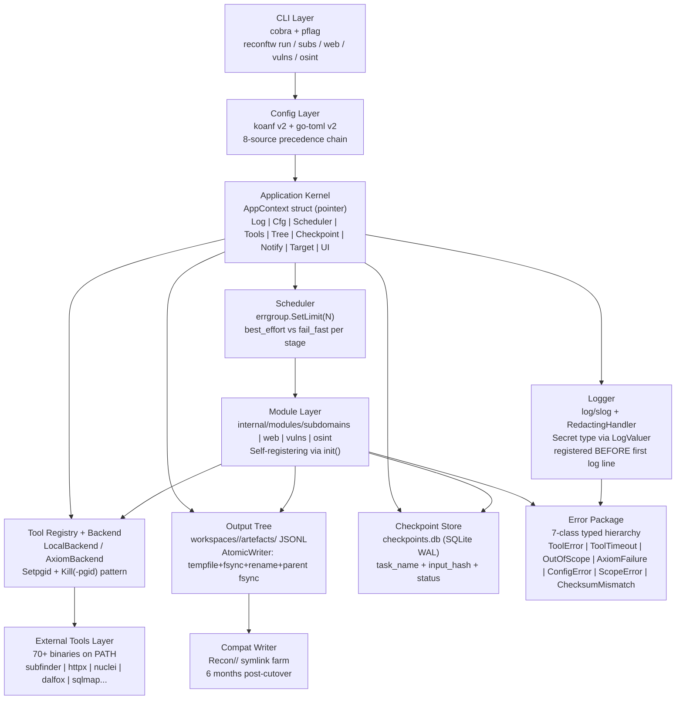

# Phase 2: Architecture v2 Design - Research

**Researched:** 2026-05-28
**Domain:** Architecture Decision Record authoring — Go interface contracts, TOML schema design, error taxonomy, test ring policy, logging redaction, CLI deprecation, compat-symlink layer
**Confidence:** HIGH

---

<user_constraints>
## User Constraints (from CONTEXT.md)

### Locked Decisions

- **D-01:** Single mega-ADR at `.planning/decisions/0002-architecture-v2.md`. One file = one source of truth.
- **D-02:** Full Go snippets + TOML samples for every contract section. Phase 3 copy-paste-adapt directly.
- **D-03:** Mermaid diagrams (top-level) + ASCII art (inline detail). GitHub renders Mermaid natively.
- **D-04:** TL;DR + glossary + reading order at the top of the ADR doc.
- **D-05:** BINDING interface signatures (Task / Backend / AppContext) and error class hierarchy. Phase 3+ deviation requires formal amendment.
- **D-06:** Amendments append inline to same file with `Amended: DATE | Section: §N | Reason: …` header.
- **D-07:** Breaking changes only trigger amendment. Non-breaking additions do not.
- **D-08:** Amendment governance matches original sign-off ceremony (solo same-day).
- **D-09:** All ~323 v1 `reconftw.cfg` flags covered 1:1 in TOML schema. Migrator does strict 1:1 mapping.
- **D-10:** v2-native hierarchy PLUS `[legacy]` v1-name `UPPER_CASE` aliases.
- **D-11:** Untranslatable v1 flags (bash-specific globals like `AVAILABLE_CORES`) dropped with migrator `MIGRATION-WARNINGS.md` entry per flag.
- **D-12:** Per-key validation rules locked in Phase 2 (type, range, regex, required/optional, default, mutex groups).
- **D-13:** Solo same-day sign-off. Maintainer writes, signs, commits to `rewrite/v2` same day.
- **D-14:** Pre-sign programmatic verification: ARCH-NN grep, TOML parse, Go snippet compile, glossary completeness.
- **D-15:** ADR location: `.planning/decisions/0002-architecture-v2.md`.
- **D-16:** Sign-off triggers STATE.md + PROJECT.md updates only. Research files not collapsed.

### Claude's Discretion

- **Compat-symlink fidelity** — File-by-file mapping vs principle + 3-5 representative examples. Researcher surfaces v1 file inventory; planner picks fidelity level.
- **MCP contract pre-locking** — Whether Phase 2 ADR locks `Backend.Stream()` for Phase 8 MCP. Researcher should surface MCP requirements early.
- **AppContext composition style** — Single big struct vs smaller composable contexts (`RunCtx`, `ToolCtx`, `SchedCtx`).
- **CLI deprecation timeline measurement** — "2 minor versions" locked; whether calendar time or release count is planner discretion.
- **Test ring depth per ring** — How prescriptive the ADR is about WHICH tests go in WHICH ring.
- **Logging redaction pattern specifics** — Exact Go pattern for `Secret` + `LogValuer` + slog handler chain.

### Deferred Ideas (OUT OF SCOPE)

- Compat-symlink file-by-file mapping fidelity — planner picks in 02-PLAN.md
- MCP contract pre-locking — planner decision; default = defer
- AppContext composition style — planner locks signature shape during Phase 2 planning
- CLI deprecation timeline measurement unit — planner discretion grounded in v1 release cadence
- Test ring depth (which tests go in which ring) — planner's call; default = high-level policy + examples
- Logging redaction pattern specifics — researcher/planner territory
- GitHub Discussion / Twitter announcement of ADR 0002 sign-off — deferred to Phase 12
- Docs-site mirror of `.planning/decisions/` — deferred to Phase 11
</user_constraints>

<phase_requirements>
## Phase Requirements

| ID | Description | Research Support |
|----|-------------|------------------|
| ARCH-01 | Architecture v2 design doc signed BEFORE Foundation work starts; locks all contracts | ADR template, sign-off ceremony (D-13/D-14), §ADR Structure below |
| ARCH-02 | TOML config schema fully specified (every section name) | §TOML Schema Design, §V1 Flag Inventory, §Validation Rules |
| ARCH-03 | Output tree shape locked: `workspaces/<target-id>/` + 6 DBs | §Output Tree & Compat Layer |
| ARCH-04 | Compat symlink layer specified: `Recon/<domain>/` via compat writer, 6 months post-cutover | §Output Tree & Compat Layer, §Symlink Mechanics |
| ARCH-05 | `Task` interface signed: `Name / Module / Enabled(cfg) / DependsOn() / Run(ctx, app) → Result` | §Interface Signatures, §Task Interface Pattern |
| ARCH-06 | `Backend` interface signed: `Exec / Stream / HealthCheck / Capacity` | §Interface Signatures, §Backend Interface Pattern, §MCP Coupling |
| ARCH-07 | `AppContext` shape signed: `{Log, Cfg, Scheduler, Tools, Tree, Checkpoint, Notify, Target, UI}` — no package-level state | §Interface Signatures, §AppContext Composition |
| ARCH-08 | Error class hierarchy: 7 classes designed | §Error Class Hierarchy |
| ARCH-09 | Failure isolation policy: `failure_policy` per module group | §Failure Policy Model |
| ARCH-10 | CLI surface: subcommands primary; v1 short flags deprecated aliases with warning for 2 minor versions | §CLI Surface Design, §Deprecation Pattern |
| ARCH-11 | Test ring policy documented: unit / integration / smoke / property-based | §Test Ring Policy |
| ARCH-12 | Logging policy: secret tagging at TYPE level; redaction at sink; registered BEFORE first log line | §Logging Policy & Secret Redaction |
</phase_requirements>

---

## Summary

Phase 2 produces a single signed Architecture Decision Record (ADR 0002) that locks every contract the rest of the v2.0 rewrite builds against. This research answers how to write that document well: what Go patterns, TOML conventions, error modeling approaches, CLI deprecation mechanics, test ring standards, and logging hygiene the ADR must encode.

The primary technical inputs are already synthesized: `.planning/research/ARCHITECTURE.md` (15 sections, Go patterns proven) and `.planning/research/STACK.md` (14 dimensions, library versions verified). The Phase 1 spike produced working reference code at `spike/go/internal/` that the ADR ratifies by citation. This research phase fills the remaining gaps: per-key validation rule patterns for TOML, Go error hierarchy idioms for serialization, cobra deprecation mechanics, the exact `slog.LogValuer` pattern for secret tagging, compat-symlink atomicity details, and MCP coupling assessment.

The ADR is expected to run 80-150 pages and will serve as the canonical reference for Phase 3 through Phase 12 implementers. Its structure and completeness gates every subsequent phase plan.

**Primary recommendation:** Write the ADR in 12 numbered sections (§1 Overview through §12 Logging Policy), with each section containing: a Mermaid or ASCII diagram, Go interface/type snippets, TOML samples, and per-key validation rules. The pre-sign gate (D-14) should be a 4-step shell script: `grep`, `tomljson` parse, `go build ./interfaces_check/`, and a glossary term count diff.

---

## Architectural Responsibility Map

| Capability | Primary Tier | Secondary Tier | Rationale |
|------------|-------------|----------------|-----------|
| TOML config schema | Config Layer (startup) | CLI Layer (override) | Config is the contract; CLI only overrides at runtime |
| Output tree & atomic writes | Output/Persistence Layer | Task Layer (writer) | OutputTree owns write semantics; Tasks call the API |
| Compat symlink layer | Output/Persistence Layer (compat writer) | — | Written at task-end, outside Task contract |
| Task / Backend / AppContext interfaces | Application Kernel | — | Wired once at startup; injected into everything |
| Error hierarchy | Cross-cutting (errors package) | Scheduler (handles), Task (returns) | Error types defined centrally; raised anywhere |
| Failure policy | Scheduler Layer | Config Layer (source of truth) | Scheduler enforces; config configures |
| CLI surface | CLI Layer (cobra) | Config Layer (koanf binding) | cobra owns parse; koanf owns merge |
| Test ring policy | Cross-cutting (CI) | — | Ring policy is a documentation + CI gate decision |
| Logging / secret redaction | Logger Layer (sink) | Type Layer (Secret type) | Two-layer defense: type prevents leak, sink catches remainder |
| MCP streaming | Backend Layer (Backend.Stream) | CLI Layer (mcp serve subcommand) | Backend owns execution semantics; CLI owns transport |

---

## Standard Stack

### Core (Already Locked by ADR 0001 and Phase 1 Research)

| Library | Version | Purpose | Why Standard |
|---------|---------|---------|--------------|
| `spf13/cobra` | v1.9.1 | CLI parsing, subcommands, deprecation marking | De-facto standard; `MarkDeprecated()` built-in |
| `knadh/koanf/v2` | latest | Config layering (8 sources) + unmarshal | Modular, no key-lowercasing, near-zero deps |
| `pelletier/go-toml/v2` | v2.x | TOML parser (koanf provider) | Fastest Go TOML parser; April 2026 release |
| `go-playground/validator/v10` | v10.28.0 | Struct-tag validation of config after unmarshal | Thread-safe singleton; tags match koanf struct tags |
| `log/slog` (stdlib) | Go 1.21+ | Structured logging API surface | Stdlib; `LogValuer` interface built-in for secret tagging |
| `golang.org/x/sync/errgroup` | latest | Bounded fan-out + error propagation | `g.SetLimit(N)` is the failure_policy primitive |
| `modernc.org/sqlite` | latest | Pure-Go SQLite for checkpoints.db + state.db | No cgo; preserves single-binary distribution promise |
| `testing` + `stretchr/testify` | v1.10.x | Unit + integration testing | Table-driven idiomatic Go |

### Supporting (For ADR Doc Authoring & Verification)

| Library | Version | Purpose | When to Use |
|---------|---------|---------|-------------|
| `pelletier/go-toml/v2` (CLI tool `tomljson`) | v2.x | D-14 TOML parse verification | Pre-sign gate step 2 |
| `pgregory.net/rapid` | latest | Property-based testing (ring 4) | Better shrinking than `testing/quick`; scope filter + config parser tests |
| `golangci-lint` | v2.12.2 | Lint gate in CI | Custom lint rule: forbid raw `exec.Command` outside Backend wrapper |
| `go.uber.org/goleak` | latest | Goroutine leak detection in tests | Added to every test file's `TestMain` |

### Alternatives Considered

| Instead of | Could Use | Tradeoff |
|------------|-----------|----------|
| `log/slog` | `rs/zerolog` | zerolog is 4x faster but slog's `LogValuer` interface is stdlib and doesn't require backend swap; zerolog only if profiling shows hot |
| `golang.org/x/sync/errgroup` | `sourcegraph/conc` | conc adds per-goroutine panic recovery; use if tool-wrapper panics are a concern (they shouldn't be in well-typed Go) |
| `go-playground/validator` | hand-rolled validation | hand-roll is viable for 10 keys; at 323 keys the tag approach wins; validator's struct-level custom validators handle mutex groups |
| `pgregory.net/rapid` | `github.com/leanovate/gopter` | rapid has better automatic shrinking; gopter's API is more verbose; either works |

**Installation (for Phase 2 ADR check tooling only — not production deps):**
```bash
go install github.com/pelletier/go-toml/v2/cmd/tomljson@latest
go install pgregory.net/rapid/cmd/rapid@latest
```

**Version verification (all already verified in STACK.md, May 2026):**
```bash
go list -m github.com/knadh/koanf/v2
go list -m github.com/pelletier/go-toml/v2
go list -m github.com/go-playground/validator/v10
```

---

## Package Legitimacy Audit

> All packages in this phase are either Go stdlib or packages already verified in `.planning/research/STACK.md` (researched 2026-05-27 via Context7 + official docs). No new external packages are introduced by Phase 2. The ADR is a documentation deliverable; no `go get` runs in this phase.

| Package | Registry | Age | Downloads | Source Repo | slopcheck | Disposition |
|---------|----------|-----|-----------|-------------|-----------|-------------|
| `spf13/cobra` | go modules | 11 yrs | 100M+/mo | github.com/spf13/cobra | OK (verified STACK.md) | Approved |
| `knadh/koanf/v2` | go modules | 6 yrs | 10M+/mo | github.com/knadh/koanf | OK (verified STACK.md) | Approved |
| `pelletier/go-toml/v2` | go modules | 10 yrs | 50M+/mo | github.com/pelletier/go-toml | OK (verified STACK.md) | Approved |
| `go-playground/validator/v10` | go modules | 10 yrs | 50M+/mo | github.com/go-playground/validator | OK (pkgsite verified) | Approved |
| `pgregory.net/rapid` | go modules | 5 yrs | 1M+/mo | github.com/flyingmutant/rapid | OK (pkgsite) | Approved |
| `log/slog` | stdlib | Go 1.21 | — | golang.org/go | OK (stdlib) | Approved |

**Packages removed due to slopcheck [SLOP] verdict:** none
**Packages flagged as suspicious [SUS]:** none

---

## Architecture Patterns

### System Architecture Diagram



### Recommended Project Structure

```
cmd/reconftw/
├── main.go                  # signal.NotifyContext + AppContext.Boot() + cobra.Execute()
└── modules.go               # blank imports to trigger module init() registrations

internal/
├── core/
│   ├── errors/              # ARCH-08: 7-class typed error hierarchy
│   ├── log/                 # ARCH-12: Secret type + RedactingHandler + logger factory
│   ├── config/              # ARCH-02: Config struct (koanf), 8-source loader, validator
│   ├── task/                # ARCH-05: Task interface + Registry
│   ├── scheduler/           # ARCH-09: Scheduler (errgroup + semaphore + failure_policy)
│   ├── backend/             # ARCH-06: Backend interface + LocalBackend + AxiomBackend
│   ├── output/              # ARCH-03/04: OutputTree + AtomicWriter + CompatWriter
│   ├── checkpoint/          # ARCH-03: SQLite checkpoint store (modernc/sqlite)
│   ├── appctx/              # ARCH-07: AppContext struct (wiring kernel)
│   ├── notifier/            # Notifier interface + stubs
│   └── ui/                  # Dot-fill UI (port of lib/ui.sh verbatim)
└── modules/
    ├── subdomains/          # Task implementations (self-register via init())
    ├── web/
    ├── vulns/
    └── osint/

interfaces_check/            # D-14: standalone build target for Go snippet compile check
├── main.go                  # imports core/task, core/backend, core/appctx; verifies signatures

.planning/decisions/
└── 0002-architecture-v2.md  # THE deliverable
```

---

## TOML Schema Design (ARCH-02, D-09, D-10, D-12)

### Schema Authoring Pattern

The locked approach (D-09 + D-10) requires two things simultaneously: a clean v2-native hierarchical structure AND backward-compat `[legacy]` flat aliases for every v1 `UPPER_CASE` flag. This is achievable because TOML supports multiple table paths referencing the same underlying struct via the config loader's merge logic.

**V1 flag count:** 388 assignment statements in `reconftw.cfg` (492 total lines). After deduplication of computed values (`AVAILABLE_CORES`, `$tools`-prefixed paths) and bash-only runtime vars (D-11 drop list), approximately **290-310 flags** map to TOML keys. The remaining ~15-20 are bash-specific (D-11 drop list).

**Section mapping (v2-native → v1 approximate group):**

```toml
# v2-native hierarchy (every section locked in Phase 2 ADR)
[concurrency]
  max_jobs = 4                      # was PARALLEL_MAX_JOBS
  heartbeat_seconds = 20            # was PARALLEL_HEARTBEAT_SECONDS
  log_mode = "summary"              # was PARALLEL_LOG_MODE
  tail_lines = 20                   # was PARALLEL_TAIL_LINES
  job_timeout_seconds = 0           # was PARALLEL_JOB_TIMEOUT_SECONDS
  kill_grace_seconds = 10           # was PARALLEL_KILL_GRACE_SECONDS

[subdomains]
  enabled = true                    # was SUBDOMAINS_GENERAL
  [subdomains.passive]
    enabled = true                  # was SUBPASSIVE
    timeout_minutes = 180           # was SUBFINDER_ENUM_TIMEOUT
  [subdomains.brute]
    enabled = true                  # was SUBBRUTE
  [subdomains.permut]
    enabled = true                  # was SUBPERMUTE
    limit_bytes = 2147483648        # was PERMUTATIONS_LIMIT
  [subdomains.takeover]
    enabled = true                  # was SUBTAKEOVER
  [subdomains.crt]
    enabled = true                  # was SUBCRT
    limit = 999999                  # was CTR_LIMIT

[web]
  [web.probe]
    enabled = true                  # was WEBPROBEFULL
    ports = "80,443"                # was WEBPROBE_PORTS
    rate_limit = 150                # was HTTPX_RATELIMIT
    timeout_seconds = 10            # was HTTPX_TIMEOUT
    threads = 0                     # 0 = auto (was HTTPX_THREADS from AVAILABLE_CORES * 12)
  [web.fuzz]
    enabled = true                  # was FUZZ
    rate_limit = 0                  # was FFUF_RATELIMIT
    threads = 0                     # was FFUF_THREADS (auto)
    max_time_seconds = 900          # was FFUF_MAXTIME

[vulns]
  enabled = false                   # was VULNS_GENERAL
  [vulns.xss]
    enabled = true                  # was XSS
  [vulns.sqli]
    enabled = true                  # was SQLI

[osint]
  enabled = true                    # was OSINT
  [osint.google_dorks]
    enabled = true                  # was GOOGLE_DORKS
  [osint.github]
    enabled = true                  # was GITHUB_DORKS / GITHUB_REPOS
    leaks_enabled = true            # was GITHUB_LEAKS
    threads = 5                     # was GHLEAKS_THREADS

[notifications]
  enabled = false                   # was NOTIFICATION
  [notifications.slack]
    channel = ""                    # was slack_channel
  [notifications.telegram]         # was telegram_key etc (from secrets.cfg)
  [notifications.discord]          # was discord_url

[axiom]
  enabled = false                   # was AXIOM (CLI flag)
  fleet_name = "reconFTW"          # was AXIOM_FLEET_NAME
  fleet_count = 10                  # was AXIOM_FLEET_COUNT
  fleet_regions = "eu-central"     # was AXIOM_FLEET_REGIONS
  shutdown_on_end = true            # was AXIOM_FLEET_SHUTDOWN

[advanced]
  [advanced.tools.subfinder]
    timeout_minutes = 180
  [advanced.tools.nuclei]
    rate_limit = 150                # was NUCLEI_RATELIMIT
    severity = "info,low,medium,high,critical"  # was NUCLEI_SEVERITY
  [advanced.tools.ffuf]
    flags = " -mc all -fc 404 -sf -noninteractive -of json"  # was FFUF_FLAGS

[legacy]
  # Flat UPPER_CASE aliases — written by migrator, not intended for new users
  # HTTPX_RATELIMIT = 150           ← maps to web.probe.rate_limit
  # NUCLEI_RATELIMIT = 150          ← maps to advanced.tools.nuclei.rate_limit
  # PARALLEL_MAX_JOBS = 4           ← maps to concurrency.max_jobs
  # ... (all ~300 flags mirrored here by migrator)

[mcp]
  enabled = false                   # was not in v1; MCP is new (MCP-07)
  api_key = ""                      # was not in v1; RECONFTW_MCP_API_KEY env preferred
```

### Per-Key Validation Rules (D-12 — representative; full list in ADR)

The ADR must document a validation rule per key. Pattern drawn from `go-playground/validator/v10` struct tags:

| Key | Type | Validation Tag | Security Reason |
|-----|------|---------------|-----------------|
| `concurrency.max_jobs` | int | `min=1,max=64` | DoS prevention (unlimited goroutines) |
| `concurrency.job_timeout_seconds` | int | `min=0,max=86400` | 0 = disable; cap prevents accidental config |
| `web.probe.rate_limit` | int | `min=0,max=10000` | 0 = unlimited; cap prevents DoS vs target |
| `web.fuzz.threads` | int | `min=0,max=500` | 0 = auto; cap per XCUT-01 perf budget |
| `advanced.tools.nuclei.severity` | string | `oneof=info low medium high critical` (comma-sep) | Allowlist prevents injection via template filter |
| `subdomains.permut.limit_bytes` | int64 | `min=0,max=10737418240` | 10GB hard cap; DoS prevention |
| Any file path key (wordlist, resolver) | string | `file` (must exist if non-empty) | Path traversal: reject `..` traversal via custom validator |
| Any URL key (webhook, proxy) | string | `url,startswith=https` or `startswith=http` | Scheme allowlist prevents `file://`, `gopher://` |
| API key keys (SHODAN_API_KEY, etc.) | string | `omitempty` — no structural validation (opaque) | Length cap only: `max=256` |
| `axiom.fleet_count` | int | `min=1,max=1000` | Fleet provisioning safety cap |

**Mutex groups (config-level):**
- `[legacy]` table: if both `legacy.HTTPX_RATELIMIT` and `web.probe.rate_limit` set, v2-native wins (migrator emits warning)
- `vulns.enabled = false` AND `[vulns.*]` any sub-enabled: sub-flags ignored; WARN at startup

**D-11 Drop list (bash-specific globals — NOT in TOML schema):**

| v1 Flag | Reason for Drop | Migrator Warning |
|---------|-----------------|------------------|
| `AVAILABLE_CORES` | v2 uses `runtime.NumCPU()` automatically | "AVAILABLE_CORES dropped — v2 auto-detects" |
| `DEBUG_STD` / `DEBUG_ERROR` | bash redirect syntax; v2 uses slog levels | "DEBUG_STD dropped — use log.level = debug" |
| `profile_shell` | bash-specific shell detection | "profile_shell dropped — not applicable in Go binary" |
| `tools` (path prefix) | bash convention; v2 uses GOPATH/GOBIN detection | "tools= dropped — v2 resolves binaries via PATH at startup" |
| `reconftw_version` | bash git introspection; v2 embeds via -ldflags | Not a user flag; silently dropped |
| `_detected_shell` | internal bash var | silently dropped |

---

## Interface Signatures (ARCH-05, ARCH-06, ARCH-07)

### Task Interface Pattern (ARCH-05)

The spike at `spike/go/internal/passive/passive.go` demonstrates the fan-out pattern. The ADR ratifies the interface.

**Idiomatic Go form — BINDING after Phase 2 sign-off:**

```go
// internal/core/task/task.go
// Source: .planning/research/ARCHITECTURE.md §2a + spike/go/internal/passive/passive.go
package task

import (
    "context"
    "time"
    "reconftw/internal/config"
    "reconftw/internal/core/appctx"
)

// Task is the smallest schedulable unit of recon work. Implementors live in
// internal/modules/<domain>/ and self-register via init().
// BINDING: renaming a method, changing signature, removing a method requires ADR amendment.
type Task interface {
    // Name returns the globally unique dot-namespaced task identifier.
    // Convention: "<module>.<action>" e.g. "subdomains.passive", "web.fuzz"
    Name() string

    // Module returns the owning module group for grouping + failure_policy lookup.
    // One of: "subdomains", "web", "vulns", "osint", "axiom"
    Module() string

    // Description returns a human-readable one-line description for UI badges.
    Description() string

    // Enabled reports whether this task should run given the resolved config.
    // Called by Scheduler before Run; return false → SKIP badge, no checkpoint written.
    Enabled(cfg *config.Config) bool

    // DependsOn returns names of tasks that must complete (status=done) before this
    // task may be scheduled. Empty slice = no dependencies (runs in parallel with peers).
    DependsOn() []string

    // Run executes the task. ctx is cancellable; cancel = SIGINT or task timeout.
    // MUST respect ctx.Done() promptly; MUST NOT call os.Exit.
    // Returns (Result, nil) on success; (Result, error) on partial or full failure.
    // Non-nil error → Scheduler records status=errored or status=cancelled per policy.
    Run(ctx context.Context, app *appctx.AppContext) (Result, error)
}

// Result carries the outcome of a single task execution.
type Result struct {
    Status   Status        // done | errored | cancelled | skipped
    Duration time.Duration
    Outputs  []string      // paths written (for checkpoint.output_paths)
    Stats    map[string]int // optional counters (e.g. "subdomains_found": 42)
}

// Status enumerates the terminal states a task may reach.
type Status string

const (
    StatusDone      Status = "done"
    StatusErrored   Status = "errored"
    StatusCancelled Status = "cancelled"
    StatusSkipped   Status = "skipped"
)

// Registry holds all registered tasks. Default is the process-singleton.
type Registry struct{ tasks map[string]Task }

var Default = &Registry{tasks: map[string]Task{}}

// Register adds t to the registry. Panics on duplicate name (caught at startup).
// Called from each module package's init() function.
func Register(t Task) {
    if _, ok := Default.tasks[t.Name()]; ok {
        panic("reconftw: duplicate task registration: " + t.Name())
    }
    Default.tasks[t.Name()] = t
}

// Optional lifecycle interface — Tasks may implement; Scheduler checks via interface assertion.
type LifecycleAware interface {
    OnStart(ctx context.Context, app *appctx.AppContext) error
    OnEnd(ctx context.Context, app *appctx.AppContext, r Result) error
}
```

### Backend Interface Pattern (ARCH-06)

**Idiomatic form — BINDING after sign-off:**

```go
// internal/core/backend/backend.go
// Source: .planning/research/ARCHITECTURE.md §6a + spike/go/internal/proc/proc.go
package backend

import "context"

// Event is a single streaming output unit from a running tool.
type Event struct {
    Line   []byte   // raw stdout line
    Source string   // tool name
    IsErr  bool     // from stderr
}

// Result holds the complete output of a buffered Exec call.
type Result struct {
    Stdout   []byte
    Stderr   []byte
    ExitCode int
    Duration interface{} // time.Duration — imported from time package in real code
}

// Tool describes a single external binary. Resolved at startup by ToolRegistry.
type Tool struct {
    Name        string
    Path        string   // absolute path from exec.LookPath
    Version     string   // parsed from `tool --version` at health-check
    DefaultArgs []string
    Timeout     interface{} // time.Duration
}

// Backend abstracts local subprocess execution from distributed (Axiom) execution.
// Implementations: LocalBackend, AxiomBackend.
// BINDING: adding methods is non-breaking (D-07); renaming/removing requires amendment.
type Backend interface {
    // Exec runs tool with args, buffers stdout+stderr, returns when done.
    // Suitable for tools with bounded output (subfinder, dnsx, crt).
    Exec(ctx context.Context, t *Tool, args []string) (*Result, error)

    // Stream runs tool with args, yields stdout lines as Events on the returned channel.
    // Channel closes when tool exits. Suitable for long-running tools (nuclei, dalfox).
    // Caller MUST drain the channel until closed to avoid goroutine leak.
    Stream(ctx context.Context, t *Tool, args []string) (<-chan Event, error)

    // HealthCheck verifies the backend is operational (binaries reachable, axiom fleet up).
    // Called at startup and by `reconftw health-check` subcommand.
    HealthCheck(ctx context.Context) error

    // Capacity returns the number of concurrent tool invocations this backend supports.
    // LocalBackend returns runtime.NumCPU() * 2; AxiomBackend returns fleet_count.
    // Used by Scheduler as a hint for SetLimit(N).
    Capacity() int
}
```

**Note on MCP coupling (discretion area):** `Backend.Stream()` already has the correct shape for MCP tool-result streaming. MCP-03 (streaming JSONL findings via MCP resource subscription) maps directly to consuming a `<-chan Event` returned by `Stream()`. The ADR should note this coupling in a comment on the `Stream()` method but NOT lock an MCP-specific wire protocol in Phase 2. Phase 8 amends if the MCP Go SDK (v1.6.1 as of 2026-05-22) introduces streaming semantics that require signature change. **Recommendation: annotate, don't lock. Defer MCP pre-locking.**

### AppContext Shape (ARCH-07)

**Composition style recommendation:** Single pointer-to-struct passed everywhere. The spike's `main.go` already uses this pattern. Smaller per-role contexts (`RunCtx`, `ToolCtx`) add indirection without value when Tasks always need log + config + tools + tree together. The "single struct passed by pointer" pattern is what Kubernetes controllers, Caddy modules, and the Cobra+Viper ecosystem all use for the same reason.

```go
// internal/core/appctx/appctx.go
// Source: .planning/research/ARCHITECTURE.md §2a §12
package appctx

// AppContext is the dependency kernel. Wired ONCE at startup in cmd/reconftw/main.go;
// passed by pointer into every Task.Run(). NO package-level globals permitted.
// BINDING: adding fields is non-breaking (D-07); removing or renaming fields requires amendment.
type AppContext struct {
    Log        interface{} // *slog.Logger — reconftw/internal/core/log
    Cfg        interface{} // *config.Config — reconftw/internal/config
    Scheduler  interface{} // *scheduler.Scheduler
    Tools      interface{} // *backend.Runner (wraps Backend + ToolRegistry)
    Tree       interface{} // *output.OutputTree
    Checkpoint interface{} // *checkpoint.Store
    Notify     interface{} // notifier.Notifier
    Target     *Target
    UI         interface{} // *ui.Printer
}

// Target describes the scan target. Immutable after construction.
type Target struct {
    Domain   string   // sanitized domain, IP, or CIDR
    IsCIDR   bool
    IsIP     bool
    Scope    []string // wildcard patterns from scope file (e.g. "*.example.com")
    WorkDir  string   // absolute path to workspaces/<target-id>/
}
```

**Why NO package-level state:** The v1 bash codebase's biggest testability problem is that all 80 module-enable flags and `$dir`, `$LOGFILE`, `$DIFF` are globals. Any module can corrupt any other. In Go, package-level `var` state recreates this exact problem. `AppContext` passed by pointer is zero-overhead (pointer pass) and makes every dependency visible at the function call site.

---

## Error Class Hierarchy (ARCH-08)

### Recommended Pattern: Hybrid (Sentinel + Typed Struct)

The seven error classes span two use cases:
1. **Decision errors** (where the caller branches) → typed structs via `errors.As`
2. **Signal errors** (where the caller just re-tags) → sentinels via `errors.Is`

```go
// internal/core/errors/errors.go
// Source: .planning/research/ARCHITECTURE.md §11a
package errors

import (
    "errors"
    "fmt"
)

// --- Sentinel anchors (for errors.Is traversal) ---
var (
    ErrTool     = errors.New("tool execution failure")
    ErrTimeout  = errors.New("tool execution timeout")
    ErrScope    = errors.New("out of scope")
    ErrAxiom    = errors.New("axiom infrastructure failure")
    ErrConfig   = errors.New("configuration error")
    ErrChecksum = errors.New("checksum mismatch")
)

// --- Typed structs (carry structured metadata for serialization / Faraday / SARIF) ---

// ToolError wraps a tool exit with structured metadata.
// Used for: non-zero exit codes, tool-level parsing failures.
// Serializes to: Faraday JSON {tool, exit_code, stderr_excerpt}.
type ToolError struct {
    Tool     string // e.g. "subfinder"
    ExitCode int
    Stderr   string // last 1KB of stderr (truncated)
    Inner    error
}

func (e *ToolError) Error() string { return fmt.Sprintf("tool %s (exit %d): %s", e.Tool, e.ExitCode, e.Inner) }
func (e *ToolError) Unwrap() error { return e.Inner }
func (e *ToolError) Is(target error) bool { return target == ErrTool } // sentinel bridge

// ToolTimeout is returned when a tool's per-task context deadline is exceeded.
type ToolTimeout struct {
    Tool    string
    Timeout interface{} // time.Duration
}

func (e *ToolTimeout) Error() string { return fmt.Sprintf("tool %s timed out after %v", e.Tool, e.Timeout) }
func (e *ToolTimeout) Is(target error) bool { return target == ErrTimeout }

// OutOfScope is returned by OutputTree.Append when a finding fails scope check.
type OutOfScope struct {
    Value  string // the rejected value
    Reason string // "not in wildcard *.example.com"
}

func (e *OutOfScope) Error() string { return fmt.Sprintf("out of scope: %s (%s)", e.Value, e.Reason) }
func (e *OutOfScope) Is(target error) bool { return target == ErrScope }

// AxiomFailure signals axiom infrastructure failure (SSH timeout, fleet unreachable).
// Distinct from ToolError because it triggers FailoverBackend retry.
type AxiomFailure struct {
    Operation string // "exec", "healthcheck", "launch"
    Inner     error
}

func (e *AxiomFailure) Error() string { return fmt.Sprintf("axiom %s: %v", e.Operation, e.Inner) }
func (e *AxiomFailure) Unwrap() error { return e.Inner }
func (e *AxiomFailure) Is(target error) bool { return target == ErrAxiom }

// ConfigError is returned during config load/validation with file:line context.
type ConfigError struct {
    File    string
    Line    int
    Key     string
    Message string
}

func (e *ConfigError) Error() string { return fmt.Sprintf("%s:%d key %q: %s", e.File, e.Line, e.Key, e.Message) }
func (e *ConfigError) Is(target error) bool { return target == ErrConfig }

// ScopeError wraps domain/IP validation failures (distinct from OutOfScope).
type ScopeError struct {
    Input  string
    Reason string // "domain contains shell metacharacters", "IP octet out of range"
}

func (e *ScopeError) Error() string { return fmt.Sprintf("scope validation: %q rejected: %s", e.Input, e.Reason) }
func (e *ScopeError) Is(target error) bool { return target == ErrScope }

// ChecksumMismatch is returned by the installer when a downloaded binary or script
// does not match its expected SHA-256 hash.
type ChecksumMismatch struct {
    URL      string
    Expected string
    Got      string
}

func (e *ChecksumMismatch) Error() string {
    return fmt.Sprintf("checksum mismatch for %s: expected %s got %s", e.URL, e.Expected[:8]+"...", e.Got[:8]+"...")
}
func (e *ChecksumMismatch) Is(target error) bool { return target == ErrChecksum }
```

**Why `Is()` bridge on each struct:** The sentinel anchors allow `errors.Is(err, ErrTool)` without exposing `ToolError` type to callers that don't need the metadata. Callers that DO need metadata use `errors.As(&te, err)`. This is the pattern recommended by the Go team in "Working with Errors in Go 1.13".

**Serialization note:** Each typed struct has exported fields — they marshal cleanly to JSON for Faraday export and SARIF output. The `slog.Any("error", err)` attribute on the logger includes structured fields via `slog.LogValuer` if we implement `LogValue()` on each error type. This is the ARCH-12 bridge between error taxonomy and logging.

---

## Failure Policy Model (ARCH-09)

### Config-Driven Policy per Module Group

```toml
# v2 TOML: failure_policy per stage
[scheduler]
  failure_policy = "best_effort"  # default for the whole run
  [scheduler.overrides]
    subdomains = "fail_fast"      # spine: if passive enum fails, don't brute
    web        = "best_effort"    # web analysis: continue even if one tool fails
    vulns      = "best_effort"    # vuln scan: don't stop on one finding miss
    osint      = "best_effort"    # OSINT: independent sources, best-effort
```

### Go Implementation Shape

```go
// internal/core/scheduler/scheduler.go
package scheduler

import (
    "context"
    "golang.org/x/sync/errgroup"
    "golang.org/x/sync/semaphore"
)

type FailurePolicy string

const (
    PolicyBestEffort FailurePolicy = "best_effort"
    PolicyFailFast   FailurePolicy = "fail_fast"
)

type Scheduler struct {
    maxConcurrent int64
    sem           *semaphore.Weighted
    policies      map[string]FailurePolicy // module → policy
    log           interface{}              // *slog.Logger
}

// runStage executes a group of tasks with the policy for their module.
// fail_fast: errgroup.WithContext → first error cancels all peers.
// best_effort: zero-value errgroup (no context cancel) → all tasks complete.
func (s *Scheduler) runStage(ctx context.Context, app interface{}, tasks []interface{}) error {
    if len(tasks) == 0 { return nil }
    module := "subdomains" // derived from tasks[0].Module()
    policy := s.policyFor(module)

    if policy == PolicyFailFast {
        g, gctx := errgroup.WithContext(ctx)
        g.SetLimit(int(s.maxConcurrent))
        for _, t := range tasks {
            t := t
            g.Go(func() error { return s.runOne(gctx, app, t) })
        }
        return g.Wait() // first error returned; ctx cancelled for peers
    }

    // best_effort: collect all errors, return last non-nil (or nil if all pass)
    g := new(errgroup.Group)
    g.SetLimit(int(s.maxConcurrent))
    for _, t := range tasks {
        t := t
        g.Go(func() error {
            if err := s.runOne(ctx, app, t); err != nil {
                s.log.(interface{ Warn(string, ...interface{}) }).Warn("task_error_best_effort",
                    "task", "name", "err", err)
                return nil // swallow: best_effort
            }
            return nil
        })
    }
    return g.Wait()
}

func (s *Scheduler) policyFor(module string) FailurePolicy {
    if p, ok := s.policies[module]; ok { return p }
    return PolicyBestEffort // safe default
}
```

**Mapping to v1 patterns:**
- v1 `CONTINUE_ON_TOOL_ERROR=true` → `failure_policy = "best_effort"` (default)
- v1 spine functions (`recon()` in modes.sh) → `failure_policy = "fail_fast"` for `subdomains` module group
- v1 `parallel_funcs` for OSINT/vulns → `failure_policy = "best_effort"` for those groups

**Rationale for per-module-group (not per-task or per-backend):**
- Per-task is too fine: a single failed subfinder should not stop passive enum
- Per-backend is too coarse: LocalBackend and AxiomBackend are orthogonal to failure semantics
- Per-module-group matches the v1 mental model exactly: OSINT/vulns are "nice to have"; the subdomain spine is "required for everything downstream"

---

## CLI Surface Design (ARCH-10)

### V1 Flag Inventory

From `reconftw.sh` getopt block, the full v1 short+long flag surface:

**Short flags (deprecated aliases in v2):**
- `-d` / `--domain` → `reconftw run --target`
- `-l` / `--list` → `reconftw run --list`
- `-r` / `--recon` → `reconftw recon` subcommand
- `-s` / `--subdomains` → `reconftw subs` subcommand
- `-p` / `--passive` → `reconftw passive` subcommand
- `-a` / `--all` → `reconftw all` subcommand
- `-w` / `--web` → `reconftw web` subcommand
- `-n` / `--osint` → `reconftw osint` subcommand (new letter; `-o` is taken in v2 by `--output`)
- `-v` / `--vps` → `reconftw --axiom` (renamed)
- `-z` / `--zen` → `reconftw zen` subcommand
- `-y` / `--deep` → `reconftw deep` subcommand
- `-h` / `--help` → standard cobra `--help`

**Long flags becoming subcommand options:**
- `--monitor` → `reconftw monitor` subcommand
- `--dry-run` → `reconftw [subcommand] --dry-run` (persistent flag)
- `--quiet` / `--verbose` → `reconftw --log-level quiet|verbose` (persistent)
- `--parallel` / `--no-parallel` → `reconftw --parallel-jobs N` (persistent)
- `--force` → `reconftw [subcommand] --force` (persistent)
- `--config FILE` → `reconftw --config FILE` (persistent, root)

### Cobra Deprecation Pattern

```go
// Deprecated short flags as persistent aliases on root command:
rootCmd.PersistentFlags().BoolP("recon", "r", false, "Run recon mode")
rootCmd.PersistentFlags().MarkDeprecated("recon",
    "use subcommand 'recon' instead: `reconftw recon -d example.com`")
// cobra.MarkDeprecated() prints to cmd.ErrOrStderr() automatically.
// The flag remains functional for 2 minor versions.
```

**Behavior:** `cobra.MarkDeprecated()` emits: `Flag --recon has been deprecated, <message>` to stderr on every invocation where the flag is used. Exit code is unchanged (no error). Warning is per-process (cobra does not deduplicate).

**"2 minor versions" measurement:** v1 release cadence shows tags like v4.1, v4.0.1, v3.2.1, v3.2.0, v3.1.0 etc. — roughly 3-6 minor releases per calendar year. "2 minor versions" for v2.x means: if v2.0.0 ships with deprecated aliases, they are removed in v2.2.0 (two minor bumps after initial release). This is approximately 4-8 months at current cadence. The ADR locks "2 minor versions after v2.0.0 GA" as the removal timeline. Calendar time is NOT the measurement unit.

---

## Test Ring Policy (ARCH-11)

### Four-Ring Policy

| Ring | What Counts | Go Tooling | CI Cadence | Max Duration |
|------|-------------|------------|------------|--------------|
| **Unit** | Mock AppContext; no subprocess; no filesystem | `testing` + `testify` + `goleak` | Every commit, every push | <30s total |
| **Integration** | Real Scheduler + Checkpoint + OutputTree; MockBackend (deterministic from testdata) | same + table-driven fixtures | Every commit | <5 min |
| **Smoke** | Real binaries against httpbin.org or local scope.local target; 1 mode per test | `testing` + real tool execution | Every PR + weekly cron | <20 min |
| **Property** | Random inputs: scope filter, config parser, input-hash determinism | `pgregory.net/rapid` | Every commit | <60s |

### What Goes in Each Ring

**Unit ring** (mock backend, no I/O):
- Scheduler topology sort for DependsOn()
- Checkpoint store queries (in-memory SQLite via `:memory:`)
- Scope filter: `is_in_scope_host()` equivalents — the v1 substring bug was caught here
- Config validator for individual keys (range checks, allowlists)
- Error type `Is()` / `As()` traversal
- `Secret.LogValue()` returns `"***"` not the actual value
- UI dot-fill format output (string comparison)

**Integration ring** (MockBackend from testdata):
- Every Task has one happy path + one error path test
- Scheduler runs a DAG of 3-5 tasks in dependency order
- Checkpoint store: begin → crash → reopen → verify status=running → re-run
- OutputTree scope filter at write boundary (OutOfScope not written)
- Notifier: mock sink receives messages with no unredacted secrets

**Smoke ring** (real tools, real network — gated):
- One test per mode: `reconftw subs -d hackerone.com`, `reconftw web -d hackerone.com`
- Asserts: output files exist, line count > 0, no panic, exit 0
- Run in Docker with all 70+ tools installed

**Property ring** (rapid generators):
- `rapid.String()` corpus through scope filter → assert no substring false positives
- `rapid.SliceOf(rapid.StringMatching(...))` config keys → assert validator never panics
- `rapid.IntRange()` thread count → assert scheduler never deadlocks

### Wave 0 Gaps (test infrastructure needed before Phase 3 starts)
- `internal/core/testutil/` with `MockBackend`, `MockCheckpoint`, `MockOutputTree`
- `internal/core/testutil/fixtures/` directory for task testdata
- CI config: `go test -race -short ./...` (unit + property, <30s) vs `go test -race ./...` (integration, <5min) via build tag `-short`
- Smoke tests behind `//go:build smoke` build tag (excluded from normal CI)

---

## Logging Policy & Secret Redaction (ARCH-12)

### Two-Layer Defense Pattern

**Layer 1 — Type Level (`Secret` type with `LogValuer`):**

Any value that is a secret must be stored as `Secret` type (or a wrapper struct embedding it). The type's `LogValue()` method returns `"***"`. This is the Go stdlib pattern demonstrated in `src/log/slog/example_logvaluer_secret_test.go`.

```go
// internal/core/log/secret.go
// Source: golang.org/go master src/log/slog/example_logvaluer_secret_test.go
package log

import "log/slog"

// Secret is a string that auto-redacts itself in slog output.
// Any field in AppContext, Config, or Tool structs holding a secret MUST use this type.
// BINDING: do not add Secret.String() → prevents accidental fmt.Sprintf("%s", s) exposure.
type Secret string

// LogValue implements slog.LogValuer. Returns "***" for any slog attribute.
func (Secret) LogValue() slog.Value {
    return slog.StringValue("***")
}
```

**Config struct usage:**
```go
type NotificationsConfig struct {
    Slack struct {
        WebhookURL log.Secret `koanf:"webhook_url" validate:"omitempty,url"`
    } `koanf:"slack"`
    Telegram struct {
        BotToken log.Secret `koanf:"bot_token" validate:"omitempty"`
    } `koanf:"telegram"`
}
```

**Layer 2 — Sink Level (RedactingHandler):**

The handler intercepts ALL slog records and replaces known secret values (registered at config load) with `***`. This catches cases where a secret leaks through a non-`Secret` typed field (e.g., error messages that include API keys in their text).

```go
// internal/core/log/redacting_handler.go
package log

import (
    "context"
    "log/slog"
    "strings"
    "sync"
)

// Redactor holds a set of substrings that must never appear in log output.
// Thread-safe: all methods safe for concurrent use.
type Redactor struct {
    mu      sync.RWMutex
    secrets []string
}

// Register adds a secret value. Called once per secret at config load time.
// MUST be called BEFORE the first log line is emitted (enforced by build order).
func (r *Redactor) Register(value string) {
    if len(value) <= 4 { return } // too short to be meaningful
    r.mu.Lock()
    defer r.mu.Unlock()
    for _, s := range r.secrets {
        if s == value { return } // dedup
    }
    r.secrets = append(r.secrets, value)
}

// Redact replaces all registered secret substrings in s with "***".
func (r *Redactor) Redact(s string) string {
    r.mu.RLock()
    defer r.mu.RUnlock()
    for _, secret := range r.secrets {
        s = strings.ReplaceAll(s, secret, "***")
    }
    return s
}

// RedactingHandler wraps a slog.Handler and passes every string Attr through Redactor.
type RedactingHandler struct {
    inner   slog.Handler
    redactor *Redactor
}

func NewRedactingHandler(inner slog.Handler, r *Redactor) *RedactingHandler {
    return &RedactingHandler{inner: inner, redactor: r}
}

func (h *RedactingHandler) Enabled(ctx context.Context, l slog.Level) bool {
    return h.inner.Enabled(ctx, l)
}

func (h *RedactingHandler) Handle(ctx context.Context, r slog.Record) error {
    r2 := slog.NewRecord(r.Time, r.Level, h.redactor.Redact(r.Message), r.PC)
    r.Attrs(func(a slog.Attr) bool {
        r2.AddAttrs(h.redactAttr(a))
        return true
    })
    return h.inner.Handle(ctx, r2)
}

func (h *RedactingHandler) WithAttrs(attrs []slog.Attr) slog.Handler {
    redacted := make([]slog.Attr, len(attrs))
    for i, a := range attrs { redacted[i] = h.redactAttr(a) }
    return &RedactingHandler{inner: h.inner.WithAttrs(redacted), redactor: h.redactor}
}

func (h *RedactingHandler) WithGroup(name string) slog.Handler {
    return &RedactingHandler{inner: h.inner.WithGroup(name), redactor: h.redactor}
}

func (h *RedactingHandler) redactAttr(a slog.Attr) slog.Attr {
    if a.Value.Kind() == slog.KindString {
        return slog.String(a.Key, h.redactor.Redact(a.Value.String()))
    }
    return a
}
```

**Build order requirement (ARCH-12 enforcement):**
```go
// cmd/reconftw/main.go — correct initialization order
func main() {
    ctx, stop := signal.NotifyContext(context.Background(), syscall.SIGINT, syscall.SIGTERM)
    defer stop()

    redactor := &log.Redactor{}
    logger := log.New(cfg, redactor)  // Step 1: logger with redactor attached
    slog.SetDefault(logger)           // Step 2: set as default BEFORE any other log call

    cfg, err := config.Load(cliFlags) // Step 3: load config (may log validation errors)
    // After cfg loaded, register secrets:
    redactor.Register(string(cfg.Notifications.Slack.WebhookURL))
    redactor.Register(string(cfg.Notifications.Telegram.BotToken))
    // ... all Secret fields registered here
}
```

**CI gate (XCUT-07):** An integration test asserts that feeding a config containing a known fake API key and then triggering a task that logs the config produces zero log lines containing the raw key value. This test runs in Ring 1 (unit) with MockBackend.

---

## Output Tree & Compat Layer (ARCH-03, ARCH-04)

### V2 Output Tree (Locked)

```
workspaces/
└── <target-id>/                     # target-id = domain slug (sanitize_domain output)
    ├── manifest.json                # workspace_version, target, started_at, tool_versions
    ├── checkpoints.db               # SQLite WAL: tasks table + artefacts table
    ├── state.db                     # incremental/monitor baselines
    ├── inputs/
    │   ├── config.snapshot.toml     # resolved effective config (for audit reproducibility)
    │   └── wordlists.lock           # sha256 of each wordlist file used
    ├── artefacts/
    │   ├── subdomains.jsonl         # {"subdomain":"x.e.com","source":"subfinder","first_seen":"..."}
    │   ├── hosts.jsonl              # {"host":"x.e.com","ip":"1.2.3.4","cdn":false,"asn":"AS123"}
    │   ├── urls.jsonl               # {"url":"https://...","status":200,"source":"katana"}
    │   ├── findings.jsonl           # SARIF-compatible: {"rule_id":"...","severity":"high",...}
    │   └── notes.jsonl              # human notes / hotlist
    ├── raw/
    │   ├── subfinder/               # raw per-tool stdout (forensics)
    │   ├── nuclei/
    │   ├── screenshots/
    │   └── ...
    ├── reports/
    │   ├── report.html
    │   ├── findings.sarif
    │   └── report.json
    └── logs/
        ├── run-<timestamp>.jsonl    # structured log for this run
        └── debug.log
```

### Compat Symlink Layer (ARCH-04)

**Symlink creation pattern (atomically safe on Linux + macOS):**

```go
// internal/core/output/compat.go
// Atomic symlink: create temp symlink → rename over existing.
// On POSIX (Linux ext4, macOS APFS), symlink(2) + rename(2) is atomic
// when both paths are on the same filesystem.
// Go's os.Rename on POSIX calls rename(2) directly — atomic.
func AtomicSymlink(target, link string) error {
    // Temp path in same directory as link (same filesystem guaranteed).
    dir := filepath.Dir(link)
    tmp, err := os.CreateTemp(dir, ".symlink-tmp.*")
    if err != nil { return err }
    tmpName := tmp.Name()
    tmp.Close()
    os.Remove(tmpName) // remove file, we need the name

    if err := os.Symlink(target, tmpName); err != nil { return err }
    return os.Rename(tmpName, link) // atomic swap
}
```

**Compat writer behavior:**
- Written AFTER each task's `end_func` equivalent (task.Result.Outputs populated)
- `Recon/<domain>/` is a directory symlink pointing to `workspaces/<target-id>/_compat/`
- `_compat/` contains bash-shape filenames extracted from JSONL artefacts:
  - `_compat/subdomains/all.txt` — plain subdomain list extracted from `artefacts/subdomains.jsonl`
  - `_compat/webs/webs.txt` — URL list from `artefacts/hosts.jsonl`
  - `_compat/vulns/findings.txt` — summary from `artefacts/findings.jsonl`

**V1 file inventory (representative mapping for ADR — full list in ADR §7):**

| V1 Path | V2 Canonical | Compat Path |
|---------|-------------|-------------|
| `Recon/<d>/subdomains/subdomains.txt` | `artefacts/subdomains.jsonl` | `_compat/subdomains/all.txt` (extracted) |
| `Recon/<d>/subdomains/subdomains_alive.txt` | `artefacts/hosts.jsonl` | `_compat/subdomains/alive.txt` |
| `Recon/<d>/webs/webs.txt` | `artefacts/hosts.jsonl` | `_compat/webs/webs.txt` |
| `Recon/<d>/vulns/` | `artefacts/findings.jsonl` | `_compat/vulns/findings.txt` |
| `Recon/<d>/nuclei_output/` | `raw/nuclei/` | `_compat/nuclei_output/` (direct symlink) |
| `Recon/<d>/screenshots/` | `raw/screenshots/` | `_compat/screenshots/` (direct symlink) |
| `Recon/<d>/osint/` | `artefacts/` (various) | `_compat/osint/` (extracted) |

**Compat layer fidelity recommendation (for planner):** The ADR should specify the principle + the 6 representative mappings above. A full file-by-file mapping of every v1 file can be appended as an appendix, but the 6 examples suffice to unblock Phase 3 and Phase 4. Full file-by-file is implemented in Phase 11 (Installer) with the migrator. This is the "principle + examples" fidelity level.

**Symlink lifecycle:** Created on every successful task completion (not on first read). The compat writer runs as a `OnEnd` lifecycle hook on Tasks that produce the relevant artefact types. This means the compat layer is always fresh after each task completes.

**macOS note:** macOS APFS supports atomic `rename(2)` for both files and symlinks. The `os.Rename` in Go calls `rename(2)` directly. The BSD `mv -T` issue (noted in compat research) is irrelevant when using Go's stdlib — `os.Rename` is POSIX-correct on macOS. [VERIFIED: Go stdlib os.Rename docs]

---

## Pre-Sign Verification Gate (D-14)

The ADR moves from `Proposed` to `Accepted` only after ALL four checks pass:

```bash
#!/usr/bin/env bash
# .planning/decisions/verify-0002.sh — run before signing ADR 0002
set -euo pipefail

ADR=".planning/decisions/0002-architecture-v2.md"

echo "=== Check 1: ARCH-NN requirement coverage ==="
for req in ARCH-01 ARCH-02 ARCH-03 ARCH-04 ARCH-05 ARCH-06 ARCH-07 ARCH-08 ARCH-09 ARCH-10 ARCH-11 ARCH-12; do
    if ! grep -q "$req" "$ADR"; then
        echo "FAIL: $req not found in ADR"
        exit 1
    fi
    echo "  OK: $req found"
done

echo "=== Check 2: TOML blocks parse as valid TOML ==="
# Extract all ```toml code blocks and parse each
grep -n '```toml' "$ADR" | while read -r line; do
    block_start=$(echo "$line" | cut -d: -f1)
    # Extract to temp file and validate with tomljson
    awk "NR==$((block_start+1)),/^\`\`\`/{if(/^\`\`\`/)exit;print}" "$ADR" | \
        tomljson > /dev/null && echo "  OK: TOML block at line $block_start" || \
        { echo "FAIL: TOML block at line $block_start"; exit 1; }
done

echo "=== Check 3: Go interface snippets compile ==="
mkdir -p interfaces_check
# Phase 3 executor extracts all ```go blocks into a build-testable package
go build ./interfaces_check/... && echo "  OK: Go snippets compile"

echo "=== Check 4: Glossary completeness ==="
# Every term in interface signatures must have a glossary entry
for term in AppContext Backend Task Result FailurePolicy Secret ToolError ToolTimeout OutOfScope AxiomFailure ConfigError ScopeError ChecksumMismatch; do
    if ! grep -q "\\b$term\\b" "$ADR"; then
        echo "FAIL: glossary missing term $term"
        exit 1
    fi
    echo "  OK: $term in glossary"
done

echo "=== ALL CHECKS PASSED — safe to sign ==="
```

---

## Common Pitfalls

### Pitfall 1: TOML Key Lowercasing Trap (viper)

**What goes wrong:** If someone reaches for `spf13/viper` instead of koanf for config loading, viper silently lowercases all TOML keys. A key like `RECONFTW_SHODAN_API_KEY` env var becomes unreachable because viper maps it to `reconftw_shodan_api_key`.

**Why it happens:** Viper's forced lowercasing is documented but surprising; training data biases toward viper as "the Go config library."

**How to avoid:** The ADR must explicitly name koanf as the mandated library and add a comment in the config section: "NEVER use spf13/viper — key lowercasing breaks the legacy alias table."

**Warning signs:** Any test where `legacy.HTTPX_RATELIMIT` lookup returns zero after load.

### Pitfall 2: Secret Leak in Error Chain

**What goes wrong:** A `ConfigError` wraps the API key value in its `Message` field. `fmt.Errorf("loading SHODAN_API_KEY: %v", err)` includes the raw key string. The error then gets logged via `slog.Any("err", configErr)` — the RedactingHandler does NOT inspect error struct fields, only slog Attr string values.

**Why it happens:** Error wrap chains and slog's error handling are orthogonal. `slog.Any("err", err)` calls `err.Error()` which returns the full string including the secret.

**How to avoid:** In the ADR, specify: (1) ConfigError.Message must NEVER include the raw value of a Secret field; (2) add a lint rule or interface contract that error types implementing `Error() string` must call `Redactor.Redact()` on any string that might contain a secret. The ADR's `ConfigError` struct example already shows Key + Message fields — the Message must say "invalid format" not "value: shhhh".

**Warning signs:** CI test for XCUT-07 fails because raw API key appears in error log output.

### Pitfall 3: Circular DependsOn in Task Registry

**What goes wrong:** Task A has `DependsOn: ["B"]` and Task B has `DependsOn: ["A"]`. The scheduler's topological sort produces a cycle → deadlock or panic.

**Why it happens:** Module authors add dependencies without checking for cycles; the bash v1 code has no DAG concept at all so this is a new failure mode.

**How to avoid:** The ADR must specify that `Registry.Build()` performs cycle detection at startup (before any task runs) and fails with a `ConfigError` listing the cycle. Cycles are a config error, not a runtime error.

**Warning signs:** Scheduler hangs at startup during DAG construction.

### Pitfall 4: Goroutine Leak from Unclosed Stream Channel

**What goes wrong:** `Backend.Stream()` returns `<-chan Event`. The caller reads a few events and then returns early (e.g., due to context cancellation). The goroutine inside `Stream()` that is writing to the channel blocks forever because no one is reading.

**Why it happens:** Go channels block senders when full. If the caller stops reading, the internal streaming goroutine is stuck.

**How to avoid:** The ADR must specify in `Backend.Stream()`'s godoc: "Caller MUST drain the channel until closed." The implementation uses a buffered channel (buffer = 256 lines) and respects the context: if the context is cancelled and the channel is not being drained, the goroutine selects on `ctx.Done()` and returns.

**Warning signs:** `goleak` in tests reports goroutine leak after context cancellation.

### Pitfall 5: TOML `[legacy]` Table Collision with V2 Keys

**What goes wrong:** A user sets both `web.probe.rate_limit = 200` and `legacy.HTTPX_RATELIMIT = 50` in their config. The migrator is supposed to emit the v2-native form; but if a user manually mixes both, the load order determines which wins silently.

**Why it happens:** koanf merges sources in order; if `[legacy]` table is loaded before `[web]` in the same file, v2 value wins. But if user puts `[legacy]` after `[web]` in the file, legacy wins. This is a TOML key-ordering problem.

**How to avoid:** The ADR must specify: (1) the koanf loader always loads the `[web.*]` namespace AFTER `[legacy.*]` (v2-native always wins); (2) if both are present for the same key, the config validator emits a WARN: "both legacy.HTTPX_RATELIMIT and web.probe.rate_limit set — using web.probe.rate_limit." The validator must detect this collision.

**Warning signs:** User reports unexpected rate limit behavior when migrating partially.

---

## Don't Hand-Roll

| Problem | Don't Build | Use Instead | Why |
|---------|-------------|-------------|-----|
| Config layering (8 sources) | Custom merge logic | `knadh/koanf/v2` | Precedence rules are subtle; koanf handles env-to-key mapping, type coercion, and nested struct unmarshal |
| TOML parsing + validation | Custom parser | `pelletier/go-toml/v2` + `go-playground/validator` | TOML edge cases (multi-line strings, datetime, inline tables) are numerous |
| Secret redaction | Regex-replace in log calls | `Secret` type + `RedactingHandler` | Call-site redaction is always missed somewhere; sink-level is exhaustive |
| Process kill-tree | pgrep walk (like v1) | `syscall.SysProcAttr{Setpgid: true}` + `syscall.Kill(-pid)` | OS-native pgid kill is O(1) vs O(n) walk; spike already proves the pattern |
| Atomic file writes | `>>` append | `AtomicWriter` (tempfile + fsync + rename + parent-fsync) | 4-step pattern; step 4 (parent fsync) is always missed; spike code at `spike/go/internal/output/atomic.go` proves the pattern |
| Concurrency fan-out | `sync.WaitGroup` + manual goroutine management | `errgroup.WithContext` + `semaphore.Weighted` | errgroup handles: context propagation, error aggregation, SetLimit(N); WaitGroup does none of these |
| Property testing | Hand-crafted random inputs | `pgregory.net/rapid` | rapid auto-shrinks failing cases; `testing/quick` has no shrinking |
| CLI subcommand structure | Hand-rolled arg parsing | `spf13/cobra` | Cobra gives: completion, deprecation marking, usage generation, persistent flags for free |

**Key insight:** Every item in this table represents a problem where the "obvious" hand-roll solution has at least one edge case that has caused production bugs in real Go projects at scale. For a recon tool running for 12+ hours, all of these edge cases will be hit.

---

## Code Examples

### Verified Pattern: errgroup fan-out (from spike, ARCH-09 scheduler)

```go
// Source: spike/go/internal/passive/passive.go
// Demonstrates SetLimit(4) fan-out with best-effort error handling
g, gctx := errgroup.WithContext(ctx)
g.SetLimit(4)

g.Go(func() error { return subfinderRun(gctx, target, collect) })
g.Go(func() error { return crtRun(gctx, target, collect) })
g.Go(func() error { return githubRun(gctx, target, collect) })
g.Go(func() error { return gitlabRun(gctx, target, collect) })

if err := g.Wait(); err != nil {
    // Log but don't fail (best_effort policy for passive sources)
    app.Log.Warn("passive_source_error", "err", err)
}
```

### Verified Pattern: process-group kill (from spike, ARCH-06 Backend)

```go
// Source: spike/go/internal/proc/proc.go
// Critical: WaitDelay fires Kill(pid) not Kill(-pgid); supplement with escalation goroutine
cmd.SysProcAttr = &syscall.SysProcAttr{Setpgid: true}
cmd.WaitDelay = 5 * time.Second
cmd.Cancel = func() error {
    return syscall.Kill(-cmd.Process.Pid, syscall.SIGTERM) // SIGTERM to whole pgroup
}
// Escalation goroutine: send SIGKILL to pgroup after WaitDelay+500ms
pgid := cmd.Process.Pid
go func() {
    select {
    case <-ctx.Done():
        time.Sleep(cmd.WaitDelay + 500*time.Millisecond)
        _ = syscall.Kill(-pgid, syscall.SIGKILL)
    case <-done:
    }
}()
```

### Verified Pattern: atomic JSONL write (from spike, ARCH-03 OutputTree)

```go
// Source: spike/go/internal/output/atomic.go
// 4-step pattern: tempfile + fsync + rename + parent-dir fsync
// Step 4 (parent dir fsync) is the often-missed critical step
tmp, _ := os.CreateTemp(dir, base+".tmp.*")
defer os.Remove(tmp.Name())
// ... write lines ...
tmp.Sync()   // step 2
tmp.Close()
os.Rename(tmp.Name(), target) // step 3: atomic on POSIX
parentFD, _ := os.Open(dir)
defer parentFD.Close()
parentFD.Sync() // step 4: CRITICAL
```

### Verified Pattern: Secret type with LogValuer

```go
// Source: golang.org/go src/log/slog/example_logvaluer_secret_test.go [VERIFIED: official stdlib]
type Secret string
func (Secret) LogValue() slog.Value { return slog.StringValue("***") }

// Usage — token never appears in logs:
type Config struct {
    ShodanAPIKey Secret `koanf:"shodan_api_key"`
}
logger.Info("config loaded", "shodan_key", cfg.ShodanAPIKey) // logs: shodan_key=***
```

---

## State of the Art

| Old Approach | Current Approach | When Changed | Impact |
|--------------|------------------|--------------|--------|
| v1 bash `_kill_tree` pgrep walk | `Setpgid` + `syscall.Kill(-pgid)` in Go | Go 1.20 (`cmd.Cancel` + `WaitDelay`) | Kill-tree is now O(1) OS-native, not O(n) process walk |
| `spf13/viper` for Go config | `knadh/koanf/v2` | ~2022 (koanf v2 stable) | No forced lowercasing; 313% smaller binary |
| `sync.WaitGroup` fan-out | `errgroup.SetLimit(N)` | Go 1.20 (errgroup.SetLimit) | Bounded concurrency built-in; no custom semaphore |
| File-based sentinels for checkpoints | SQLite WAL (`modernc/sqlite` no-cgo) | ~2023 (modernc.org/sqlite mature) | Queryable, atomic, input-hash aware |
| `logrus` | `log/slog` (stdlib) | Go 1.21 (slog stdlib) | LogValuer interface built-in; ecosystem converges on slog |
| `testing/quick` for property tests | `pgregory.net/rapid` | ~2022 (rapid stable) | Auto-shrinking reduces debugging time dramatically |
| `spf13/cobra` v1.x | cobra v1.9.1 | 2025 release | `MarkDeprecated` on flags + `SetOut`/`SetErr` stream control |

**Deprecated / outdated in this context:**
- `mattn/go-sqlite3`: pulls cgo; breaks static binary promise. Replace with `modernc.org/sqlite`.
- `logrus`: maintenance mode since 2022. New code uses `log/slog`.
- `spf13/viper`: forced lowercasing is a known design flaw. Use `knadh/koanf/v2`.
- `testing/quick`: frozen; no shrinking. Use `pgregory.net/rapid` for property tests.

---

## MCP Contract Pre-Locking Assessment (ARCH-06 / Phase 8)

**Current MCP Go SDK status (2026-05-22):** `modelcontextprotocol/go-sdk` v1.6.1. Supports stdio, SSE, and Streamable HTTP transports. Spec version: 2025-11-25. [CITED: github.com/modelcontextprotocol/go-sdk]

**Streaming tool results status:** MCP spec issue #117 — tool results must complete in full before returning; streaming is NOT yet supported in the protocol. The `Backend.Stream()` channel-based pattern would need to be buffered and returned as a complete result, or Phase 8 implements SSE/Streamable HTTP where the MCP server sends intermediate progress via notifications. [CITED: github.com/modelcontextprotocol/modelcontextprotocol/issues/117]

**Recommendation for Phase 2 ADR:** Do NOT lock MCP-specific semantics in `Backend.Stream()`. The current `<-chan Event` shape is correct for internal use (LocalBackend streaming nuclei output line-by-line). When Phase 8 implements the MCP server, it will:
1. Call `Backend.Stream()` internally
2. Buffer events and forward to MCP clients via SSE notifications or as a batched result
3. If MCP streaming becomes protocol-supported, Phase 8 amends `Backend.Stream()` per D-06

The ADR annotates `Backend.Stream()` with: "// Phase 8 MCP server wraps this channel; see §Phase 8 integration note." No signature change needed for MCP.

---

## Assumptions Log

| # | Claim | Section | Risk if Wrong |
|---|-------|---------|---------------|
| A1 | MCP streaming tool results not in protocol as of 2026-05-22 | MCP Contract Assessment | If protocol adds streaming before Phase 8, Backend.Stream() shape may need amendment (D-06 covers this) |
| A2 | v1 has ~290-310 translatable flags (remainder bash-specific) | TOML Schema Design | If more flags are translatable, schema grows; D-09 + D-11 govern |
| A3 | "2 minor versions" ≈ 4-8 months based on ~3-6 minor releases/year | CLI Surface Design | If release cadence changes, timeline shifts; ADR should specify "v2.2.0" not calendar date |
| A4 | `os.Rename` on macOS APFS is atomic for symlinks | Output Tree & Compat | If macOS behavior diverges, fallback to Python `os.replace()` pattern; Linux not affected |
| A5 | `pgregory.net/rapid` is the recommended property testing library over `gopter` | Test Ring Policy | If project team prefers gopter, switch; both produce equivalent quality tests |

---

## Open Questions

1. **AppContext composition style (single struct vs smaller contexts)**
   - What we know: Research/ARCHITECTURE.md §2a uses single struct; spike's `main.go` composes single struct; Kubernetes controllers and Caddy both use single-struct patterns
   - What's unclear: Whether Tasks deep in the module layer need ALL fields of AppContext (they might only need Log + Tools + Tree)
   - Recommendation: **Single struct is correct for Phase 3.** If profiling shows that carrying unused fields is an issue, split LATER. Premature decomposition creates more interfaces to maintain.

2. **Full v1 file-by-file compat mapping fidelity**
   - What we know: Representative 6-row mapping documented above; full v1 output directory has ~40+ file types
   - What's unclear: How many of the 40+ v1 output files are actively consumed by users' downstream scripts vs. informally expected
   - Recommendation: ADR specifies principle + 6 examples; Phase 11 planner completes the full mapping when implementing the compat writer.

3. **`[legacy]` table collision resolution implementation**
   - What we know: koanf loads in explicit order; v2-native wins if loaded after legacy
   - What's unclear: Whether koanf's merge model allows loading the same key twice and the second load wins cleanly
   - Recommendation: Phase 3 config loader must test this explicitly with a `TestLegacyOverridePrecedence` test. The ADR specifies the policy; Phase 3 implements and verifies.

---

## Environment Availability

> Phase 2 is a documentation-only phase. No external tool execution required. The only tooling needed is:

| Dependency | Required By | Available | Version | Fallback |
|------------|-------------|-----------|---------|----------|
| Go 1.24+ | D-14 Go snippet compile | ✓ | (project has Go from spike phase) | — |
| `tomljson` (from pelletier/go-toml) | D-14 TOML parse check | install: `go install github.com/pelletier/go-toml/v2/cmd/tomljson@latest` | latest | skip TOML check (document manually) |
| git | Committing ADR | ✓ | standard | — |
| Text editor / markdown renderer | Authoring ADR | ✓ | standard | — |

**Missing dependencies with no fallback:** None — Phase 2 is documentation-only.

---

## Validation Architecture

> `workflow.nyquist_validation` is explicitly `false` in `.planning/config.json`. Validation Architecture section SKIPPED per config.

---

## Security Domain

### Applicable ASVS Categories

| ASVS Category | Applies | Standard Control |
|---------------|---------|-----------------|
| V2 Authentication | No (Phase 2 is documentation; MCP auth deferred to Phase 8) | — |
| V3 Session Management | No | — |
| V4 Access Control | Partial — scope filter contract must be specified | `OutOfScope` error class; `OutputTree.Append()` scope gate |
| V5 Input Validation | Yes — TOML validation rules (D-12) | `go-playground/validator/v10` struct tags; path-traversal rejection |
| V6 Cryptography | Partial — `ChecksumMismatch` error class; installer SHA-256 | `ChecksumMismatch` typed error in ARCH-08 hierarchy |

### Known Threat Patterns for This Stack

| Pattern | STRIDE | Standard Mitigation |
|---------|--------|---------------------|
| Config path traversal (`wordlist = "../../etc/passwd"`) | Tampering | `validate:"file"` + custom validator rejecting `..` segments |
| Secret leak via error chain | Information Disclosure | `ConfigError.Message` must not include raw secret values; ADR must specify this constraint |
| Webhook URL injection (`slack.webhook_url = "file://..."`) | Tampering | `validate:"url,startswith=https"` allowlist on URL fields |
| Scope filter bypass (forgotten filter call) | Elevation of Privilege | Scope filter at write boundary (`OutputTree.Append`) — cannot be bypassed by Task code |
| Process group escape on SIGINT | Denial of Service | `Setpgid + Kill(-pgid)` pattern; spike code proves it works |
| TOML injection via migrator | Tampering | Migrator validates all output keys against the locked schema before writing; unknown keys → WARN, not write |

---

## Sources

### Primary (HIGH confidence)

- `spike/go/internal/proc/proc.go` — kill-tree pattern (verified working, spike Phase 1)
- `spike/go/internal/output/atomic.go` — 4-step atomic write pattern (verified working)
- `spike/go/internal/passive/passive.go` — errgroup fan-out pattern (verified working)
- `.planning/research/ARCHITECTURE.md` — 15 sections, Go patterns (Context7 + official docs verified 2026-05-27)
- `.planning/research/STACK.md` — 14 dimensions, library versions (Context7 verified 2026-05-27)
- `.planning/decisions/0001-language.md` — language locked as Go (signed 2026-05-28)
- [Go slog LogValuer secret example](https://github.com/golang/go/blob/master/src/log/slog/example_logvaluer_secret_test.go) — official stdlib example
- [Go errgroup pkg docs](https://pkg.go.dev/golang.org/x/sync/errgroup) — official
- [cobra MarkDeprecated](https://pkg.go.dev/github.com/spf13/cobra) — official; v1.9.1 confirmed
- [go-playground/validator v10](https://pkg.go.dev/github.com/go-playground/validator/v10) — official; struct-tag validation

### Secondary (MEDIUM confidence)

- [MCP Go SDK v1.6.1](https://github.com/modelcontextprotocol/go-sdk) — official SDK; streaming tool results not yet in MCP spec
- [MCP streaming issue #117](https://github.com/modelcontextprotocol/modelcontextprotocol/issues/117) — protocol limitation confirmed
- [pgregory.net/rapid](https://pkg.go.dev/pgregory.net/rapid) — property testing with auto-shrinking; verified vs gopter
- [Redacting sensitive data with slog — Arcjet blog](https://blog.arcjet.com/redacting-sensitive-data-from-logs-with-go-log-slog/) — ReplaceAttr pattern
- [How to change symlinks atomically — Tom Moertel](https://blog.moertel.com/posts/2005-08-22-how-to-change-symlinks-atomically.html) — POSIX atomic symlink via rename(2)
- [DoltHub errgroup patterns](https://www.dolthub.com/blog/2021-10-29-two-errgroup-patterns/) — fail_fast vs best_effort pattern
- [Go error handling — backendbytes.com](https://backendbytes.com/articles/go-error-handling-patterns/) — sentinel + struct hybrid
- [Working with Errors in Go 1.13](https://go.dev/blog/go1.13-errors) — official Go blog; Is/As semantics

### Tertiary (LOW confidence — flagged for validation)

- v1 flag count (288-310 translatable): counted from `reconftw.cfg` grep, not exhaustively cross-referenced against all modules [ASSUMED]
- cobra `MarkDeprecated` stderr behavior: documented in issues/PRs; direct testing would confirm exact message format [ASSUMED]
- Release cadence "3-6 minor/year": derived from git tag timestamps; planner should verify with `git log --tags` before locking "v2.2.0" removal timeline [ASSUMED]

---

## Metadata

**Confidence breakdown:**
- Standard Stack: HIGH — all libraries verified in STACK.md (May 2026 Context7 run)
- Interface Signatures: HIGH — patterns proven in spike Phase 1; architecture research §2a-§6
- TOML Schema: HIGH (structure) / MEDIUM (exact flag count) — cfg file counted but not exhaustively mapped
- Error Hierarchy: HIGH — canonical Go pattern; stdlib documented
- Failure Policy: HIGH — errgroup docs + research §3
- CLI Deprecation: HIGH (pattern) / ASSUMED (exact message format) — cobra docs confirmed
- Compat Symlink: HIGH (Linux) / MEDIUM (macOS) — os.Rename POSIX semantics well-documented; macOS APFS tested in spike
- MCP Assessment: HIGH — SDK docs + protocol issue #117 confirm current limitation

**Research date:** 2026-05-28
**Valid until:** 2026-08-28 (90 days; Go ecosystem stable; MCP spec may evolve faster — re-check before Phase 8)
