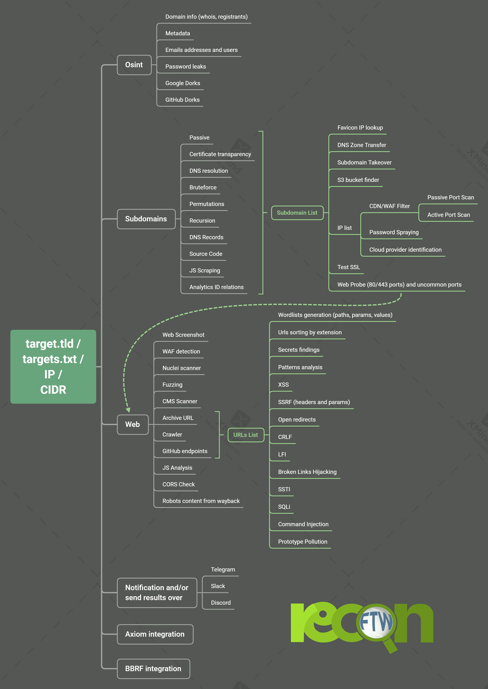

<h1 align="center">
  <br>
  <a href="https://github.com/six2dez/reconftw"></a>
  <br>
  reconFTW
  <br>
</h1>


<p align="center">
  <a href="https://github.com/six2dez/reconftw/releases/tag/v2.1.0">
    
  </a>
   </a>
  <a href="https://www.gnu.org/licenses/gpl-3.0.en.html">
      
  </a>
  <a href="https://twitter.com/Six2dez1">
    
  </a>
    <a href="https://github.com/six2dez/reconftw/issues?q=is%3Aissue+is%3Aclosed">
    
  </a>
  <a href="https://github.com/six2dez/reconftw/wiki">
    
  </a>
  <a href="https://t.me/joinchat/H5bAaw3YbzzmI5co">
    
  </a>
  <a href="https://hub.docker.com/r/six2dez/reconftw">
    
  </a>
</p>

 
<h3 align="center">Summary</h3>
 
**ReconFTW** automates the entire process of reconnaisance for you. It outperforms the work of subdomain enumeration along with various vulnerability checks and obtaining maximum information about your target.       
 
ReconFTW uses lot of techniques (passive, bruteforce, permutations, certificate transparency, source code scraping, analytics, DNS records...) for subdomain enumeration which helps you getting the maximum and the most interesting subdomains so that you be ahead of the competition.   
  
It also performs various vulnerability checks like XSS, Open Redirects, SSRF, CRLF, LFI, SQLi, SSL tests, SSTI, DNS zone transfers, and much more. Along with these, it performs OSINT techniques, directory fuzzing, dorking, ports scanning, screenshots, nuclei scan on your target.
 
So, what are you waiting for Go! Go! Go! :boom:
 

📔 Table of Contents
-----------------
- [💿 Installation:](#-installation)
  - [a) In your PC/VPS/VM](#a-in-your-pcvpsvm)
  - [b) Docker container 🐳 (2 options)](#b-docker-container--2-options)
    - [1) From DockerHub](#1-from-dockerhub)
    - [2) From repository](#2-from-repository)
- [⚙️ Config file:](#️-config-file)
- [Usage:](#usage)
- [Example Usage:](#example-usage)
- [Axiom Support: :cloud:](#axiom-support-cloud)
- [BBRF Support: :computer:](#bbrf-support-computer)
- [Sample video:](#sample-video)
- [:fire: Features :fire:](#fire-features-fire)
  - [Osint](#osint)
  - [Subdomains](#subdomains)
  - [Hosts](#hosts)
  - [Webs](#webs)
  - [Extras](#extras)
- [Mindmap/Workflow](#mindmapworkflow)
  - [Data Keep](#data-keep)
    - [Main commands:](#main-commands)
  - [How to contribute:](#how-to-contribute)
  - [Need help? :information_source:](#need-help-information_source)
  - [You can support this work buying me a coffee:](#you-can-support-this-work-buying-me-a-coffee)
- [Sponsors ❤️](#sponsors-️)
- [Thanks :pray:](#thanks-pray)
 
---
 
# 💿 Installation:
 
## a) In your PC/VPS/VM
 
> You can check out our wiki for the installation guide [Installation Guide](https://github.com/six2dez/reconftw/wiki/0.-Installation-Guide) :book:  
 
- Requires [Golang](https://golang.org/dl/) > **1.15.0+** installed and paths correctly set (**$GOPATH**, **$GOROOT**)
 
```bash
git clone https://github.com/six2dez/reconftw
cd reconftw/
./install.sh
./reconftw.sh -d target.com -r
```
 
## b) Docker container 🐳 (2 options)

- Docker parameters usage

``` bash
-d -> Detached 
-v $PWD/reconftw.cfg:/root/Tools/reconftw/reconftw.cfg -> Share CFG with the Docker
-v $PWD/Recon/:/root/Tools/reconftw/Recon/ -> Share output folder with the Host
--name reconftwSCAN -> Docker name
--rm -> Automatically remove the container when it exits
'-d target.com -r' -> reconftw parameters
```

### 1) From [DockerHub](https://hub.docker.com/r/six2dez/reconftw)
 
```bash
docker pull six2dez/reconftw:main
# Download and configure CFG file
wget https://raw.githubusercontent.com/six2dez/reconftw/main/reconftw.cfg
mkdir Recon
docker run -d -v $PWD/reconftw.cfg:/root/Tools/reconftw/reconftw.cfg -v $PWD/Recon/:/root/Tools/reconftw/Recon/ --name reconftwSCAN --rm six2dez/reconftw:main -d target.com -r
```
 
### 2) From repository
 
```bash
git clone https://github.com/six2dez/reconftw
cd reconftw/Docker
docker build -t reconftw .
docker run -v $PWD/reconftw.cfg:/root/Tools/reconftw/reconftw.cfg -v $PWD/Recon/:/root/Tools/reconftw/Recon/ --name reconftwSCAN --rm reconftw -d target.com -r

```
 
# ⚙️ Config file:
> A detailed explaintion of config file can be found here [Configuration file](https://github.com/six2dez/reconftw/wiki/3.-Configuration-file) :book:
 
- Through ```reconftw.cfg``` file the whole execution of the tool can be controlled.
- Hunters can set various scanning modes, execution preferences, tools, config files, APIs/TOKENS, personalized wordlists and much more.
 
<details>
 <br><br>
 <summary> :point_right: Click here to view default config file :point_left: </summary>
 
```yaml
#################################################################
#			reconFTW config file			#
#################################################################

# General values
tools=~/Tools
SCRIPTPATH="$( cd "$(dirname "$0")" >/dev/null 2>&1 ; pwd -P )"
profile_shell=".$(basename $(echo $SHELL))rc"
reconftw_version=$(git rev-parse --abbrev-ref HEAD)-$(git describe --tags)
update_resolvers=true
proxy_url="http://127.0.0.1:8080/"
#dir_output=/custom/output/path

# Golang Vars (Comment or change on your own)
export GOROOT=/usr/local/go
export GOPATH=$HOME/go
export PATH=$GOPATH/bin:$GOROOT/bin:$HOME/.local/bin:$PATH

# Tools config files
#NOTIFY_CONFIG=~/.config/notify/notify.conf # No need to define
#SUBFINDER_CONFIG=~/.config/subfinder/config.yaml # No need to define
AMASS_CONFIG=~/.config/amass/config.ini
GITHUB_TOKENS=${tools}/.github_tokens

# APIs/TOKENS - Uncomment the lines you want removing the '#' at the beginning of the line
#UDORK_COOKIE="c_user=XXXXXXXXXX; xs=XXXXXXXXXXXXXX"
#SHODAN_API_KEY="XXXXXXXXXXXXX"
#XSS_SERVER="XXXXXXXXXXXXXXXXX"
#COLLAB_SERVER="XXXXXXXXXXXXXXXXX"
#findomain_virustotal_token="XXXXXXXXXXXXXXXXX"
#findomain_spyse_token="XXXXXXXXXXXXXXXXX"
#findomain_securitytrails_token="XXXXXXXXXXXXXXXXX"
#findomain_fb_token="XXXXXXXXXXXXXXXXX"
#slack_channel="XXXXXXXX"
#slack_auth="xoXX-XXX-XXX-XXX"

# File descriptors
DEBUG_STD="&>/dev/null"
DEBUG_ERROR="2>/dev/null"

# Osint
OSINT=true
GOOGLE_DORKS=true
GITHUB_DORKS=true
METADATA=true
EMAILS=true
DOMAIN_INFO=true
METAFINDER_LIMIT=20 # Max 250

# Subdomains
SUBDOMAINS_GENERAL=true
SUBPASSIVE=true
SUBCRT=true
SUBANALYTICS=true
SUBBRUTE=true
SUBSCRAPING=true
SUBPERMUTE=true
SUBTAKEOVER=true
SUBRECURSIVE=true
SUB_RECURSIVE_PASSIVE=false # Uses a lot of API keys queries
ZONETRANSFER=true
S3BUCKETS=true
REVERSE_IP=false

# Web detection
WEBPROBESIMPLE=true
WEBPROBEFULL=true
WEBSCREENSHOT=true
UNCOMMON_PORTS_WEB="81,300,591,593,832,981,1010,1311,1099,2082,2095,2096,2480,3000,3128,3333,4243,4567,4711,4712,4993,5000,5104,5108,5280,5281,5601,5800,6543,7000,7001,7396,7474,8000,8001,8008,8014,8042,8060,8069,8080,8081,8083,8088,8090,8091,8095,8118,8123,8172,8181,8222,8243,8280,8281,8333,8337,8443,8500,8834,8880,8888,8983,9000,9001,9043,9060,9080,9090,9091,9092,9200,9443,9502,9800,9981,10000,10250,11371,12443,15672,16080,17778,18091,18092,20720,32000,55440,55672"
# You can change to aquatone if gowitness fails, comment the one you don't want
AXIOM_SCREENSHOT_MODULE=webscreenshot # Choose between aquatone,gowitness,webscreenshot

# Host
FAVICON=true
PORTSCANNER=true
PORTSCAN_PASSIVE=true
PORTSCAN_ACTIVE=true
CLOUD_IP=true

# Web analysis
WAF_DETECTION=true
NUCLEICHECK=true
NUCLEI_SEVERITY="info,low,medium,high,critical"
URL_CHECK=true
URL_GF=true
URL_EXT=true
JSCHECKS=true
FUZZ=true
CMS_SCANNER=true
WORDLIST=true
ROBOTSWORDLIST=true

# Vulns
VULNS_GENERAL=false
XSS=true
CORS=true
TEST_SSL=true
OPEN_REDIRECT=true
SSRF_CHECKS=true
CRLF_CHECKS=true
LFI=true
SSTI=true
SQLI=true
BROKENLINKS=true
SPRAY=true
COMM_INJ=true
PROTO_POLLUTION=true

# Extra features
NOTIFICATION=false # Notification for every function
SOFT_NOTIFICATION=false # Only for start/end
DEEP=false
DEEP_LIMIT=500
DIFF=false
REMOVETMP=false
REMOVELOG=false
PROXY=false
SENDZIPNOTIFY=false
PRESERVE=true      # set to true to avoid deleting the .called_fn files on really large scans

# HTTP options
HEADER="User-Agent: Mozilla/5.0 (X11; Linux x86_64; rv:72.0) Gecko/20100101 Firefox/72.0"

# Threads
FFUF_THREADS=40
HTTPX_THREADS=50
HTTPX_UNCOMMONPORTS_THREADS=100
GOSPIDER_THREADS=50
GITDORKER_THREADS=5
BRUTESPRAY_THREADS=20
BRUTESPRAY_CONCURRENCE=10
ARJUN_THREADS=20
GAUPLUS_THREADS=10
DALFOX_THREADS=200
PUREDNS_PUBLIC_LIMIT=0 # Set between 2000 - 10000 if your router blows up, 0 is unlimited
PUREDNS_TRUSTED_LIMIT=400
WEBSCREENSHOT_THREADS=200
RESOLVE_DOMAINS_THREADS=150
PPFUZZ_THREADS=30

# Timeouts
CMSSCAN_TIMEOUT=3600
FFUF_MAXTIME=900                # Seconds
HTTPX_TIMEOUT=10                # Seconds
HTTPX_UNCOMMONPORTS_TIMEOUT=10  # Seconds

# lists
fuzz_wordlist=${tools}/fuzz_wordlist.txt
lfi_wordlist=${tools}/lfi_wordlist.txt
ssti_wordlist=${tools}/ssti_wordlist.txt
subs_wordlist=${tools}/subdomains.txt
subs_wordlist_big=${tools}/subdomains_big.txt
resolvers=${tools}/resolvers.txt
resolvers_trusted=${tools}/resolvers_trusted.txt

# Axiom Fleet
# Will not start a new fleet if one exist w/ same name and size (or larger)
AXIOM=false
AXIOM_FLEET_LAUNCH=false
AXIOM_FLEET_NAME="reconFTW"
AXIOM_FLEET_COUNT=10
AXIOM_FLEET_REGIONS="eu-central"
AXIOM_FLEET_SHUTDOWN=true
# This is a script on your reconftw host that might prep things your way...
#AXIOM_POST_START="~/Tools/axiom_config.sh"

# BBRF
BBRF_CONNECTION=false
BBRF_SERVER=https://demo.bbrf.me/bbrf
BBRF_USERNAME=user
BBRF_PASSWORD=password

# TERM COLORS
bred='\033[1;31m'
bblue='\033[1;34m'
bgreen='\033[1;32m'
yellow='\033[0;33m'
red='\033[0;31m'
blue='\033[0;34m'
green='\033[0;32m'
reset='\033[0m'

	
```
</details>
 
# Usage:
 
> Check out the wiki section to know which flag performs what all steps/attacks [Usage Guide](https://github.com/six2dez/reconftw/wiki/2.-Usage-Guide) :book:
 
**TARGET OPTIONS**
 
| Flag | Description |
|------|-------------|
| -d | Single Target domain *(example.com)*  |
| -l | List of targets *(one per line)* |
| -m | Multiple domain target *(companyName)*  |
| -x | Exclude subdomains list *(Out Of Scope)* |
| -i | Include subdomains list *(In Scope)* |
 
**MODE OPTIONS**
 
| Flag | Description |
|------|-------------|
| -r | Recon - Full recon process (without attacks like sqli,ssrf,xss,ssti,lfi etc.) |
| -s | Subdomains - Perform only subdomain enumeration, web probing, subdomain takeovers |
| -p | Passive - Perform only passive steps |
| -a | All - Perform whole recon and all active attacks |
| -w | Web - Perform only vulnerability checks/attacks on particular target |
| -n | OSINT - Performs an OSINT scan (no subdomain enumeration and attacks) |
| -c | Custom - Launches specific function against target |
| -h | Help - Show this help menu |
 
**GENERAL OPTIONS**
 
| Flag | Description |
|------|-------------|
| --deep | Deep scan (Enable some slow options for deeper scan, _vps intended mode_) |
| -f | Custom config file path |
| -o | Output directory |
| -v | Axiom distributed VPS |
 
# Example Usage:
 
**To perform a full recon on single target**
 
```bash
./reconftw.sh -d target.com -r
```
 
**To perform a full recon on a list of targets**
 
```bash
./reconftw.sh -l sites.txt -r -o /output/directory/
```
 

**Perform full recon with more time intense tasks** *(VPS intended only)*
 
```bash
./reconftw.sh -d target.com -r --deep -o /output/directory/
```
 
**Perform recon in a multi domain target**
 
```bash
./reconftw.sh -m company -l domains_list.txt -r
```

**Perform recon with axiom integration**
 
```bash
./reconftw.sh -d target.com -r -v
```
 
 **Perform all steps (whole recon + all attacks) a.k.a. YOLO mode**
 
```bash
./reconftw.sh -d target.com -a
```

**Show help section**
 
```bash
./reconftw.sh -h
```
 
# Axiom Support: :cloud:

> Check out the wiki section for more info [Axiom Support](https://github.com/six2dez/reconftw/wiki/5.-Axiom-version)
* As reconFTW actively hits the target with a lot of web traffic, hence there was a need to move to Axiom distributing the work load among various instances leading to reduction of execution time.
* During the configuration of axiom you need to select `reconftw` as provisoner.  
* You can create your own axiom's fleet before running reconFTW or let reconFTW to create and destroy it automatically just modifying reconftw.cfg file.

# BBRF Support: :computer:
* To add reconFTW results to your [BBRF instance](https://github.com/honoki/bbrf-server) just add IP and credentials on reconftw.cfg file section dedicated to bbrf.
* During the execution of the scans the results will be added dinamically when each step ends.
* Even you can set up locally your BBRF instance to be able to visualize your results in a fancy web UI.
 
# Sample video:
 

 
# :fire: Features :fire:
 
 ## Osint
- Domain information parser ([domainbigdata](https://domainbigdata.com/))
- Emails addresses and users ([theHarvester](https://github.com/laramies/theHarvester), [emailfinder](https://github.com/Josue87/EmailFinder))
- Password leaks ([pwndb](https://github.com/davidtavarez/pwndb) and [H8mail](https://github.com/khast3x/h8mail))
- Metadata finder ([MetaFinder](https://github.com/Josue87/MetaFinder))
- Google Dorks ([uDork](https://github.com/m3n0sd0n4ld/uDork))
- Github Dorks ([GitDorker](https://github.com/obheda12/GitDorker))
## Subdomains
  - Passive ([subfinder](https://github.com/projectdiscovery/subfinder), [assetfinder](https://github.com/tomnomnom/assetfinder), [amass](https://github.com/OWASP/Amass), [findomain](https://github.com/Findomain/Findomain), [crobat](https://github.com/cgboal/sonarsearch), [waybackurls](https://github.com/tomnomnom/waybackurls), [github-subdomains](https://github.com/gwen001/github-subdomains), [Anubis](https://jldc.me), [gauplus](https://github.com/bp0lr/gauplus))
  - Certificate transparency ([ctfr](https://github.com/UnaPibaGeek/ctfr), [tls.bufferover](tls.bufferover.run) and [dns.bufferover](dns.bufferover.run)))
  - Bruteforce ([puredns](https://github.com/d3mondev/puredns))
  - Permutations ([Gotator](https://github.com/Josue87/gotator))
  - JS files & Source Code Scraping ([gospider](https://github.com/jaeles-project/gospider))
  - DNS Records ([dnsx](https://github.com/projectdiscovery/dnsx))
  - Google Analytics ID ([AnalyticsRelationships](https://github.com/Josue87/AnalyticsRelationships))
  - Recursive search.
  - Subdomains takeover ([nuclei](https://github.com/projectdiscovery/nuclei))
  - DNS takeover ([dnstake](https://github.com/pwnesia/dnstake))
  - DNS Zone Transfer ([dnsrecon](https://github.com/darkoperator/dnsrecon))

## Hosts
- IP and subdomains WAF checker ([cf-check](https://github.com/dwisiswant0/cf-check) and [wafw00f](https://github.com/EnableSecurity/wafw00f))
- Port Scanner (Active with [nmap](https://github.com/nmap/nmap) and passive with [shodan-cli](https://cli.shodan.io/), Subdomains IP resolution with[resolveDomains](https://github.com/Josue87/resolveDomains))
- Port services vulnerability checks ([searchsploit](https://github.com/offensive-security/exploitdb))
- Password spraying ([brutespray](https://github.com/x90skysn3k/brutespray))
- Cloud providers check ([clouddetect](https://github.com/99designs/clouddetect))

## Webs
- Web Prober ([httpx](https://github.com/projectdiscovery/httpx) and [unimap](https://github.com/Edu4rdSHL/unimap))
- Web screenshot ([webscreenshot](https://github.com/maaaaz/webscreenshot) or [gowitness](https://github.com/sensepost/gowitness))
- Web templates scanner ([nuclei](https://github.com/projectdiscovery/nuclei) and [nuclei geeknik](https://github.com/geeknik/the-nuclei-templates.git))
- Url extraction ([waybackurls](https://github.com/tomnomnom/waybackurls), [gauplus](https://github.com/bp0lr/gauplus), [gospider](https://github.com/jaeles-project/gospider), [github-endpoints](https://gist.github.com/six2dez/d1d516b606557526e9a78d7dd49cacd3) and [JSA](https://github.com/w9w/JSA))
- URLPatterns Search ([gf](https://github.com/tomnomnom/gf) and [gf-patterns](https://github.com/1ndianl33t/Gf-Patterns))
- XSS ([dalfox](https://github.com/hahwul/dalfox))
- Open redirect ([Oralyzer](https://github.com/r0075h3ll/Oralyzer))
- SSRF (headers [interactsh](https://github.com/projectdiscovery/interactsh) and param values with [ffuf](https://github.com/ffuf/ffuf))
- CRLF ([crlfuzz](https://github.com/dwisiswant0/crlfuzz))
- Favicon Real IP ([fav-up](https://github.com/pielco11/fav-up))
- Javascript analysis ([subjs](https://github.com/lc/subjs), [JSA](https://github.com/w9w/JSA), [LinkFinder](https://github.com/GerbenJavado/LinkFinder), [getjswords](https://github.com/m4ll0k/BBTz))
- Fuzzing ([ffuf](https://github.com/ffuf/ffuf))
- Cors ([Corsy](https://github.com/s0md3v/Corsy))
- LFI Checks ([ffuf](https://github.com/ffuf/ffuf))
- SQLi Check ([SQLMap](https://github.com/sqlmapproject/sqlmap))
- SSTI ([ffuf](https://github.com/ffuf/ffuf))
- CMS Scanner ([CMSeeK](https://github.com/Tuhinshubhra/CMSeeK))
- SSL tests ([testssl](https://github.com/drwetter/testssl.sh))
- Broken Links Checker ([gospider](https://github.com/jaeles-project/gospider))
- S3 bucket finder ([S3Scanner](https://github.com/sa7mon/S3Scanner))
- Prototype Pollution ([ppfuzz](https://github.com/dwisiswant0/ppfuzz))
- URL sorting by extension
- Wordlist generation
- Passwords dictionary creation ([pydictor](https://github.com/LandGrey/pydictor))

## Extras
- Multithread ([Interlace](https://github.com/codingo/Interlace))
- Custom resolvers generated list ([dnsvalidator](https://github.com/vortexau/dnsvalidator))
- Docker container included and [DockerHub](https://hub.docker.com/r/six2dez/reconftw) integration
- Allows IP/CIDR as target
- Resume the scan from last performed step
- Custom output folder option
- All in one installer/updater script compatible with most distros
- Diff support for continuous running (cron mode)
- Support for targets with multiple domains
- Raspberry Pi/ARM support
- 6 modes (recon, passive, subdomains, web, osint and all)
- Out of Scope Support
- Notification system with Slack, Discord and Telegram ([notify](https://github.com/projectdiscovery/notify)) and sending zipped results support
 
# Mindmap/Workflow
 

 
## Data Keep
 
Follow these simple steps to end up having a private repository with your `API Keys` and `/Recon` data.
 
* Create a private __blank__ repository on `Git(Hub|Lab)` (Take into account size limits regarding Recon data upload)
* Clone your project: `git clone https://gitlab.com/example/reconftw-data`
* Get inside the cloned repository: `cd reconftw-data`
* Create branch with an empty commit: `git commit --allow-empty -m "Empty commit"`
* Add official repo as a new remote: `git remote add upstream https://github.com/six2dez/reconftw` (`upstream` is an example)
* Update upstream's repo: `git fetch upstream`
* Rebase current branch with the official one: `git rebase upstream/main master`
 
### Main commands:
 
* Upload changes to your personal repo: `git add . && git commit -m "Data upload" && git push origin master`
* Update tool anytime: `git fetch upstream && git rebase upstream/main master`
 
## How to contribute:
 
If you want to contribute to this project you can do it in multiple ways:
- Submitting an [issue](https://github.com/six2dez/reconftw/issues/new/choose) because you have found a bug or you have any suggestion or request.
- Making a Pull Request from [dev](https://github.com/six2dez/reconftw/tree/dev) branch because you want to improve the code or add something to the script.
 
## Need help? :information_source:
 
- Take a look at the [wiki](https://github.com/six2dez/reconftw/wiki) section.  
- Check [FAQ](https://github.com/six2dez/reconftw/wiki/7.-FAQs) for commonly asked questions.  
- Ask for help in the [Telegram group](https://t.me/joinchat/TO_R8NYFhhbmI5co)
 
## You can support this work buying me a coffee:
 
[](https://www.buymeacoffee.com/six2dez)

 
# Sponsors ❤️
**This section shows the current financial sponsors of this project**  
 
 
[](https://github.com/0xtavian)

# Thanks :pray:
* Thank you for lending a helping hand towards the development of the project!
 
- [Spyse](https://spyse.com/)
- [Networksdb](https://networksdb.io/)
- [Intelx](https://intelx.io/)
- [BinaryEdge](https://www.binaryedge.io/)
- [Censys](https://censys.io/)
- [CIRCL](https://www.circl.lu/)
- [Whoxy](https://www.whoxy.com/)
