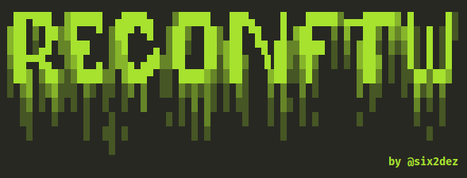

<h1 align="center">
  <br>
  <a href="https://github.com/six2dez/reconftw"></a>
  <br>
  ReconFTW
  <br>
</h1>

<h4 align="center">A simple bash script for full recon</h4>

<p align="center">
  <a href="https://github.com/six2dez/reconftw/releases/tag/0.9-beta1">
    
  </a>
   </a>
  <a href="https://www.gnu.org/licenses/gpl-3.0.en.html">
      
  </a>
  <a href="https://twitter.com/Six2dez1">
    
  </a>
</p>

:warning: ***Warning*** :warning:

This is a live development project, until the first stable release (1.0) it will be constantly updated in master branch, so if you have detected any bug, you can open an issue or ping me over [Telegram](https://t.me/six2dez) or [Twitter](https://twitter.com/Six2dez1) and I will try to do my best :)

# Table of Contents
-   [Summary](#summary)
-   [Installation](#installation)
-   [Usage](#usage)
-   [Features](#features)
-   [Mindmap](#mindmapworkflow)
-   [Improvement plan](#improvement-plan)
-   [Thanks](#thanks)


## Summary

ReconFTW performs automated enumeration of subdomains via various techniques and futher scanning for vulnerabilties, to give you a potential vulns.


## Installation
- [Installation Guide](https://github.com/six2dez/reconftw/wiki)
- Requires [Golang](https://golang.org/dl/) > 1.14 installed and paths correctly set ($GOPATH,$GOROOT)

```bash
git clone https://github.com/six2dez/reconftw
cd reconftw
chmod +x *.sh
./install.sh
./reconftw.sh -d target.com -a
```

- It is highly recommended, and in some cases essential, to set your api keys or env variables:
  - amass (```~/.config/amass/config.ini```)
  - subfinder (```~/.config/subfinder/config.yaml```)
  - git-hound (```~/.githound/config.yml```)
  - github-endpoints.py (```GITHUB_TOKEN``` env var)
  - favup (```shodan init <SHODANPAIDAPIKEY>```)
  - SSRF Server (```COLLAB_SERVER``` env var) 
  - Blind XSS Server (```XSS_SERVER``` env var) 
- This script uses dalfox with blind-xss option, you must change to your own server, check xsshunter.com.

## Usage
<pre>

<b>TARGET OPTIONS</b>
-d DOMAIN        Target domain
-l list.txt      Targets list, one per line

<b>MODE OPTIONS</b>
-a               Perform all checks
-s               Full subdomains scan (Subs, tko and probe)
-g               Google dorks searches
-w               Perform web checks only without subs (-l required)
-t               Check subdomain takeover(-l required)
-i               Check all needed tools
-v               Debug/verbose mode, no file descriptor redir
-h               Show this help

<b>SUBDOMAIN OPTIONS</b>
--sp             Passive subdomain scans
--sb             Bruteforce subdomain resolution
--sr             Subdomain permutations and resolution (-l required)
--ss             Subdomain scan by scraping (-l required)

<b>OUTPUT OPTIONS</b>
-o output/path   Define output folder

</pre>

## Features 

- Google Dorks (based on deggogle_hunter)
- Subdomain enumeration (passive, resolution, bruteforce and permutations)
- Sub TKO (subjack and nuclei)
- Web Prober (httpx)
- Web screenshot (aquatone)
- Template scanner (nuclei)
- Port Scanner (naabu)
- Url extraction (waybackurls, gau, hakrawler, github-endpoints)
- Pattern Search (gf and gf-patterns)
- Param discovery (paramspider and arjun)
- XSS (Gxss and dalfox)
- Open redirect (Openredirex)
- SSRF checks (from m4ll0k/Bug-Bounty-Toolz/SSRF.py)
- Github Check (git-hound)
- Favicon Real IP (fav-up)
- JS Checks (LinkFinder, SecretFinder, scripts from JSFScan)
- Fuzzing (ffuf)
- Cors (Corsy)
- SSL Check (testssl)
- Interlace integration
- Custom output folder (default under Recon/target.com/)
- Run standalone steps (subdomains, subtko, web, gdorks...)
- Polished installer compatible with most distros
- Verbose mode
- Update tools script
- Raspberry supported

## Mindmap/Workflow


## Improvement plan:

These are the last features that we have implemented, take a look at our pending [features](https://github.com/six2dez/reconftw/labels/feature) or suggest a new feature in the issues section:

:heavy_check_mark: Open Redirect with Openredirex  
:heavy_check_mark: SSRF Checks  
:heavy_check_mark: More error checks  
:heavy_check_mark: More verbose  
:heavy_check_mark: Enhance this Readme  
:heavy_check_mark: Customize output folder  
:heavy_check_mark: Interlace usage  
:heavy_check_mark: Crawler  
:heavy_check_mark: SubDomainizer  
:heavy_check_mark: Install script  
:heavy_check_mark: Apt,rpm,pacman compatible installer  


You can support this work buying me a coffee:

[](https://www.buymeacoffee.com/six2dez)

## Thanks
For their great feedback, support, help or for nothing special but well deserved:
- [@detonXX](https://twitter.com/detonXX)
- [@cyph3r_asr](https://twitter.com/cyph3r_asr)
- [@h4ms1k](https://twitter.com/h4ms1k)
- [@Bileltechno](https://twitter.com/BilelEljaamii)
