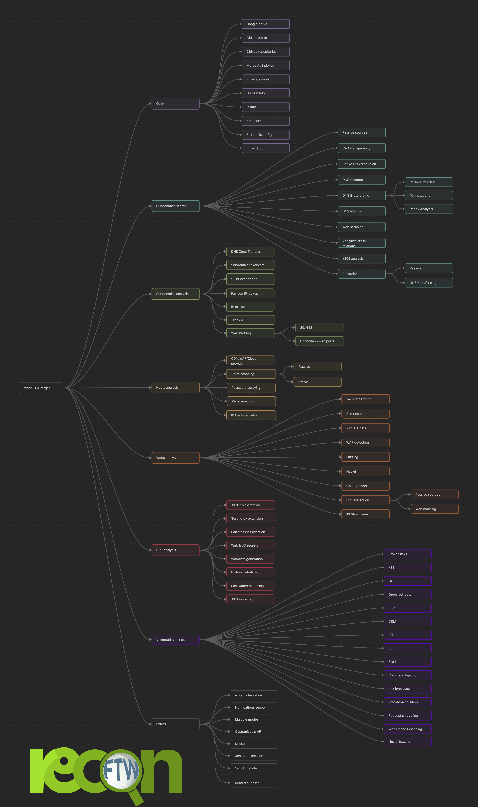

<h1 align="center">
  <br>
  <a href="https://github.com/six2dez/reconftw"></a>
  <br>
  reconFTW
  <br>
</h1>

<p align="center">
  <a href="https://github.com/six2dez/reconftw/releases/tag/v3.2">
    
  </a>
   </a>
  <a href="https://opensource.org/licenses/MIT">
      
  </a>
  <a href="https://twitter.com/Six2dez1">
    
  </a>
    <a href="https://github.com/six2dez/reconftw/issues?q=is%3Aissue+is%3Aclosed">
    
  </a>
  <a href="https://github.com/six2dez/reconftw/wiki">
    
  </a>
  <a href="https://t.me/joinchat/H5bAaw3YbzzmI5co">
    
  </a>
  <a href="https://discord.gg/R5DdXVEdTy">
    
  </a>
</p>

**reconFTW** is a powerful automated reconnaissance tool designed for security researchers and penetration testers. It streamlines the process of gathering intelligence on a target by performing subdomain enumeration, vulnerability scanning, OSINT and more. With a modular design, extensive configuration options, and support for distributed scanning via AX Framework, reconFTW is built to deliver comprehensive results efficiently.

reconFTW leverages a wide range of techniques, including passive and active subdomain discovery, web vulnerability checks (e.g., XSS, SSRF, SQLi), OSINT, directory fuzzing, port scanning and screenshotting. It integrates with cutting-edge tools and APIs to maximize coverage and accuracy, ensuring you stay ahead in your reconnaissance efforts.

**Key Features:**

- Comprehensive subdomain enumeration (passive, bruteforce, permutations, certificate transparency, etc.)
- Vulnerability scanning for XSS, SSRF, SQLi, LFI, SSTI, and more
- OSINT for emails, metadata, API leaks, and third-party misconfigurations
- Distributed scanning with AX Framework for faster execution
- Customizable workflows with a detailed configuration file
- Integration with Faraday for reporting and visualization
- Support for Docker, Terraform and Ansible deployments

**Disclaimer:** Usage of reconFTW for attacking targets without prior consent is illegal. It is the user's responsibility to obey all applicable laws. The developers assume no liability for misuse or damage caused by this tool. Use responsibly.

---

## 📔 Table of Contents

- [📔 Table of Contents](#-table-of-contents)
- [✨ Features](#-features)
  - [OSINT](#osint)
  - [Subdomains](#subdomains)
  - [Hosts](#hosts)
  - [Web Analysis](#web-analysis)
  - [Vulnerability Checks](#vulnerability-checks)
  - [Extras](#extras)
- [💿 Installation](#-installation)
  - [Local Installation (PC/VPS/VM)](#local-installation-pcvpsvm)
  - [Docker](#docker)
  - [Terraform + Ansible](#terraform--ansible)
- [⚙️ Configuration](#️-configuration)
- [🚀 Usage](#-usage)
  - [Target Options](#target-options)
  - [Mode Options](#mode-options)
  - [General Options](#general-options)
  - [Example Usage](#example-usage)
- [☁️ Ax Framework Support (previously Axiom)](#️-ax-framework-support-previously-axiom)
- [💻 Faraday Support](#-faraday-support)
- [🧠 AI Integration](#-ai-integration)
- [🗂️ Data Management](#️-data-management)
  - [Makefile](#makefile)
  - [Manual](#manual)
- [Mindmap/Workflow](#mindmapworkflow)
- [Sample video](#sample-video)
- [🤝 How to Contribute](#-how-to-contribute)
- [❓ Need Help?](#-need-help)
- [💖 Support This Project](#-support-this-project)
- [🙏 Thanks](#-thanks)
- [📜 License](#-license)
- [⭐ Star History](#-star-history)

---

## ✨ Features

reconFTW is packed with features to make reconnaissance thorough and efficient. Below is a detailed breakdown of its capabilities, updated to reflect the latest functionality in the script and configuration.

### OSINT

- **Domain Information**: WHOIS lookup for domain registration details ([whois](https://github.com/rfc1036/whois)).
- **Email and Password Leaks**: Searches for leaked emails and credentials ([emailfinder](https://github.com/Josue87/EmailFinder) and [LeakSearch](https://github.com/JoelGMSec/LeakSearch)).
- **Microsoft 365/Azure Mapping**: Identifies Microsoft 365 and Azure tenants ([msftrecon](https://github.com/Arcanum-Sec/msftrecon)).
- **Metadata Extraction**: Extracts metadata from indexed office documents ([metagoofil](https://github.com/opsdisk/metagoofil)).
- **API Leaks**: Detects exposed APIs in public sources ([porch-pirate](https://github.com/MandConsultingGroup/porch-pirate) and [SwaggerSpy](https://github.com/UndeadSec/SwaggerSpy)).
- **Google Dorking**: Automated Google dork queries for sensitive information ([dorks_hunter](https://github.com/six2dez/dorks_hunter) and [xnldorker](https://github.com/xnl-h4ck3r/xnldorker)).
- **GitHub Analysis**: Scans GitHub organizations for repositories and secrets ([enumerepo](https://github.com/trickest/enumerepo), [trufflehog](https://github.com/trufflesecurity/trufflehog) and [gitleaks](https://github.com/gitleaks/gitleaks)).
- **Third-Party Misconfigurations**: Identifies misconfigured third-party services ([misconfig-mapper](https://github.com/intigriti/misconfig-mapper)).
- **Mail Hygiene**: Reviews SPF/DMARC configuration to flag spoofing or deliverability issues.
- **Cloud Storage Enumeration**: Surveys buckets across major providers for exposure ([cloud_enum](https://github.com/initstring/cloud_enum)).
- **Spoofable Domains**: Checks for domains vulnerable to spoofing ([spoofcheck](https://github.com/MattKeeley/Spoofy)).

### Subdomains

- **Passive Enumeration**: Uses APIs and public sources for subdomain discovery ([subfinder](https://github.com/projectdiscovery/subfinder) and [github-subdomains](https://github.com/gwen001/github-subdomains)).
- **Certificate Transparency**: Queries certificate transparency logs ([crt](https://github.com/cemulus/crt)).
- **NOERROR Discovery**: Identifies subdomains with DNS NOERROR responses ([dnsx](https://github.com/projectdiscovery/dnsx), more info [here](https://www.securesystems.de/blog/enhancing-subdomain-enumeration-ents-and-noerror/)).
- **Bruteforce**: Performs DNS bruteforcing with customizable wordlists ([puredns](https://github.com/d3mondev/puredns) and custom wordlists).
- **Permutations**: Generates subdomain permutations using AI, regex and tools ([Gotator](https://github.com/Josue87/gotator), [ripgen](https://github.com/resyncgg/ripgen), [regulator](https://github.com/cramppet/regulator) and [subwiz](https://github.com/hadriansecurity/subwiz)).
- **Web Scraping**: Extracts subdomains from web crawling and JS files ([katana](https://github.com/projectdiscovery/katana)).
- **DNS Records**: Resolves DNS records for subdomains ([dnsx](https://github.com/projectdiscovery/dnsx)).
- **Google Analytics**: Identifies subdomains via Analytics IDs ([AnalyticsRelationships](https://github.com/Josue87/AnalyticsRelationships)).
- **TLS Handshake**: Discovers subdomains via TLS ports ([tlsx](https://github.com/projectdiscovery/tlsx)).
- **Recursive Search**: Performs recursive passive or bruteforce enumeration combined ([dsieve](https://github.com/trickest/dsieve)).
- **Subdomain Takeover**: Detects vulnerable subdomains ([nuclei](https://github.com/projectdiscovery/nuclei) and [dnstake](https://github.com/pwnesia/dnstake)).
- **DNS Zone Transfer**: Checks for misconfigured DNS zone transfers ([dig](https://linux.die.net/man/1/dig)).
- **Cloud Buckets**: Identifies misconfigured S3 buckets ([S3Scanner](https://github.com/sa7mon/S3Scanner) and [CloudHunter](https://github.com/belane/CloudHunter)).
- **Reverse IP Lookup**: Discovers subdomains via IP ranges ([hakip2host](https://github.com/hakluke/hakip2host)).

### Hosts

- **IP Information**: Retrieves geolocation and WHOIS data ([ipinfo](https://www.ipinfo.io/)).
- **CDN Detection**: Identifies IPs behind CDNs ([cdncheck](https://github.com/projectdiscovery/cdncheck)).
- **WAF Detection**: Detects Web Application Firewalls ([wafw00f](https://github.com/EnableSecurity/wafw00f)).
- **Port Scanning**: Active scanning with [nmap](https://github.com/nmap/nmap) and passive scanning with [smap](https://github.com/s0md3v/Smap).
- **Service Vulnerabilities**: Checks for vulnerabilities in open ports ([vulners](https://github.com/vulnersCom/nmap-vulners)).
- **Password Spraying**: Attempts password spraying on identified services ([brutespray](https://github.com/x90skysn3k/brutespray)).
- **Geolocation**: Maps IP addresses to geographic locations ([ipinfo](https://www.ipinfo.io/)).
- **IPv6 Discovery**: Optionally enumerates and scans discovered IPv6 targets when `IPV6_SCAN` is enabled.

### Web Analysis

- **Web Probing**: Detects live web servers on standard and uncommon ports (([httpx](https://github.com/projectdiscovery/httpx))).
- **Screenshots**: Captures screenshots of web pages ([nuclei](https://github.com/projectdiscovery/nuclei)).
- **Virtual Host Fuzzing**: Identifies virtual hosts by fuzzing HTTP headers ([VhostFinder](https://github.com/wdahlenburg/VhostFinder)).
- **CMS Detection**: Identifies content management systems ([CMSeeK](https://github.com/Tuhinshubhra/CMSeeK)).
- **URL Extraction**: Collects URLs passively and actively ([urlfinder](https://github.com/projectdiscovery/urlfinder), [katana](https://github.com/projectdiscovery/katana), [github-endpoints](https://gist.github.com/six2dez/d1d516b606557526e9a78d7dd49cacd3) and [JSA](https://github.com/w9w/JSA)).
- **URL Pattern Analysis**: Classifies URLs using patterns ([urless](https://github.com/xnl-h4ck3r/urless), [gf](https://github.com/tomnomnom/gf) and [gf-patterns](https://github.com/1ndianl33t/Gf-Patterns)).
- **Favicon Analysis**: Discovers real IPs behind favicons ([fav-up](https://github.com/pielco11/fav-up)).
- **JavaScript Analysis**: Extracts secrets and endpoints from JS files ([subjs](https://github.com/lc/subjs), [JSA](https://github.com/w9w/JSA), [xnLinkFinder](https://github.com/xnl-h4ck3r/xnLinkFinder), [getjswords](https://github.com/m4ll0k/BBTz), [mantra](https://github.com/MrEmpy/mantra), [jsluice](https://github.com/BishopFox/jsluice)).
- **Source Map Extraction**: Retrieves sensitive data from JavaScript source maps ([sourcemapper](https://github.com/denandz/sourcemapper)).
- **GraphQL Detection**: Discovers GraphQL endpoints with nuclei and optionally performs in-depth introspection ([GQLSpection](https://github.com/doyensec/GQLSpection)).
- **Parameter Discovery**: Bruteforces hidden parameters on endpoints ([arjun](https://github.com/s0md3v/Arjun)).
- **WebSocket Auditing**: Validates upgrade handshakes and origin handling on `ws://` and `wss://` endpoints.
- **gRPC Reflection**: Probes common gRPC ports for exposed service reflection ([grpcurl](https://github.com/fullstorydev/grpcurl)).
- **Fuzzing**: Performs directory and parameter fuzzing ([ffuf](https://github.com/ffuf/ffuf)).
- **File Extension Sorting**: Organizes URLs by file extensions.
- **Wordlist Generation**: Creates custom wordlists for fuzzing.
- **Password Dictionary**: Generates password dictionaries ([pydictor](https://github.com/LandGrey/pydictor)).
- **IIS Shortname Scanning**: Detects IIS shortname vulnerabilities ([shortscan](https://github.com/bitquark/shortscan) and [sns](https://github.com/sw33tLie/sns)).

### Vulnerability Checks

- **CVEs**: Checks for CVE and common vulnerabilites [nuclei](https://github.com/projectdiscovery/nuclei)
- **XSS**: Tests for cross-site scripting vulnerabilities ([dalfox](https://github.com/hahwul/dalfox)).
- **CORS**: Identifies CORS misconfigurations ([Corsy](https://github.com/s0md3v/Corsy)).
- **SSL/TLS**: Checks for SSL/TLS misconfigurations ([testssl](https://github.com/drwetter/testssl.sh)).
- **Open Redirects**: Detects open redirect vulnerabilities ([Oralyzer](https://github.com/r0075h3ll/Oralyzer)).
- **SSRF**: Tests for server-side request forgery ([interactsh](https://github.com/projectdiscovery/interactsh) and param values with [ffuf](https://github.com/ffuf/ffuf)).
- **CRLF**: Checks for CRLF injection vulnerabilities ([crlfuzz](https://github.com/dwisiswant0/crlfuzz)).
- **LFI**: Tests for local file inclusion via fuzzing ([ffuf](https://github.com/ffuf/ffuf)).
- **SSTI**: Detects server-side template injection ([ffuf](https://github.com/ffuf/ffuf)).
- **SQLi**: Tests for SQL injection ([SQLMap](https://github.com/sqlmapproject/sqlmap) and [ghauri](https://github.com/r0oth3x49/ghauri)).
- **Broken Links**: Identifies broken links on web pages ([katana](https://github.com/projectdiscovery/katana)).
- **Command Injection**: Tests for command injection vulnerabilities ([commix](https://github.com/commixproject/commix)).
- **Prototype Pollution**: Detects JavaScript prototype pollution ([ppmap](https://github.com/kleiton0x00/ppmap)).
- **HTTP Request Smuggling**: Checks for request smuggling vulnerabilities ([smugglex](https://github.com/hahwul/smugglex)).
- **Web Cache**: Identifies web cache vulnerabilities ([Web-Cache-Vulnerability-Scanner](https://github.com/Hackmanit/Web-Cache-Vulnerability-Scanner)).
- **4XX Bypassing**: Attempts to bypass 4XX responses ([nomore403](https://github.com/devploit/nomore403)).
- **Parameter Fuzzing**: Fuzzes URL parameters for vulnerabilities ([nuclei](https://github.com/projectdiscovery/nuclei)).

### Extras

- **Multithreading**: Optimizes performance ([Interlace](https://github.com/codingo/Interlace)).
- **Custom Resolvers**: Generates DNS resolvers ([dnsvalidator](https://github.com/vortexau/dnsvalidator)).
- **Docker Support**: Official Docker image on [DockerHub](https://hub.docker.com/r/six2dez/reconftw).
- **AWS Deployment**: Deploys via Terraform and Ansible.
- **IP/CIDR Support**: Scans IP ranges and CIDR blocks.
- **Scan Resumption**: Resumes scans from the last completed step.
- **Custom Output**: Saves results to a user-defined directory.
- **Diff Mode**: Highlights new findings in subsequent scans.
- **Scope Filtering**: Supports in-scope and out-of-scope lists ([inscope](https://github.com/tomnomnom/hacks/tree/master/inscope)).
- **Notifications**: Sends alerts via Slack, Discord, or Telegram ([notify](https://github.com/projectdiscovery/notify)).
- **Result Zipping**: Compresses and sends results.
- **Faraday Integration**: Exports results to [Faraday](https://github.com/infobyte/faraday) for reporting .
- **AI Report Generation**: Generates reports using local AI models ([reconftw_ai](https://github.com/six2dez/reconftw_ai)).
- **Quick Rescan Mode**: Skips heavy stages automatically when no new assets are discovered (`--quick-rescan` / `QUICK_RESCAN`).
- **Hotlist Builder**: Scores and highlights the riskiest assets (`hotlist.txt`) based on new findings.
- **Command Tracing**: Toggle `SHOW_COMMANDS` to log every executed command into target logs for debugging.
- **Asset Store**: Appends findings to `assets.jsonl` for downstream automation when `ASSET_STORE` is enabled.
- **ARM Support**: Compatible with Raspberry Pi and ARM architectures (including MacOS MX).

---

## 💿 Installation

reconFTW supports multiple installation methods to suit different environments. Ensure you have sufficient disk space (at least 10 GB recommended) and a stable internet connection.

### Quickstart

1) Clone and install

```yaml
git clone https://github.com/six2dez/reconftw
cd reconftw
./install.sh --verbose
```

2) Run a scan (full + resume)

```bash
./reconftw.sh -d example.com -r
```

3) Minimal run (passive-only footprint)

```bash
./reconftw.sh -d example.com -p
```

> Tip: re-run `./install.sh --tools` later to refresh the toolchain without reinstalling system packages.

### Local Installation (PC/VPS/VM)

1. **Prerequisites**:

   - **Golang**: Latest version (`install_golang` enabled by default in `reconftw.cfg`).
   - **System Permissions**: If not running as root, configure sudo to avoid prompts:
     ```bash
     sudo echo "${USERNAME} ALL=(ALL:ALL) NOPASSWD: ALL" | sudo tee -a /etc/sudoers.d/reconFTW
     ```

2. **Steps**:

   ```bash
   git clone https://github.com/six2dez/reconftw
   cd reconftw
   ./install.sh
   ./reconftw.sh -d target.com -r
   ```

3. **Notes**:
- The `install.sh` script installs dependencies, tools, and configures paths (`GOROOT`, `GOPATH`, `PATH`).
- Set `install_golang=false` in `reconftw.cfg` if Golang is already configured.
- For existing setups, run `./install.sh --tools` to refresh Go binaries, pipx packages, and repositories without touching system packages.
- Check the [Installation Guide](https://github.com/six2dez/reconftw/wiki/0.-Installation-Guide) for detailed instructions.

### Docker

1. **Pull the Image**:

   ```bash
   docker pull six2dez/reconftw:main
   ```

2. **Run the Container**:

   ```bash
   docker run -it --rm \
     -v "${PWD}/OutputFolder/:/reconftw/Recon/" \
     six2dez/reconftw:main -d example.com -r
   ```

   For a list of targets, bind the list file into the container and reference the in-container path:

   ```bash
   docker run -it --rm \
     -v "${PWD}/domains.txt:/reconftw/domains.txt:ro" \
     -v "${PWD}/OutputFolder/:/reconftw/Recon/" \
     six2dez/reconftw:main -l /reconftw/domains.txt -r
   ```

3. **View Results**:

   - Results are saved in the `OutputFolder` directory on the host (not inside the container).

4. **Customization**:
   - Modify the Docker image or build your own; see the [Docker Guide](https://github.com/six2dez/reconftw/wiki/4.-Docker).
   - To skip Axiom tooling in custom builds, pass `--build-arg INSTALL_AXIOM=false`.
   - Mount your notify config at `~/.config/notify/providerconfig.yaml` inside the container if you use notifications.

### Terraform + Ansible

- Deploy reconFTW on AWS using Terraform and Ansible.
- Follow the guide in [Terraform/README.md](Terraform/README.md) for setup instructions.

---

## 🛠️ Troubleshooting

- Bash 4+ on macOS: The scripts auto-relaunch under Homebrew Bash. If you see a message about Bash < 4, run `brew install bash`, open a new terminal, and re-run `./install.sh`.
- timeout on macOS: macOS provides `gtimeout` via `brew install coreutils`. The scripts now detect and use it automatically.
- Network hiccups: Installers hide most command output. If something fails, re-run with `upgrade_tools=true` in `reconftw.cfg`, execute `./install.sh --tools`, or install the missing tool manually (the error will name it).
- GOPATH binaries: Binaries are copied to `/usr/local/bin`. If you prefer not to, ensure `~/go/bin` is in your `PATH`.
- Nuclei templates: If templates weren’t cloned, remove `~/nuclei-templates` and re-run `./install.sh`.

## 🔑 API Checklist (Optional)

- `subfinder`: `~/.config/subfinder/provider-config.yaml`
- GitHub tokens: `~/Tools/.github_tokens` (one per line)
- GitLab tokens: `~/Tools/.gitlab_tokens` (one per line)
- WHOISXML: set `WHOISXML_API` in `reconftw.cfg` or env var
- Slack/Discord/Telegram: configure `notify` in `~/.config/notify/provider-config.yaml`
- SSRF server: set `COLLAB_SERVER` env/cfg if used
- Blind XSS server: set `XSS_SERVER` env/cfg if used

## 💾 Requirements

- Disk: 10–20 GB free recommended (toolchain + data)
- Network: stable connection during installation and updates
- OS: Linux/macOS with Bash ≥ 4
- Extras: `shellcheck` and `shfmt` (optional) for `make lint`/`make fmt`

## ⚙️ Configuration

The `reconftw.cfg` file controls the entire execution of reconFTW. It allows fine-grained customization of:

- **Tool Paths**: Set paths for tools, resolvers, and wordlists (`tools`, `resolvers`, `fuzz_wordlist`).
- **API Keys**: Configure keys for Shodan, WHOISXML, etc. (uncomment and set in `reconftw.cfg`).
- **Scanning Modes**: Enable/disable modules (e.g., `OSINT`, `SUBDOMAINS_GENERAL`, `VULNS_GENERAL`).
- **Performance**: Adjust threads, rate limits, and timeouts (e.g., `FFUF_THREADS`, `HTTPX_RATELIMIT`).
- **Notifications**: Set up Slack, Discord, or Telegram notifications (`NOTIFY_CONFIG`).
- **Axiom**: Configure distributed scanning (`AXIOM_FLEET_NAME`, `AXIOM_FLEET_COUNT`).
- **AI Reporting**: Select AI model and report format (`AI_MODEL`, `AI_REPORT_TYPE`).
- **Advanced Web Checks**: Toggle GraphQL introspection, parameter discovery, WebSocket testing, gRPC probing, and IPv6 scanning.
- **Automation & Data**: Control quick rescan heuristics, asset logging, chunk sizes, hotlists, and debug tracing (`QUICK_RESCAN`, `ASSET_STORE`, `CHUNK_LIMIT`, `HOTLIST_TOP`, `SHOW_COMMANDS`).

**Example Configuration**:

```bash
#############################################
#			reconFTW config file			#
#############################################

# General values
tools=$HOME/Tools   # Path installed tools
SCRIPTPATH="$( cd "$(dirname "$0")" >/dev/null 2>&1 ; pwd -P )" # Get current script's path
_detected_shell="${SHELL:-/bin/bash}"
profile_shell=".$(basename "${_detected_shell}")rc" # Get current shell profile
if git rev-parse --is-inside-work-tree >/dev/null 2>&1; then
	reconftw_version="$(git rev-parse --abbrev-ref HEAD)-$(git describe --tags 2>/dev/null || git rev-parse --short HEAD)"
else
	reconftw_version="standalone"
fi # Fetch current reconftw version
generate_resolvers=false # Generate custom resolvers with dnsvalidator
update_resolvers=true # Fetch and rewrite resolvers from trickest/resolvers before DNS resolution
resolvers_url="https://raw.githubusercontent.com/trickest/resolvers/main/resolvers.txt"
resolvers_trusted_url="https://gist.githubusercontent.com/six2dez/ae9ed7e5c786461868abd3f2344401b6/raw/trusted_resolvers.txt"
fuzzing_remote_list="https://raw.githubusercontent.com/six2dez/OneListForAll/main/onelistforallmicro.txt" # Used to send to axiom(if used) on fuzzing 
proxy_url="http://127.0.0.1:8080/" # Proxy url
install_golang=true # Set it to false if you already have Golang configured and ready
upgrade_tools=true
upgrade_before_running=false # Upgrade tools before running
#dir_output=/custom/output/path
SHOW_COMMANDS=false # Log every executed command to the per-target log (verbose; may include sensitive data)

# Golang Vars (Comment or change on your own)
export GOROOT="${GOROOT:-/usr/local/go}"
export GOPATH="${GOPATH:-$HOME/go}"
case ":${PATH}:" in
	*":$GOPATH/bin:"*) ;;
	*) PATH="$GOPATH/bin:$PATH" ;;
esac
case ":${PATH}:" in
	*":$GOROOT/bin:"*) ;;
	*) PATH="$GOROOT/bin:$PATH" ;;
esac
case ":${PATH}:" in
	*":$HOME/.local/bin:"*) ;;
	*) PATH="$HOME/.local/bin:$PATH" ;;
esac
export PATH

# Rust Vars (Comment or change on your own)
export PATH="$HOME/.cargo/bin:$PATH"

# Tools config files
#NOTIFY_CONFIG=~/.config/notify/provider-config.yaml # No need to define
GITHUB_TOKENS=${tools}/.github_tokens
GITLAB_TOKENS=${tools}/.gitlab_tokens
#CUSTOM_CONFIG=custom_config_path.txt # In case you use a custom config file, uncomment this line and set your files path

# APIs/TOKENS - Uncomment the lines you want removing the '#' at the beginning of the line
#SHODAN_API_KEY="XXXXXXXXXXXXX"
#WHOISXML_API="XXXXXXXXXX"
#XSS_SERVER="XXXXXXXXXXXXXXXXX"
#COLLAB_SERVER="XXXXXXXXXXXXXXXXX"
#slack_channel="XXXXXXXX"
#slack_auth="xoXX-XXX-XXX-XXX"

# File descriptors
DEBUG_STD="&>/dev/null" # Skips STD output on installer
DEBUG_ERROR="2>/dev/null" # Skips ERR output on installer

# Osint
OSINT=true # Enable or disable the whole OSINT module
GOOGLE_DORKS=true
GITHUB_DORKS=true
GITHUB_REPOS=true
METADATA=true # Fetch metadata from indexed office documents
EMAILS=true # Fetch emails from differents sites 
DOMAIN_INFO=true # whois info
IP_INFO=true    # Reverse IP search, geolocation and whois
API_LEAKS=true # Check for API leaks
THIRD_PARTIES=true # Check for 3rd parties misconfigs
SPOOF=true # Check spoofable domains
METAFINDER_LIMIT=20 # Max 250
MAIL_HYGIENE=true # Check DMARC/SPF records
CLOUD_ENUM=true # Enumerate cloud storage across providers with cloud_enum

# Subdomains
SUBDOMAINS_GENERAL=true # Enable or disable the whole Subdomains module
SUBPASSIVE=true # Passive subdomains search
SUBCRT=true # crtsh search
CTR_LIMIT=999999 # Limit the number of results
SUBNOERROR=false # Check DNS NOERROR response and BF on them
SUBANALYTICS=true # Google Analytics search
SUBBRUTE=true # DNS bruteforcing
SUBSCRAPING=true # Subdomains extraction from web crawling
SUBPERMUTE=true # DNS permutations
SUBIAPERMUTE=true # Permutations by AI analysis
SUBREGEXPERMUTE=true # Permutations by regex analysis
PERMUTATIONS_OPTION=gotator # The alternative is "ripgen" (faster, not deeper)
GOTATOR_FLAGS=" -depth 1 -numbers 3 -mindup -adv -md" # Flags for gotator
SUBTAKEOVER=true # Check subdomain takeovers, false by default cuz nuclei already check this
SUB_RECURSIVE_PASSIVE=false # Uses a lot of API keys queries
DEEP_RECURSIVE_PASSIVE=10 # Number of top subdomains for recursion
SUB_RECURSIVE_BRUTE=false # Needs big disk space and time to resolve
ZONETRANSFER=true # Check zone transfer
S3BUCKETS=true # Check S3 buckets misconfigs
REVERSE_IP=false # Check reverse IP subdomain search (set True if your target is CIDR/IP)
TLS_PORTS="21,22,25,80,110,135,143,261,271,324,443,448,465,563,614,631,636,664,684,695,832,853,854,990,993,989,992,994,995,1129,1131,1184,2083,2087,2089,2096,2221,2252,2376,2381,2478,2479,2482,2484,2679,2762,3077,3078,3183,3191,3220,3269,3306,3410,3424,3471,3496,3509,3529,3539,3535,3660,36611,3713,3747,3766,3864,3885,3995,3896,4031,4036,4062,4064,4081,4083,4116,4335,4336,4536,4590,4740,4843,4849,5443,5007,5061,5321,5349,5671,5783,5868,5986,5989,5990,6209,6251,6443,6513,6514,6619,6697,6771,7202,7443,7673,7674,7677,7775,8243,8443,8991,8989,9089,9295,9318,9443,9444,9614,9802,10161,10162,11751,12013,12109,14143,15002,16995,41230,16993,20003"
INSCOPE=false # Uses inscope tool to filter the scope, requires .scope file in reconftw folder 

# Web detection
WEBPROBESIMPLE=true # Web probing on 80/443
WEBPROBEFULL=true # Web probing in a large port list
WEBSCREENSHOT=true # Webs screenshooting
VIRTUALHOSTS=false # Check virtualhosts by fuzzing HOST header
UNCOMMON_PORTS_WEB="81,300,591,593,832,981,1010,1311,1099,2082,2095,2096,2480,3000,3001,3002,3003,3128,3333,4243,4567,4711,4712,4993,5000,5104,5108,5280,5281,5601,5800,6543,7000,7001,7396,7474,8000,8001,8008,8014,8042,8060,8069,8080,8081,8083,8088,8090,8091,8095,8118,8123,8172,8181,8222,8243,8280,8281,8333,8337,8443,8500,8834,8880,8888,8983,9000,9001,9043,9060,9080,9090,9091,9092,9200,9443,9502,9800,9981,10000,10250,11371,12443,15672,16080,17778,18091,18092,20720,32000,55440,55672"

# Host
FAVICON=true # Check Favicon domain discovery
PORTSCANNER=true # Enable or disable the whole Port scanner module 
GEO_INFO=true # Fetch Geolocalization info
PORTSCAN_PASSIVE=true # Port scanner with Shodan
PORTSCAN_ACTIVE=true # Port scanner with nmap
PORTSCAN_ACTIVE_OPTIONS="--top-ports 200 -sV -n -Pn --open --max-retries 2 --script vulners"
CDN_IP=true # Check which IPs belongs to CDN

# Web analysis
WAF_DETECTION=true # Detect WAFs
NUCLEICHECK=true # Enable or disable nuclei
NUCLEI_TEMPLATES_PATH="$HOME/nuclei-templates" # Set nuclei templates path
NUCLEI_SEVERITY="info,low,medium,high,critical" # Set templates criticity
NUCLEI_EXTRA_ARGS="" # Additional nuclei extra flags, don't set the severity here but the exclusions like " -etags openssh"
#NUCLEI_EXTRA_ARGS="-etags openssh,ssl -eid node-express-dev-env,keycloak-xss,CVE-2023-24044,CVE-2021-20323,header-sql,header-reflection" # Additional nuclei extra flags, don't set the severity here but the exclusions like " -etags openssh"
NUCLEI_FLAGS="-silent -retries 2" # Additional nuclei extra flags, don't set the severity here but the exclusions like " -etags openssh"
NUCLEI_FLAGS_JS="-silent -tags exposure,token -severity info,low,medium,high,critical" # Additional nuclei extra flags for js secrets
URL_CHECK=true # Enable or disable URL collection
URL_CHECK_PASSIVE=true # Search for urls, passive methods from Archive, OTX, CommonCrawl, etc
URL_CHECK_ACTIVE=true # Search for urls by crawling the websites
URL_GF=true # Url patterns classification
URL_EXT=true # Returns a list of files divided by extension
JSCHECKS=true # JS analysis
FUZZ=true # Web fuzzing
IIS_SHORTNAME=true
CMS_SCANNER=true # CMS scanner
WORDLIST=true # Wordlist generation
ROBOTSWORDLIST=true # Check historic disallow entries on waybackMachine
PASSWORD_DICT=true # Generate password dictionary
PASSWORD_MIN_LENGTH=5 # Min password length
PASSWORD_MAX_LENGTH=14 # Max password length
CLOUDHUNTER_PERMUTATION=NORMAL # Options: DEEP (very slow), NORMAL (slow), NONE 

# Vulns
VULNS_GENERAL=false # Enable or disable the vulnerability module (very intrusive and slow)
XSS=true # Check for xss with dalfox
CORS=true # CORS misconfigs
TEST_SSL=true # SSL misconfigs
OPEN_REDIRECT=true # Check open redirects
SSRF_CHECKS=true # SSRF checks
CRLF_CHECKS=true # CRLF checks
LFI=true # LFI by fuzzing
SSTI=true # SSTI by fuzzing
SQLI=true # Check SQLI
SQLMAP=true # Check SQLI with sqlmap
GHAURI=false # Check SQLI with ghauri
BROKENLINKS=true # Check for brokenlinks
SPRAY=true # Performs password spraying
COMM_INJ=true # Check for command injections with commix
PROTO_POLLUTION=true # Check for prototype pollution flaws
SMUGGLING=true # Check for HTTP request smuggling flaws
WEBCACHE=true # Check for Web Cache issues
BYPASSER4XX=true # Check for 4XX bypasses
FUZZPARAMS=true # Fuzz parameters values

# Extra features
NOTIFICATION=false # Notification for every function
SOFT_NOTIFICATION=false # Only for start/end
DEEP=false # DEEP mode, really slow and don't care about the number of results
DEEP_LIMIT=500 # First limit to not run unless you run DEEP
DEEP_LIMIT2=1500 # Second limit to not run unless you run DEEP
DIFF=false # Diff function, run every module over an already scanned target, printing only new findings (but save everything)
REMOVETMP=false # Delete temporary files after execution (to free up space)
REMOVELOG=false # Delete logs after execution
PROXY=false # Send to proxy the websites found
SENDZIPNOTIFY=false # Send to zip the results (over notify)
PRESERVE=true      # set to true to avoid deleting the .called_fn files on really large scans
FFUF_FLAGS=" -mc all -fc 404 -sf -noninteractive -of json" # Ffuf flags
HTTPX_FLAGS=" -follow-redirects -random-agent -status-code -silent -title -web-server -tech-detect -location -content-length" # Httpx flags for simple web probing

# HTTP options
HEADER="User-Agent: Mozilla/5.0 (X11; Linux x86_64; rv:72.0) Gecko/20100101 Firefox/72.0" # Default header

# Threads
FFUF_THREADS=40
HTTPX_THREADS=50
HTTPX_UNCOMMONPORTS_THREADS=100
KATANA_THREADS=20
BRUTESPRAY_THREADS=20
BRUTESPRAY_CONCURRENCE=10
DNSTAKE_THREADS=100
DALFOX_THREADS=200
PUREDNS_PUBLIC_LIMIT=0 # Set between 2000 - 10000 if your router blows up, 0 means unlimited
PUREDNS_TRUSTED_LIMIT=400
PUREDNS_WILDCARDTEST_LIMIT=30
PUREDNS_WILDCARDBATCH_LIMIT=1500000
RESOLVE_DOMAINS_THREADS=150
DNSVALIDATOR_THREADS=200
INTERLACE_THREADS=10
TLSX_THREADS=1000
XNLINKFINDER_DEPTH=3

# Rate limits
HTTPX_RATELIMIT=150
NUCLEI_RATELIMIT=150
FFUF_RATELIMIT=0

# Timeouts
SUBFINDER_ENUM_TIMEOUT=180          # Minutes
CMSSCAN_TIMEOUT=3600            # Seconds
FFUF_MAXTIME=900                # Seconds
HTTPX_TIMEOUT=10                # Seconds
HTTPX_UNCOMMONPORTS_TIMEOUT=10  # Seconds
PERMUTATIONS_LIMIT=21474836480  # Bytes, default is 20 GB

# lists
fuzz_wordlist=${tools}/fuzz_wordlist.txt
lfi_wordlist=${tools}/lfi_wordlist.txt
ssti_wordlist=${tools}/ssti_wordlist.txt
subs_wordlist=${tools}/subdomains.txt
subs_wordlist_big=${tools}/subdomains_n0kovo_big.txt
resolvers=${tools}/resolvers.txt
resolvers_trusted=${tools}/resolvers_trusted.txt

# Axiom Fleet
# Will not start a new fleet if one exist w/ same name and size (or larger)
# AXIOM=false Uncomment only to overwrite command line flags
AXIOM_FLEET_LAUNCH=true # Enable or disable spin up a new fleet, if false it will use the current fleet with the AXIOM_FLEET_NAME prefix
AXIOM_FLEET_NAME="reconFTW" # Fleet's prefix name
AXIOM_FLEET_COUNT=10 # Fleet's number
AXIOM_FLEET_REGIONS="eu-central" # Fleet's region
AXIOM_FLEET_SHUTDOWN=true # # Enable or disable delete the fleet after the execution
# This is a script on your reconftw host that might prep things your way...
#AXIOM_POST_START="~/Tools/axiom_config.sh" # Useful  to send your config files to the fleet
AXIOM_EXTRA_ARGS="" # Leave empty if you don't want to add extra arguments
#AXIOM_EXTRA_ARGS=" --rm-logs" # Example

# Faraday-Server
FARADAY=false # Enable or disable Faraday integration
FARADAY_SERVER="http://localhost:5985" # Faraday server address
FARADAY_USER="faraday" # Faraday user
FARADAY_PASS="FARADAY_PASSWORD" # Faraday password
FARADAY_WORKSPACE="reconftw" # Faraday workspace

# AI
AI_MODEL="llama3:8b" # Model to use
AI_REPORT_TYPE="md" # Report type to use (md, txt)
AI_REPORT_PROFILE="bughunter" # Report profile to use (executive, brief, or bughunter)

# API & Advanced Web Checks
GRAPHQL_CHECK=true # Detect GraphQL endpoints and introspection
GQLSPECTION=false # Run GQLSpection deep introspection on detected GraphQL endpoints (heavier)
PARAM_DISCOVERY=true # Parameter discovery with arjun
GRPC_SCAN=false # Attempt basic gRPC reflection on common ports

# IPv6
IPV6_SCAN=true # Attempt IPv6 discovery/portscan where addresses exist

# Wordlists / threads for new modules
ARJUN_THREADS=10

# Data & Automation
ASSET_STORE=true # Append assets/findings to assets.jsonl
QUICK_RESCAN=false # Skip heavy steps if no new subdomains/webs
CHUNK_LIMIT=2000 # Split very large lists into chunks (urls, webs)
HOTLIST_TOP=50 # Number of top risky assets to highlight

# Performance
RESOLVER_IQ=false # Prefer fast/healthy resolvers (experimental)

# Intrusive controls (keep false by default)
INTRUSIVE=false # Enable intrusive cloud write/CORS tests (dangerous)

# Estimated durations for skipped heavy modules (seconds)
TIME_EST_NUCLEI=600
TIME_EST_FUZZ=900
TIME_EST_URLCHECKS=300
TIME_EST_JSCHECKS=300
TIME_EST_API=300
TIME_EST_GQL=180
TIME_EST_PARAM=240
TIME_EST_GRPC=120
TIME_EST_IIS=60

# TERM COLORS
bred='\033[1;31m'
bblue='\033[1;34m'
bgreen='\033[1;32m'
byellow='\033[1;33m'
red='\033[0;31m'
blue='\033[0;34m'
green='\033[0;32m'
yellow='\033[0;33m'
reset='\033[0m'
```

**Full Details**: See the [Configuration Guide](https://github.com/six2dez/reconftw/wiki/3.-Configuration-file).

---

## 🚀 Usage

reconFTW supports multiple modes and options for flexible reconnaissance. Use the `-h` flag to view the help menu.

### Target Options

| Flag | Description                                                  |
| ---- | ------------------------------------------------------------ |
| `-d` | Single target domain (e.g., `example.com`)                   |
| `-l` | File with list of target domains (one per line)              |
| `-m` | Multi-domain target (e.g., company name for related domains) |
| `-x` | Exclude subdomains (out-of-scope list)                       |
| `-i` | Include subdomains (in-scope list)                           |

### Mode Options

| Flag | Description                                                           |
| ---- | --------------------------------------------------------------------- |
| `-r` | **Recon**: Full reconnaissance without active attacks                 |
| `-s` | **Subdomains**: Subdomain enumeration, web probing, and takeovers     |
| `-p` | **Passive**: Passive reconnaissance only                              |
| `-a` | **All**: Full reconnaissance plus active vulnerability checks         |
| `-w` | **Web**: Vulnerability checks on specific web targets                 |
| `-n` | **OSINT**: OSINT scan without subdomain enumeration or attacks        |
| `-z` | **Zen**: Lightweight recon with basic checks and some vulnerabilities |
| `-c` | **Custom**: Run a specific function (requires additional arguments)   |
| `-h` | Show help menu                                                        |

### General Options

| Flag            | Description                                    |
| --------------- | ---------------------------------------------- |
| `--deep`        | Enable deep scanning (slower, VPS recommended) |
| `-f`            | Custom configuration file path                 |
| `-o`            | Output directory for results                   |
| `-v`            | Enable Axiom distributed scanning              |
| `-q`            | Set rate limit (requests per second)           |
| `-y`            | Enables AI results analysis                    |
| `--check-tools` | Exit if required tools are missing             |
| `--quick-rescan` | Skip heavy modules when no new subs/webs are found |

### Example Usage

1. **Full Recon on a Single Target**:

   ```bash
   ./reconftw.sh -d target.com -r
   ```

2. **Recon on Multiple Targets**:

   ```bash
   ./reconftw.sh -l targets.txt -r -o /path/to/output/
   ```

3. **Deep Recon (VPS Recommended)**:

   ```bash
   ./reconftw.sh -d target.com -r --deep
   ```

4. **Multi-Domain Recon**:

   ```bash
   ./reconftw.sh -m company -l domains.txt -r
   ```

5. **Axiom Integration**:

   ```bash
   ./reconftw.sh -d target.com -r -v
   ```

6. **Full Recon with Attacks (YOLO Mode)**:

   ```bash
   ./reconftw.sh -d target.com -a
   ```

7. **Show Help**:
   ```bash
   ./reconftw.sh -h
   ```

**Full Guide**: See the [Usage Guide](https://github.com/six2dez/reconftw/wiki/2.-Usage-Guide).

---

## ☁️ Ax Framework Support (previously Axiom)

reconFTW integrates with [Ax](https://github.com/attacksurge/ax) for distributed scanning, reducing execution time by distributing tasks across multiple cloud instances.

- **Setup**: Select `reconftw` as the provisioner during Axiom configuration.
- **Fleet Management**: Automatically create and destroy fleets (`AXIOM_FLEET_LAUNCH`, `AXIOM_FLEET_SHUTDOWN`) or use an existing fleet.
- **Configuration**: Set fleet size, region, and name in `reconftw.cfg` (`AXIOM_FLEET_COUNT`, `AXIOM_FLEET_REGIONS`, `AXIOM_FLEET_NAME`).

**Example**:

```bash
./reconftw.sh -d target.com -r -v
```

**Details**: See the [Axiom Guide](https://github.com/six2dez/reconftw/wiki/5.-Axiom-version) and official [Ax Docs](https://ax.attacksurge.com/).

---

## 💻 Faraday Support

reconFTW integrates with [Faraday](https://faradaysec.com/) for web-based reporting and vulnerability management.

- **Setup**: Install Faraday, authenticate via `faraday-cli`, and configure the workspace in `reconftw.cfg` (`FARADAY_SERVER`, `FARADAY_USER`, `FARADAY_PASS`, `FARADAY_WORKSPACE`).
- **Usage**: Enable with `FARADAY=true` in `reconftw.cfg`.

---

## 🧠 AI Integration

reconFTW uses AI to generate detailed reports from scan results with the tool [reconftw_ai](https://github.com/six2dez/reconftw_ai).

- **Model**: Configurable AI model (e.g., `llama3:8b` via `AI_MODEL`).
- **Report Types**: Markdown or plain text (`AI_REPORT_TYPE`).
- **Profiles**: Executive, brief, or bug hunter (`AI_REPORT_PROFILE`).

**Example**:

```yaml
AI_MODEL="llama3:8b"
AI_REPORT_TYPE="md"
AI_REPORT_PROFILE="bughunter"
```

---

## 🗂️ Data Management

Manage scan data and API keys securely using a private repository.

When `ASSET_STORE=true`, reconFTW aggregates key findings into `assets.jsonl` during each run, making it easy to sync only actionable deltas to your private repo.

### Makefile

Use the provided `Makefile` for easy repository management (requires [GitHub CLI](https://cli.github.com/)).

1. **Bootstrap**:

   ```bash
   export PRIV_REPO="$HOME/reconftw-data"
   make bootstrap
   ```

2. **Sync with Upstream**:

   ```bash
   make sync
   ```

3. **Upload Data**:
   ```bash
   make upload
   ```

4. **Lint / Format Scripts**:

   ```bash
   make lint   # shellcheck for install.sh & reconftw.sh (best effort)
   make fmt    # shfmt with project defaults
   ```

### Manual

1. Create a private repository on GitHub/GitLab.
2. Clone and configure:

   ```bash
   git clone https://github.com/yourusername/reconftw-data
   cd reconftw-data
   git commit --allow-empty -m "Initial commit"
   git remote add upstream https://github.com/six2dez/reconftw
   git fetch upstream
   git rebase upstream/main master
   ```

3. **Upload Changes**:

   ```bash
   git add .
   git commit -m "Data upload"
   git push origin master
   ```

4. **Update Tool**:
   ```bash
   git fetch upstream
   git rebase upstream/main master
   ```

---

## Mindmap/Workflow



---

## Sample video


---

## 🤝 How to Contribute

Contributions are welcome! You can help by:

- **Reporting Issues**: Submit bugs or feature requests via [GitHub Issues](https://github.com/six2dez/reconftw/issues/new/choose).
- **Submitting Pull Requests**: Contribute code improvements to the [dev branch](https://github.com/six2dez/reconftw/tree/dev).

**Guidelines**: Follow the [Code of Conduct](CODE_OF_CONDUCT.md).

---

## ❓ Need Help?

- **Wiki**: Explore the [reconFTW Wiki](https://github.com/six2dez/reconftw/wiki).
- **FAQ**: Check the [FAQ](https://github.com/six2dez/reconftw/wiki/7.-FAQs).
- **Community**: Join the [Discord server](https://discord.gg/R5DdXVEdTy) or [Telegram group](https://t.me/joinchat/TO_R8NYFhhbmI5co).

---

## 💖 Support This Project

Support reconFTW’s development through:

- **Buy Me a Coffee**: [buymeacoffee.com/six2dez](https://www.buymeacoffee.com/six2dez)

[](https://www.buymeacoffee.com/six2dez)

- **DigitalOcean Referral**: [Referral Link](https://www.digitalocean.com/?refcode=f362a6e193a1&utm_campaign=Referral_Invite&utm_medium=Referral_Program&utm_source=badge)

<a href="https://www.digitalocean.com/?refcode=f362a6e193a1&utm_campaign=Referral_Invite&utm_medium=Referral_Program&utm_source=badge"></a>

- **GitHub Sponsorship**: [github.com/sponsors/six2dez](https://github.com/sponsors/six2dez)

---

## 🙏 Thanks

Special thanks to the following services for supporting reconFTW:

- [C99](https://api.c99.nl/)
- [CIRCL](https://www.circl.lu/)
- [NetworksDB](https://networksdb.io/)
- [ipinfo](https://ipinfo.io/)
- [hackertarget](https://hackertarget.com/)
- [Censys](https://censys.io/)
- [Fofa](https://fofa.info/)
- [intelx](https://intelx.io/)
- [Whoxy](https://www.whoxy.com/)

---

## 📜 License

reconFTW is licensed under the [MIT License](LICENSE).

---

## ⭐ Star History

[](https://www.star-history.com/#six2dez/reconftw&Date)
