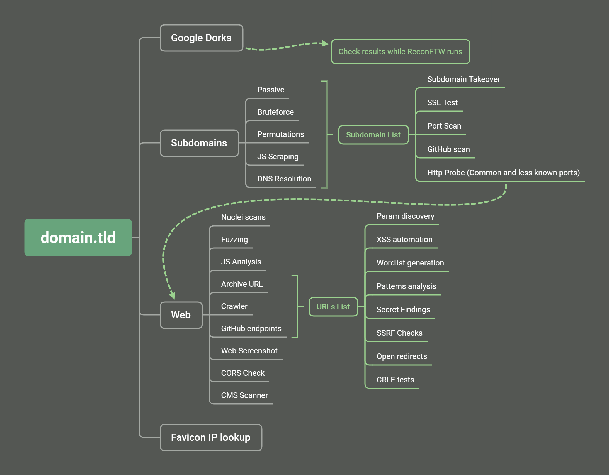

<h1 align="center">
  <br>
  <a href="https://github.com/six2dez/reconftw"></a>
  <br>
  reconFTW
  <br>
</h1>

<h4 align="center">A simple bash script for full recon</h4>

<p align="center">
  <a href="https://github.com/six2dez/reconftw/releases/tag/v1.2.3">
    
  </a>
   </a>
  <a href="https://www.gnu.org/licenses/gpl-3.0.en.html">
      
  </a>
  <a href="https://twitter.com/Six2dez1">
    
  </a>
    <a href="https://github.com/six2dez/reconftw/issues?q=is%3Aissue+is%3Aclosed">
    
  </a>
  <a href="https://github.com/six2dez/reconftw/wiki">
    
  </a>
  <a href="https://t.me/joinchat/H5bAaw3YbzzmI5co">
    
  </a>
  <a href="https://hub.docker.com/r/six2dez/reconftw">
    
  </a>
</p>

- [Summary](#summary)
- [Install](#install)
- [Usage](#usage)
- [Running reconFTW](#running-reconftw)
- [Sample Video](#sample-video)
- [Features](#fire-features-fire)
- [Mindmap/Workflow](#mindmapworkflow)
- [Need help?](#need-help)
- [Contribute](#how-to-contribute)
- [Thanks](#thanks)

# Summary

reconFTW is a tool designed to perform automated recon on a target domain by running the best set of tools to perform enumeration and finding out vulnerabilities.

# Install

## a) In your PC/VPS/VM

- [Installation Guide](https://github.com/six2dez/reconftw/wiki) :book:
- Requires [Golang](https://golang.org/dl/) > 1.14 installed and paths correctly set (**$GOPATH**, **$GOROOT**)

```bash
▶ git clone https://github.com/six2dez/reconftw
▶ cd reconftw
▶ chmod +x *.sh
▶ ./install.sh
▶ ./reconftw.sh -d target.com -a
```

## b) Docker container (2 options)

### From [DockerHub](https://hub.docker.com/r/six2dez/reconftw)

```bash
▶ docker pull six2dez/reconftw:main
▶ docker run -it six2dez/reconftw:main /bin/bash
```

### From repository

```bash
▶ git clone https://github.com/six2dez/reconftw
▶ cd reconftw/Docker
▶ docker build -t reconftw .
▶ docker run -it reconftw /bin/bash
```


# Config file
- Through ```reconftw.config``` file the whole execution of the tool can be controlled.
- Hunters can set various scanning modes, execution preferences, tools config files, APIs/TOKENS, personalized wordlists

<details>
 <br><br>
 <summary>Click here to view default config file</summary>   
 
```yaml
#################################################################
#			reconFTW config file			#
#################################################################

# TERM COLOURS
bred='\033[1;31m'
bblue='\033[1;34m'
bgreen='\033[1;32m'
yellow='\033[0;33m'
red='\033[0;31m'
blue='\033[0;34m'
green='\033[0;32m'
reset='\033[0m'

# General values
tools=~/Tools
NPROC=$(nproc || echo -n 1)
output=${dir}/Recon/${domain}

# Tools config files
#NOTIFY_CONFIG=~/.config/notify/notify.conf # No need to define
#SUBFINDER_CONFIG=~/.config/subfinder/config.yaml # No need to define
AMASS_CONFIG=~/.config/amass/config.ini
GITHUB_TOKENS=${tools}/.github_tokens

# APIs/TOKENS
SHODAN_API_KEY=XXXXXXXXXXXXX
XSS_SERVER=reconftw.xss.ht
COLLAB_SERVER=webhook.site/e3d6156b
findomain_virustotal_token=XXXXXXXXXXXXXXXXX
findomain_spyse_token=XXXXXXXXXXXXXXXXX
findomain_securitytrails_token=XXXXXXXXXXXXXXXXX
findomain_fb_token=XXXXXXXXXXXXXXXXX

# File descriptors
DEBUG_STD="&>/dev/null"
DEBUG_ERROR="2>/dev/null"

# Steps
DORKS=true
SUBCRT=true
SUBBRUTE=true
SUBSCRAPING=true
SUBPERMUTE=true
SUBTAKEOVER=true
WEBPROBEFULL=true
WEBSCREENSHOT=true
PORTSCANNER=true
PORTSCAN_PASSIVE=true
PORTSCAN_ACTIVE=true
NUCLEICHECK=true
URL_GF=true
JSCHECKS=true
PARAMS=true
XSS=true
GITHUB=true
FAVICON=true
FUZZ=true
CMS_SCANNER=true
CORS=true
TEST_SSL=true
OPEN_REDIRECT=true
SSRF_CHECKS=true
CRLF_CHECKS=true
LFI=true
SSTI=true
SQLI=true
BROKENLINKS=true
WORDLIST=true

# Extra features
NOTIFICATION=false
DEEP=false
FULLSCOPE=false
DIFF=false
REMOVETMP=false

## HTTP options
COOKIE=""
HEADER="User-Agent: Mozilla/5.0 (X11; Linux x86_64; rv:72.0) Gecko/20100101 Firefox/72.0"

# lists
fuzz_wordlist=${tools}/fuzz_wordlist.txt
lfi_wordlist=${tools}/lfi_wordlist.txt
subs_wordlist=${tools}/subdomains.txt
resolvers=${tools}/resolvers.txt
``` 
</details>


## Usage

**TARGET OPTIONS**

| Flag | Description |
|------|-------------|
| -d | Target domain *(example.com)*  |
| -m | Multiple domain target *(companyName)*  |
| -l | Target list *(one per line)* |
| -x | Exclude subdomains list *(Out Of Scope)* |

**MODE OPTIONS**

| Flag | Description |
|------|-------------|
| -r | Recon - Full recon process (only recon without attacks) |
| -s | Subdomains - Search subdomains, check tko and web probe |
| -p | Passive - Performs only passive steps |
| -a | All - Perform all checks and exploitations |
| -w | Web - Just web checks from list provided |
| -v | Verbose - Prints everything including errors, for debug purposes |
| -h | Help - Show this help |

**GENERAL OPTIONS**

| Flag | Description |
|------|-------------|
| --deep | Deep scan (Enable some slow options for deeper scan) |
| --fs   | Full scope (Enable the widest scope * *.domain.* * options) |
| -o |  Output directory |

## Running ReconFTW

**To perform a full recon on single target** *(may take a significant time)*

```bash
▶ ./reconftw.sh -d example.com -r
```

**To perfrom a full recon on a list of targets**

```bash
▶ ./reconftw.sh -l sites.txt -r -o /output/directory/
```

**Perform all steps (recon + attacks)** 

```bash
▶ ./reconftw.sh -d example.com -a
```

**Perform full recon with more intense tasks** *(VPS intended)*

```bash
▶ ./reconftw.sh -d example.com -r --deep -o /output/directory/
```

**Perform a wide scope recon on a target**   *(may include false positives)*

```bash
▶ ./reconftw.sh -d example.com -r --fs -o /output/directory/
```

**Perform recon in a multi domain target**

```bash
▶ ./reconftw.sh -m company -l domainsList.txt
```

**Show help section**

```bash
▶ ./reconftw.sh -h
```

## Sample video


## :fire: Features :fire:

- Domain information parser ([domainbigdata](https://domainbigdata.com/))
- Emails addresses and users ([theHarvester](https://github.com/laramies/theHarvester))
- Password leaks ([pwndb](https://github.com/davidtavarez/pwndb) and [H8mail](https://github.com/khast3x/h8mail))
- Metadata finder ([MetaFinder](https://github.com/Josue87/MetaFinder))
- Google Dorks ([degoogle_hunter](https://github.com/six2dez/degoogle_hunter))
- Github Dorks ([GitDorker](https://github.com/obheda12/GitDorker))  
- Multiple subdomain enumeration techniques (passive, bruteforce, permutations and scraping)
  - Passive ([subfinder](https://github.com/projectdiscovery/subfinder), [assetfinder](https://github.com/tomnomnom/assetfinder), [amass](https://github.com/OWASP/Amass), [findomain](https://github.com/Findomain/Findomain), [crobat](https://github.com/cgboal/sonarsearch), [waybackurls](https://github.com/tomnomnom/waybackurls))
  - Certificate transparency ([crtfinder](https://github.com/eslam3kl/crtfinder), [tls.bufferover](tls.bufferover.run) and [dns.bufferover](dns.bufferover.run)))
  - Bruteforce ([shuffledns](https://github.com/projectdiscovery/shuffledns))  
  - Permutations ([dnsgen](https://github.com/ProjectAnte/dnsgen))  
  - Source Code Scraping ([gospider](https://github.com/jaeles-project/gospider))  
  - CNAME Records ([dnsx](https://github.com/projectdiscovery/dnsx))
- Nuclei Sub TKO templates ([nuclei](https://github.com/projectdiscovery/nuclei))  
- Web Prober ([httpx](https://github.com/projectdiscovery/httpx))  
- Web screenshot ([webscreenshot](https://github.com/maaaaz/webscreenshot))  
- Template scanner ([nuclei](https://github.com/projectdiscovery/nuclei))  
- IP and subdomains WAF checker ([cf-check](https://github.com/dwisiswant0/cf-check) and [wafw00f](https://github.com/EnableSecurity/wafw00f))
- Port Scanner (Active with [nmap](https://github.com/nmap/nmap) and passive with [shodan-cli](https://cli.shodan.io/))  
- Url extraction ([waybackurls](https://github.com/tomnomnom/waybackurls), [gau](https://github.com/lc/gau), [gospider](https://github.com/jaeles-project/gospider), [github-endpoints](https://gist.github.com/six2dez/d1d516b606557526e9a78d7dd49cacd3))  
- Pattern Search ([gf](https://github.com/tomnomnom/gf) and [gf-patterns](https://github.com/1ndianl33t/Gf-Patterns))  
- Param discovery ([paramspider](https://github.com/devanshbatham/ParamSpider) and [arjun](https://github.com/s0md3v/Arjun))  
- XSS ([XSStrike](https://github.com/s0md3v/XSStrike))  
- Open redirect ([Openredirex](https://github.com/devanshbatham/OpenRedireX))  
- SSRF (headers [asyncio_ssrf.py](https://gist.github.com/h4ms1k/adcc340495d418fcd72ec727a116fea2) and param values with [ffuf](https://github.com/ffuf/ffuf))  
- CRLF ([crlfuzz](https://github.com/dwisiswant0/crlfuzz))  
- Favicon Real IP ([fav-up](https://github.com/pielco11/fav-up))  
- Javascript analysis ([LinkFinder](https://github.com/GerbenJavado/LinkFinder), scripts from [JSFScan](https://github.com/KathanP19/JSFScan.sh))  
- Fuzzing ([ffuf](https://github.com/ffuf/ffuf))  
- Cors ([Corsy](https://github.com/s0md3v/Corsy)) 
- LFI Checks (manual/[ffuf](https://github.com/ffuf/ffuf)) 
- SQLi Check ([SQLMap](https://github.com/sqlmapproject/sqlmap)) 
- SSTI (manual/[ffuf](https://github.com/ffuf/ffuf)) 
- CMS Scanner ([CMSeeK](https://github.com/Tuhinshubhra/CMSeeK))
- SSL tests ([testssl](https://github.com/drwetter/testssl.sh))  
- Multithread in some steps ([Interlace](https://github.com/codingo/Interlace))  
- Broken Links Checker (manual/wget spider)
- Docker support with [DockerHub](https://hub.docker.com/r/six2dez/reconftw) integration  
- Custom output folder  
- Polished installer compatible with most distros  
- Diff support for continuous running (cron mode) 
- Support for targets with multiple domains
- Update tools script  
- RaspberryPi/ARM support  
- 5 modes (recon, passive, subdomains, web and all)
- Out of Scope Support
- Notification support for Slack, Discord and Telegram ([notify](https://github.com/projectdiscovery/notify))

## Mindmap/Workflow



## How to contribute

If you want to contribute to this project you can do it in multiple ways:
- Submitting an [issue](https://github.com/six2dez/reconftw/issues/new/choose) because you have found a bug or you have any suggestion or request.
- Making a Pull Request from [dev](https://github.com/six2dez/reconftw/tree/dev) branch because you want to improve the code or add something to the script.

## Need help?

- Take a look in the [wiki](https://github.com/six2dez/reconftw/wiki) 
- Ask for help in the [Telegram group](https://t.me/joinchat/TO_R8NYFhhbmI5co)

## You can support this work buying me a coffee:  

[](https://www.buymeacoffee.com/six2dez)

## Thanks

For their great feedback, support, help or for nothing special but well deserved:

- [@detonXX](https://twitter.com/detonXX)
- [@Bileltechno](https://twitter.com/BilelEljaamii)
- [@cyph3r_asr](https://twitter.com/cyph3r_asr)
- [@h4ms1k](https://twitter.com/h4ms1k)
