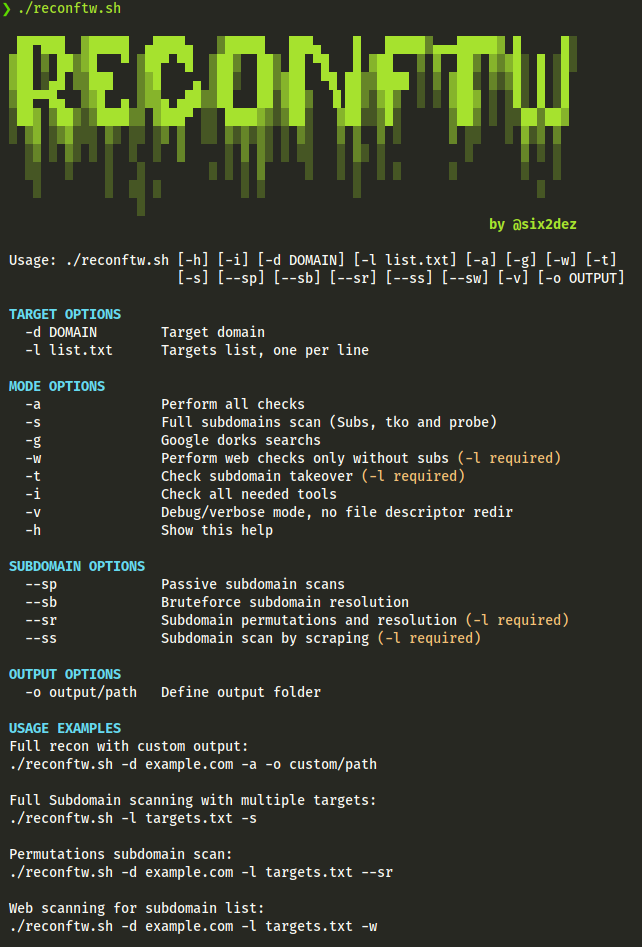

# reconftw

-   [tl;dr](#tldr)
-   [Summary](#summary)
-   [Features](#features)
-   [Mindmap](#mindmapworkflow)
-   [Requirements](#requirements)
-   [Usage examples](#usage-examples)
-   [Improvement plan](#improvement-plan)
-   [Thanks](#thanks)

:warning: Warning :warning:

This is a live development project, until the first stable release (1.0) it will be constantly updated in master branch, so if you have detected any bug, you can open an issue or ping me over Telegram (@six2dez) or Twitter (@six2dez1) and I will try to do my best :)


## tl;dr

- Requires [Golang](https://golang.org/dl/) > 1.14 installed and env vars correctly set ($GOPATH,$GOROOT)
- Run ./install.sh before first run (apt, rpm, pacman compatible)

```bash
git clone https://github.com/six2dez/reconftw
cd reconftw
chmod +x *.sh
./install.sh
./reconftw.sh -d target.com -a
```


## Summary

This is a simple script intended to perform a full recon on an objective with multiple subdomains

## Features

- Tools checker
- Google Dorks (based on deggogle_hunter)
- Subdomain enumeration (passive, resolution, bruteforce and permutations)
- Sub TKO (subjack and nuclei)
- Web Prober (httpx)
- Web screenshot (aquatone)
- Template scanner (nuclei)
- Port Scanner (naabu)
- Url extraction (waybackurls, gau, hakrawler, github-endpoints)
- Pattern Search (gf and gf-patterns)
- Param discovery (paramspider and arjun)
- XSS (Gxss and dalfox)
- Open redirect (Openredirex)
- SSRF checks (from m4ll0k/Bug-Bounty-Toolz/SSRF.py)
- Github Check (git-hound)
- Favicon Real IP (fav-up)
- JS Checks (LinkFinder, SecretFinder, scripts from JSFScan)
- Fuzzing (ffuf)
- Cors (Corsy)
- SSL Check (testssl)
- Interlace integration
- Custom output folder (default under Recon/target.com/)
- Run standalone steps (subdomains, subtko, web, gdorks...)
- Polished installer compatible with most distros
- Verbose mode
- Update tools script

## Mindmap/Workflow


## Requirements

- [Golang](https://golang.org/dl/) > 1.14 installed and env vars correctly set ($GOPATH,$GOROOT)
- Run ./install.sh
> Installer is provided as is. Nobody knows your system better than you, so nobody can debug your system better than you. If you are experiencing some issues with the installer script I can help you out, but keep in mind that is not my main priority.
- It is highly recommended, and in some cases essential, set your api keys or env vars:
  - amass (~/.config/amass/config.ini)
  - subfinder (~/.config/subfinder/config.yaml)
  - git-hound (~/.githound/config.yml)
  - github-endpoints.py (GITHUB_TOKEN env var)
  - favup (shodan init SHODANPAIDAPIKEY)
  - SSRF Server (COLLAB_SERVER env var) 
  - Blind XSS Server (XSS_SERVER env var) 
- This script uses dalfox with blind-xss option, you must change to your own server, check xsshunter.com.

## Usage examples

### Full scan:
```bash
./reconftw.sh -d target.com -a
```

### Subdomains scan:
```bash
./reconftw.sh -d target.com -s
```

### Web scan (target list required):
```bash
./reconftw.sh -d target.com -l targets.txt -w
```

### Dorks:
```bash
./reconftw.sh -d target.com -g
```

## Improvement plan:

Anyone can take one of these features and start working on it, just ping me to keep in mind and avoid duplicate efforts:

(yeah, this has become my backlog)

- [ ] Notification support for Slack, Discord and Telegram (slackcat? notify.sh?)
- [ ] CMS tools (wpscan, drupwn/droopescan, joomscan)
- [ ] Add menu option for every feature
- [ ] CRLF checks, manual or [this scanner](https://github.com/MichaelStott/CRLF-Injection-Scanner)
- [ ] Fast mode (Like -a but only passive cheks, maxtime, etc)
- [ ] Docker image
- [ ] Diff support
- [ ] Performance options to avoid net overload (soft, default, hard)
- [ ] Nice and easily readable final html report
- [ ] Add [autosubtakeover](https://github.com/JordyZomer/autoSubTakeover) before subjack
- [ ] Public S3 Checker, [this](https://gist.githubusercontent.com/random-robbie/b0c8603e55e22b21c49fd80072392873/raw/bucket_list.sh) or [this](https://gist.githubusercontent.com/jhaddix/4769f5e3e4dbcaaf9032fbb741ef6f83/raw/fdfc8ded52a6746d8ecb0fc522cf492e42ba0dec/bucket-disclose.sh)
- [ ] Check git-hound replacements (GitGraber or truffleHog or other)
- [ ] Metadata Checks (pymeta)
- [ ] Check xsstrike instead dalfox
- [X] Open Redirect with Openredirex
- [X] SSRF Checks
- [X] More error checks
- [X] More verbose
- [X] Enhance this Readme
- [X] Customize output folder
- [X] Interlace usage
- [X] Crawler
- [X] SubDomainizer
- [X] Install script
- [X] Apt,rpm,pacman compatible installer

You can support this work buying me a coffee:

[](https://www.buymeacoffee.com/six2dez)

## Thanks
For their great feedback, support, help or for nothing special but well deserved:
- [@detonXX](https://twitter.com/detonXX)
- [@cyph3r_asr](https://twitter.com/cyph3r_asr)
- [@h4ms1k](https://twitter.com/h4ms1k)
- [@Bileltechno](https://twitter.com/BilelEljaamii)


