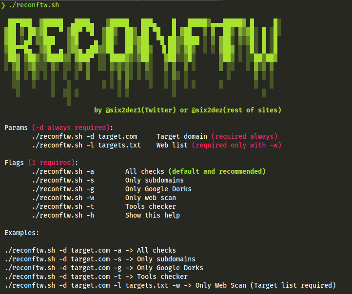
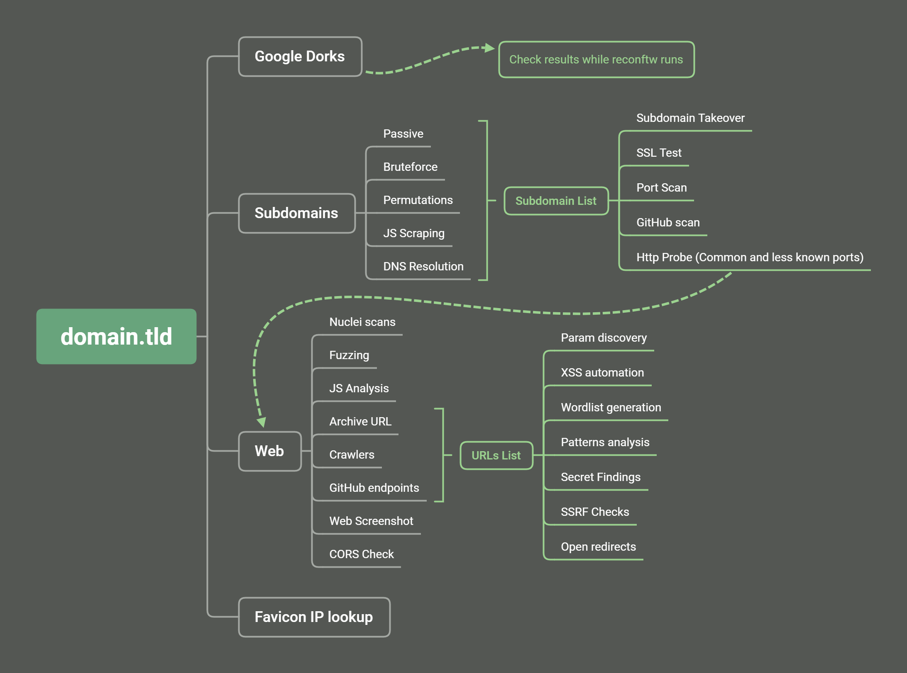

# reconftw

-   [tl;dr](#tldr)
-   [Summary](#summary)
-   [Features](#features)
-   [Mindmap](#mindmapworkflow)
-   [Requirements](#requirements)
-   [Usage examples](#usage-examples)
-   [Improvement plan](#improvement-plan)
-   [Thanks](#thanks)

## tl;dr

- Requires [Go](https://golang.org/dl/)
- Run ./install.sh before first run (apt, rpm, pacman compatible)

```bash
git clone https://github.com/six2dez/reconftw
cd reconftw
chmod +x *.sh
./install.sh
./reconftw.sh -d target.com -a
```


## Summary

This is a simple script intended to perform a full recon on an objective with multiple subdomains

## Features

- Tools checker
- Google Dorks (based on deggogle_hunter)
- Subdomain enumeration (passive, resolution, bruteforce and permutations)
- Sub TKO (subjack and nuclei)
- Web Prober (httpx)
- Web screenshot (aquatone)
- Template scanner (nuclei)
- Port Scanner (naabu)
- Url extraction (waybackurls, gau, hakrawler, github-endpoints)
- Pattern Search (gf and gf-patterns)
- Param discovery (paramspider and arjun)
- XSS (Gxss and dalfox)
- Github Check (git-hound)
- Favicon Real IP (fav-up)
- JS Checks (LinkFinder, SecretFinder, scripts from JSFScan)
- Fuzzing (ffuf)
- Cors (Corsy)
- SSL Check (testssl)
- Interlace integration
- Custom output folder (default under Recon/target.com/)
- Run standalone steps (subdomains, subtko, web, gdorks...)
- Polished installer compatible with most distros

## Mindmap/Workflow



## Requirements

- [Golang](https://golang.org/dl/) > 1.14 installed and env vars correctly set ($GOPATH,$GOROOT)
- Run ./install.sh
- It is highly recommended, and in some cases essential, set your api keys:
  - amass (~/.config/amass/config.ini)
  - subfinder (~/.config/subfinder/config.yaml)
  - git-hound (~/.githound/config.yml)
  - github-endpoints.py (GITHUB_TOKEN env var)
  - favup (shodan init SHODANPAIDAPIKEY)
- This script uses dalfox with blind-xss option, you must change to your own server, check xsshunter.com.

## Usage examples

### Full scan:
```bash
./reconftw.sh -d target.com -a
```

### Subdomains scan:
```bash
./reconftw.sh -d target.com -s
```

### Web scan (target list required):
```bash
./reconftw.sh -d target.com -l targets.txt -w
```

### Dorks:
```bash
./reconftw.sh -d target.com -g
```

## Improvement plan:

- [ ] Notification support (Slack, Discord and Telegram)
- [ ] CMS tools (wpscan, drupwn/droopescan, joomscan)
- [ ] Add menu option for every feature
- [ ] Any other interesting suggestion
- [X] Enhance this Readme
- [X] Customize output folder
- [X] Interlace usage
- [X] Crawler
- [X] SubDomainizer
- [X] Install script
- [X] Apt,rpm,pacman compatible installer

## Thanks
For their great feedback, support, help or for nothing special but well deserved:
- [@detonXX](https://twitter.com/detonXX)
- [@cyph3r_asr](https://twitter.com/cyph3r_asr)
- [@h4ms1k](https://twitter.com/h4ms1k)


