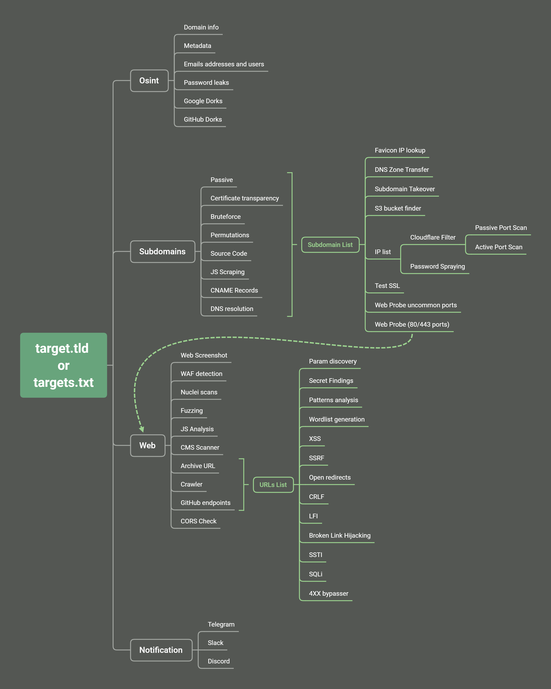

<h1 align="center">
  <br>
  <a href="https://github.com/six2dez/reconftw"></a>
  <br>
  reconFTW
  <br>
</h1>
 
<h4 align="center">A simple bash script for full recon</h4>
 
<p align="center">
  <a href="https://github.com/six2dez/reconftw/releases/tag/v1.5.3">
    
  </a>
   </a>
  <a href="https://www.gnu.org/licenses/gpl-3.0.en.html">
      
  </a>
  <a href="https://twitter.com/Six2dez1">
    
  </a>
    <a href="https://github.com/six2dez/reconftw/issues?q=is%3Aissue+is%3Aclosed">
    
  </a>
  <a href="https://github.com/six2dez/reconftw/wiki">
    
  </a>
  <a href="https://t.me/joinchat/H5bAaw3YbzzmI5co">
    
  </a>
  <a href="https://hub.docker.com/r/six2dez/reconftw">
    
  </a>
</p>
 
📔 Table of Contents
-----------------
- [Installation](#-installation)
- [Config file](#%EF%B8%8F-config-file)
- [Usage](#usage)
- [Example Usage](#Example-Usage)
- [Axiom Support](#axiom-support-cloud)
- [Sample Video](#sample-video)
- [Features](#fire-features-fire)
- [Mindmap/Workflow](#mindmapworkflow)
- [Data Keep](#data-keep)
- [Need help?](#need-help)
- [Contribute](#how-to-contribute)
- [Thanks](#thanks)
 
---
 
# 💿 Installation:
 
## a) In your PC/VPS/VM
 
> You can check out our wiki for installtion guide [Installation Guide](https://github.com/six2dez/reconftw/wiki/0.-Installation-Guide) :book:  
- Requires [Golang](https://golang.org/dl/) > **1.15.0+** installed and paths correctly set (**$GOPATH**, **$GOROOT**)
 
```bash
▶ git clone https://github.com/six2dez/reconftw
▶ cd reconftw/
▶ ./install.sh
▶ ./reconftw.sh -d target.com -r
```
 
## b) Docker container 🐳 (2 options)
 
### 1) From [DockerHub](https://hub.docker.com/r/six2dez/reconftw)
 
```bash
▶ docker pull six2dez/reconftw:main
▶ docker run -it six2dez/reconftw:main /bin/bash
 
# Exit the container and run this commands additionally if you want to gain persistence:
▶ docker start $(docker ps -a|grep six2dez/reconftw:main|cut -d' ' -f1)
▶ docker exec -it $(docker ps -a|grep six2dez/reconftw:main|cut -d' ' -f1) /bin/bash
 
# Now you can exit the container and run again this command without files loss:
▶ docker exec -it $(docker ps -a|grep six2dez/reconftw:main|cut -d' ' -f1) /bin/bash
```
 
### 2) From repository
 
```bash
▶ git clone https://github.com/six2dez/reconftw
▶ cd reconftw/Docker
▶ docker build -t reconftw .
▶ docker run -it reconftw /bin/bash
```
 
# ⚙️ Config file:
> A detailed explaintion of config file can be found here [Configuration file](https://github.com/six2dez/reconftw/wiki/3.-Configuration-file) :book:
- Through ```reconftw.cfg``` file the whole execution of the tool can be controlled.
- Hunters can set various scanning modes, execution preferences, tools, config files, APIs/TOKENS, personalized wordlists and much more.
 
<details>
 <br><br>
 <summary> :point_right: Click here to view default config file :point_left: </summary>   
 
```yaml
#################################################################
#			reconFTW config file			#
#################################################################

# TERM COLORS
bred='\033[1;31m'
bblue='\033[1;34m'
bgreen='\033[1;32m'
yellow='\033[0;33m'
red='\033[0;31m'
blue='\033[0;34m'
green='\033[0;32m'
reset='\033[0m'

# General values
tools=~/Tools
SCRIPTPATH="$( cd "$(dirname "$0")" >/dev/null 2>&1 ; pwd -P )"
profile_shell=".$(basename $(echo $SHELL))rc"
reconftw_version=$(git branch --show-current)-$(git describe --tags)
update_resolvers=true
proxy_url="http://127.0.0.1:8080/"
#dir_output=/custom/output/path

# Golang Vars (Comment or change on your own)
export GOROOT=/usr/local/go
export GOPATH=$HOME/go
export PATH=$GOPATH/bin:$GOROOT/bin:$HOME/.local/bin:$PATH

# Tools config files
#NOTIFY_CONFIG=~/.config/notify/notify.conf # No need to define
#SUBFINDER_CONFIG=~/.config/subfinder/config.yaml # No need to define
AMASS_CONFIG=~/.config/amass/config.ini
GITHUB_TOKENS=${tools}/.github_tokens

# APIs/TOKENS - Uncomment the lines you set removing the '#' at the beginning of the line
#SHODAN_API_KEY=XXXXXXXXXXXXX
#XSS_SERVER=six2dez.xss.ht
#COLLAB_SERVER=XXXXXXXXXXXXXXXXX
#findomain_virustotal_token=XXXXXXXXXXXXXXXXX
#findomain_spyse_token=XXXXXXXXXXXXXXXXX
#findomain_securitytrails_token=XXXXXXXXXXXXXXXXX
#findomain_fb_token=XXXXXXXXXXXXXXXXX

# File descriptors
DEBUG_STD="&>/dev/null"
DEBUG_ERROR="2>/dev/null"

# Osint
OSINT=true
GOOGLE_DORKS=true
GITHUB_DORKS=true
METADATA=true
EMAILS=true
DOMAIN_INFO=true

# Subdomains
SUBCRT=true
SUBBRUTE=true
SUBSCRAPING=true
SUBPERMUTE=true
SUBTAKEOVER=true
SUBRECURSIVE=true
ZONETRANSFER=true
S3BUCKETS=true

# Web detection
WEBPROBESIMPLE=true
WEBPROBEFULL=true
WEBSCREENSHOT=true
UNCOMMON_PORTS_WEB="81,300,591,593,832,981,1010,1311,1099,2082,2095,2096,2480,3000,3128,3333,4243,4567,4711,4712,4993,5000,5104,5108,5280,5281,5601,5800,6543,7000,7001,7396,7474,8000,8001,8008,8014,8042,8060,8069,8080,8081,8083,8088,8090,8091,8095,8118,8123,8172,8181,8222,8243,8280,8281,8333,8337,8443,8500,8834,8880,8888,8983,9000,9001,9043,9060,9080,9090,9091,9200,9443,9502,9800,9981,10000,10250,11371,12443,15672,16080,17778,18091,18092,20720,32000,55440,55672"

# Host
FAVICON=true
PORTSCANNER=true
PORTSCAN_PASSIVE=true
PORTSCAN_ACTIVE=true
CLOUD_IP=true

# Web analysis
WAF_DETECTION=true
NUCLEICHECK=true
URL_CHECK=true
URL_GF=true
URL_EXT=true
JSCHECKS=true
PARAMS=true
FUZZ=true
CMS_SCANNER=true
WORDLIST=true

# Vulns
XSS=true
CORS=true
TEST_SSL=true
OPEN_REDIRECT=true
SSRF_CHECKS=true
CRLF_CHECKS=true
LFI=true
SSTI=true
SQLI=true
BROKENLINKS=true
SPRAY=true
BYPASSER4XX=true

# Extra features
NOTIFICATION=false
DEEP=false
DIFF=false
REMOVETMP=false
PROXY=false

# HTTP options
HEADER="User-Agent: Mozilla/5.0 (X11; Linux x86_64; rv:72.0) Gecko/20100101 Firefox/72.0"

# Threads
FFUF_THREADS=40
HTTPX_THREADS=50
HTTPX_UNCOMMONPORTS_THREADS=100
GOSPIDER_THREADS=50
GITDORKER_THREADS=5
BRUTESPRAY_THREADS=20
BRUTESPRAY_CONCURRENCE=10
ARJUN_THREADS=20
GAUPLUS_THREADS=10
DALFOX_THREADS=200
PUREDNS_TRUSTED_LIMIT=400

# lists
fuzz_wordlist=${tools}/fuzz_wordlist.txt
lfi_wordlist=${tools}/lfi_wordlist.txt
subs_wordlist=${tools}/subdomains.txt
subs_wordlist_big=${tools}/subdomains_big.txt
resolvers=${tools}/resolvers.txt
resolvers_trusted=${tools}/resolvers_trusted.txt
``` 
</details>
 
# Usage:
> Check out the wiki section to know which flag performs what all steps/attacks [Usage Guide](https://github.com/six2dez/reconftw/wiki/2.-Usage-Guide) :book:
 
**TARGET OPTIONS**
 
| Flag | Description |
|------|-------------|
| -d | Target domain *(example.com)*  |
| -m | Multiple domain target *(companyName)*  |
| -l | Target list *(one per line)* |
| -x | Exclude subdomains list *(Out Of Scope)* |
 
**MODE OPTIONS**
 
| Flag | Description |
|------|-------------|
| -r | Recon - Full recon process (without attacks like sqli,ssrf,xss,ssti,lfi etc.) |
| -s | Subdomains - Perform only subdomain enumeration, web probing, subdomain takeovers |
| -p | Passive - Perform only passive steps |
| -a | All - Perform whole recon and all active attacks |
| -w | Web - Just web checks on the list provided |
| -v | Verbose - Prints everything including errors, for debug purposes |
| -h | Help - Show this help menu |
 
**GENERAL OPTIONS**
 
| Flag | Description |
|------|-------------|
| --deep | Deep scan (Enable some slow options for deeper scan, _vps intended mode_) |
| -o |  Output directory |
 
# Example Usage:
 
**To perform a full recon on single target** 
 
```bash
▶ ./reconftw.sh -d target.com -r
```
 
**To perform a full recon on a list of targets**
 
```bash
▶ ./reconftw.sh -l sites.txt -r -o /output/directory/
```
 
**Perform all steps (whole recon + all attacks)** 
 
```bash
▶ ./reconftw.sh -d target.com -a
```
 
**Perform full recon with more time intense tasks** *(VPS intended only)*
 
```bash
▶ ./reconftw.sh -d target.com -r --deep -o /output/directory/
```
 
**Perform recon in a multi domain target**
 
```bash
▶ ./reconftw.sh -m company -l domains_list.txt -r
```
 
**Show help section**
 
```bash
▶ ./reconftw.sh -h
```

# Axiom Support: :cloud:

> Check out the wiki section for more info [Axiom Support](https://github.com/six2dez/reconftw/wiki/5.-Axiom-version)
* Using ```reconftw_axiom.sh``` script you can take advantage of running **reconFTW** with [Axiom](https://github.com/pry0cc/axiom).
* As reconFTW actively hits the target with a lot of web traffic, hence there was a need to move to Axiom distributing the work load among various instances leading to reduction of execution time.
* Currently except the ```-a``` flag, all flags are supported when running with Axiom.
```bash
▶ ./reconftw_axiom.sh -d target.com -r
```
 
# Sample video:
 

 
# :fire: Features :fire:
 
- Domain information parser ([domainbigdata](https://domainbigdata.com/))
- Emails addresses and users ([theHarvester](https://github.com/laramies/theHarvester))
- Password leaks ([pwndb](https://github.com/davidtavarez/pwndb) and [H8mail](https://github.com/khast3x/h8mail))
- Metadata finder ([MetaFinder](https://github.com/Josue87/MetaFinder))
- Google Dorks ([degoogle_hunter](https://github.com/six2dez/degoogle_hunter))
- Github Dorks ([GitDorker](https://github.com/obheda12/GitDorker))  
- Multiple subdomain enumeration techniques (passive, bruteforce, permutations and scraping)
  - Passive ([subfinder](https://github.com/projectdiscovery/subfinder), [assetfinder](https://github.com/tomnomnom/assetfinder), [amass](https://github.com/OWASP/Amass), [findomain](https://github.com/Findomain/Findomain), [crobat](https://github.com/cgboal/sonarsearch), [waybackurls](https://github.com/tomnomnom/waybackurls), [github-subdomains](https://github.com/gwen001/github-subdomains), [Anubis](https://jldc.me) and [mildew](https://github.com/daehee/mildew))
  - Certificate transparency ([ctfr](https://github.com/UnaPibaGeek/ctfr), [tls.bufferover](tls.bufferover.run) and [dns.bufferover](dns.bufferover.run)))
  - Bruteforce ([puredns](https://github.com/d3mondev/puredns))  
  - Permutations ([DNScewl](https://github.com/codingo/DNSCewl))  
  - JS files & Source Code Scraping ([gospider](https://github.com/jaeles-project/gospider))  
  - CNAME Records ([dnsx](https://github.com/projectdiscovery/dnsx))
- Nuclei Sub TKO templates ([nuclei](https://github.com/projectdiscovery/nuclei))  
- Web Prober ([httpx](https://github.com/projectdiscovery/httpx))  
- Web screenshot ([gowitness](https://github.com/sensepost/gowitness))  
- Web templates scanner ([nuclei](https://github.com/projectdiscovery/nuclei))  
- IP and subdomains WAF checker ([cf-check](https://github.com/dwisiswant0/cf-check) and [wafw00f](https://github.com/EnableSecurity/wafw00f))
- Port Scanner (Active with [nmap](https://github.com/nmap/nmap) and passive with [shodan-cli](https://cli.shodan.io/))  
- Url extraction ([waybackurls](https://github.com/tomnomnom/waybackurls), [gauplus](https://github.com/bp0lr/gauplus), [gospider](https://github.com/jaeles-project/gospider), [github-endpoints](https://gist.github.com/six2dez/d1d516b606557526e9a78d7dd49cacd3))  
- Pattern Search ([gf](https://github.com/tomnomnom/gf) and [gf-patterns](https://github.com/1ndianl33t/Gf-Patterns))  
- Param discovery ([paramspider](https://github.com/devanshbatham/ParamSpider) and [arjun](https://github.com/s0md3v/Arjun))  
- XSS ([XSStrike](https://github.com/s0md3v/XSStrike))  
- Open redirect ([Openredirex](https://github.com/devanshbatham/OpenRedireX))  
- SSRF (headers [asyncio_ssrf.py](https://gist.github.com/h4ms1k/adcc340495d418fcd72ec727a116fea2) and param values with [ffuf](https://github.com/ffuf/ffuf))  
- CRLF ([crlfuzz](https://github.com/dwisiswant0/crlfuzz))  
- Favicon Real IP ([fav-up](https://github.com/pielco11/fav-up))  
- Javascript analysis ([LinkFinder](https://github.com/GerbenJavado/LinkFinder), scripts from [JSFScan](https://github.com/KathanP19/JSFScan.sh))  
- Fuzzing ([ffuf](https://github.com/ffuf/ffuf))  
- Cors ([Corsy](https://github.com/s0md3v/Corsy)) 
- LFI Checks (manual/[ffuf](https://github.com/ffuf/ffuf)) 
- SQLi Check ([SQLMap](https://github.com/sqlmapproject/sqlmap)) 
- SSTI (manual/[ffuf](https://github.com/ffuf/ffuf)) 
- CMS Scanner ([CMSeeK](https://github.com/Tuhinshubhra/CMSeeK))
- SSL tests ([testssl](https://github.com/drwetter/testssl.sh))  
- Multithread in some steps ([Interlace](https://github.com/codingo/Interlace))  
- Broken Links Checker ([gospider](https://github.com/jaeles-project/gospider))
- S3 bucket finder ([S3Scanner](https://github.com/sa7mon/S3Scanner))
- Password spraying ([brutespray](https://github.com/x90skysn3k/brutespray))
- 4xx bypasser ([DirDar](https://github.com/M4DM0e/DirDar))
- Custom resolvers generated list ([dnsvalidator](https://github.com/vortexau/dnsvalidator))
- DNS Zone Transfer ([dnsrecon](https://github.com/darkoperator/dnsrecon))
- Docker container included and [DockerHub](https://hub.docker.com/r/six2dez/reconftw) integration  
- Cloud providers check ([ip2provider](https://github.com/oldrho/ip2provider))
- Resume the scan from last performed step
- Custom output folder  
- All in one installer/updater script compatible with most distros  
- Diff support for continuous running (cron mode) 
- Support for targets with multiple domains 
- RaspberryPi/ARM support  
- 5 modes (recon, passive, subdomains, web and all)
- Out of Scope Support
- Notification support for Slack, Discord and Telegram ([notify](https://github.com/projectdiscovery/notify))
 
# Mindmap/Workflow
 

 
## Data Keep
 
Follow these simple steps to end up having a private repository with your `API Keys` and `/Recon` data.
 
* Create a private __blank__ repository on `Git(Hub|Lab)` (Take into account size limits regarding Recon data upload)
* Clone your project: `git clone https://gitlab.com/example/reconftw-data`
* Get inside the cloned repository: `cd reconftw-data`
* Create branch with an empty commit: `git commit --allow-empty -m "Empty commit"`
* Add official repo as a new remote: `git remote add upstream https://github.com/six2dez/reconftw` (`upstream` is an example)
* Update upstream's repo: `git fetch upstream`
* Rebase current branch with the official one: `git rebase upstream/main master`
 
### Main commands:
 
* Upload changes to your personal repo: `git add . && git commit -m "Data upload" && git push origin master`
* Update tool anytime: `git fetch upstream && git rebase upstream/main master`
 
## How to contribute:
 
If you want to contribute to this project you can do it in multiple ways:
- Submitting an [issue](https://github.com/six2dez/reconftw/issues/new/choose) because you have found a bug or you have any suggestion or request.
- Making a Pull Request from [dev](https://github.com/six2dez/reconftw/tree/dev) branch because you want to improve the code or add something to the script.
 
## Need help?
 
- Take a look in the [wiki](https://github.com/six2dez/reconftw/wiki) 
- Ask for help in the [Telegram group](https://t.me/joinchat/TO_R8NYFhhbmI5co)
 
## You can support this work buying me a coffee:  
 
[](https://www.buymeacoffee.com/six2dez)
 
# Thanks :pray:
* Thank you for lending a helping hand towards the development of the project!
 
- [Spyse](https://spyse.com/)
- [Networksdb](https://networksdb.io/)
- [Intelx](https://intelx.io/)
- [BinaryEdge](https://www.binaryedge.io/)
- [Censys](https://censys.io/)
- [CIRCL](https://www.circl.lu/)
- [Whoxy](https://www.whoxy.com/)
