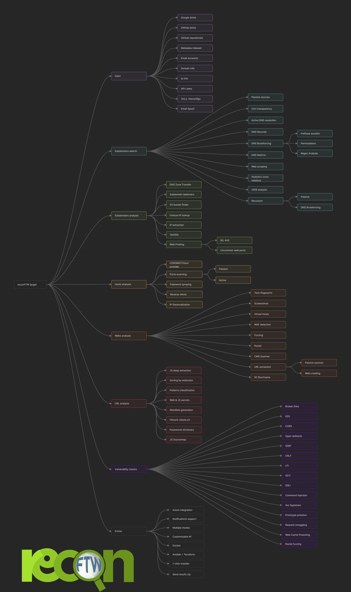

<h1 align="center">
  <br>
  <a href="https://github.com/six2dez/reconftw"></a>
  <br>
  reconFTW
  <br>
</h1>

<p align="center">
  <a href="https://github.com/six2dez/reconftw/releases/tag/v2.0.0"></a>
  <a href="https://opensource.org/licenses/MIT"></a>
  <a href="https://github.com/six2dez/reconftw/issues?q=is%3Aissue+is%3Aclosed"></a>
  <a href="https://discord.gg/R5DdXVEdTy"></a>
  <a href="https://t.me/joinchat/H5bAaw3YbzzmI5co"></a>
  <a href="https://twitter.com/Six2dez1"></a>
</p>

<p align="center">
  <a href="https://docs.reconftw.com"></a>
  <a href="https://github.com/six2dez/reconftw"></a>
  <a href="https://github.com/six2dez/reconftw"></a>
  <a href="https://github.com/six2dez/reconftw"></a>
  <a href="https://github.com/six2dez/reconftw"></a>
</p>

<p align="center">
  <a href="https://github.com/six2dez/reconftw/actions"></a>
  <a href="https://hub.docker.com/r/six2dez/reconftw"></a>
  <a href="https://github.com/six2dez/reconftw/tree/main/Terraform"></a>
  <a href="https://github.com/six2dez/reconftw/tree/main/Terraform"></a>
  <a href="https://github.com/six2dez/reconftw"></a>
  <a href="https://github.com/six2dez/reconftw"></a>
</p>

<p align="center">
  <a href="https://www.buymeacoffee.com/six2dez"></a>
  <a href="https://github.com/sponsors/six2dez"></a>
  <a href="https://www.paypal.com/paypalme/six2dez"></a>
</p>

**reconFTW** is a powerful automated reconnaissance tool designed for security researchers and penetration testers. It streamlines the process of gathering intelligence on a target by performing subdomain enumeration, vulnerability scanning, OSINT and more. With a modular design, extensive configuration options, and support for distributed scanning via AX Framework, reconFTW is built to deliver comprehensive results efficiently.

reconFTW leverages a wide range of techniques, including passive and active subdomain discovery, web vulnerability checks (e.g., XSS, SSRF, SQLi), OSINT, directory fuzzing, port scanning and screenshotting. It integrates with cutting-edge tools and APIs to maximize coverage and accuracy, ensuring you stay ahead in your reconnaissance efforts.

**Key Features:**

- Comprehensive subdomain enumeration (passive, bruteforce, permutations, certificate transparency, etc.)
- Vulnerability scanning for XSS, SSRF, SQLi, LFI, SSTI, and more
- OSINT for emails, metadata, API leaks, and third-party misconfigurations
- Resumable, checkpointed scans with structured JSONL output
- Customizable workflows via a layered TOML configuration
- Integration with Faraday for reporting and visualization
- Support for Docker, Terraform and Ansible deployments

**Disclaimer:** Usage of reconFTW for attacking targets without prior consent is illegal. It is the user's responsibility to obey all applicable laws. The developers assume no liability for misuse or damage caused by this tool. Use responsibly.

---

## 📔 Table of Contents

- [✨ Features](#-features)
- [🏗️ Architecture](#️-architecture)
- [💿 Installation](#-installation)
- [🚀 Usage](#-usage)
- [⚙️ Configuration](#️-configuration)
- [📂 Output](#-output)
- [🔄 Upgrading from v1](#-upgrading-from-v1)
- [🔌 Integrations](#-integrations)
- [🛠️ Troubleshooting](#️-troubleshooting)
- [Mindmap/Workflow](#mindmapworkflow)
- [Sample video](#sample-video)
- [🤝 How to Contribute](#-how-to-contribute)
- [🔒 Security](#-security)
- [❓ Need Help?](#-need-help)
- [💖 Support This Project](#-support-this-project)
- [🙏 Thanks](#-thanks)
- [🧑‍💻 Development](#-development)
- [📜 License](#-license)

---

> ### ⚡ reconFTW v2 is a single Go binary
>
> v2 is a ground-up rewrite of the bash framework. Same recon philosophy — one
> command, a complete picture of a target — now as one statically-linked binary with a
> task scheduler, a TOML config, resumable checkpoints and structured JSONL output.
>
> Coming from v1? Everything you need is in **[MIGRATION.md](MIGRATION.md)**: every
> breaking change with before/after examples, the rollback procedure, and
> `reconftw migrate` to convert your `reconftw.cfg` automatically.
> The bash implementation remains available on the frozen `legacy-bash` branch.

## ✨ Features

reconFTW is packed with features to make reconnaissance thorough and efficient. Below is a detailed breakdown of its capabilities.

### OSINT

- **Domain Information**: WHOIS lookup for domain registration details ([whois](https://github.com/rfc1036/whois)).
- **Email and Password Leaks**: Searches for leaked emails and credentials ([emailfinder](https://github.com/Josue87/EmailFinder) and [LeakSearch](https://github.com/JoelGMSec/LeakSearch)).
- **Microsoft 365/Azure Mapping**: Identifies Microsoft 365 and Azure tenants ([msftrecon](https://github.com/Arcanum-Sec/msftrecon)).
- **Metadata Extraction**: Extracts metadata from indexed office documents ([metagoofil](https://github.com/opsdisk/metagoofil)).
- **API Leaks**: Detects exposed APIs in public sources ([porch-pirate](https://github.com/MandConsultingGroup/porch-pirate), [SwaggerSpy](https://github.com/UndeadSec/SwaggerSpy) and [postleaksNg](https://github.com/six2dez/postleaksNG)).
- **Google Dorking**: Automated Google dork queries for sensitive information ([dorks_hunter](https://github.com/six2dez/dorks_hunter) and [xnldorker](https://github.com/xnl-h4ck3r/xnldorker)).
- **GitHub Analysis**: Scans GitHub organizations for repositories and secrets with selectable engines ([enumerepo](https://github.com/trickest/enumerepo), [trufflehog](https://github.com/trufflesecurity/trufflehog), [gitleaks](https://github.com/gitleaks/gitleaks), [titus](https://github.com/praetorian-inc/titus), [noseyparker](https://github.com/praetorian-inc/noseyparker)).
- **GitHub Actions Audit (Optional)**: Audits workflow artifacts and CI/CD exposure with [gato](https://github.com/praetorian-inc/gato).
- **Third-Party Misconfigurations**: Identifies misconfigured third-party services ([misconfig-mapper](https://github.com/intigriti/misconfig-mapper)).
- **Mail Hygiene**: Reviews SPF/DMARC configuration to flag spoofing or deliverability issues.
- **Cloud Storage Enumeration**: Surveys buckets across major providers for exposure ([cloud_enum](https://github.com/initstring/cloud_enum)).
- **Spoofable Domains**: Checks for domains vulnerable to spoofing ([spoofcheck](https://github.com/MattKeeley/Spoofy)).

### Subdomains

- **Passive Enumeration**: Uses APIs and public sources for subdomain discovery ([subfinder](https://github.com/projectdiscovery/subfinder) and [github-subdomains](https://github.com/gwen001/github-subdomains)).
- **Certificate Transparency**: Queries certificate transparency logs ([crt](https://github.com/cemulus/crt)).
- **NOERROR Discovery**: Identifies subdomains with DNS NOERROR responses ([dnsx](https://github.com/projectdiscovery/dnsx), more info [here](https://www.securesystems.de/blog/enhancing-subdomain-enumeration-ents-and-noerror/)).
- **Bruteforce**: Performs DNS bruteforcing with customizable wordlists ([puredns](https://github.com/d3mondev/puredns) and custom wordlists).
- **Permutations**: Generates subdomain permutations using AI, regex and tools ([Gotator](https://github.com/Josue87/gotator) as the single permutation engine, plus [regulator](https://github.com/cramppet/regulator) and [subwiz](https://github.com/hadriansecurity/subwiz)).
- **Web Scraping**: Extracts subdomains from passive URL sources and live web metadata ([urlfinder](https://github.com/projectdiscovery/urlfinder), [waymore](https://github.com/xnl-h4ck3r/waymore), [httpx](https://github.com/projectdiscovery/httpx), [csprecon](https://github.com/edoardottt/csprecon)).
- **DNS Records**: Resolves DNS records for subdomains ([dnsx](https://github.com/projectdiscovery/dnsx)).
- **Google Analytics**: Identifies subdomains via Analytics IDs ([AnalyticsRelationships](https://github.com/Josue87/AnalyticsRelationships)).
- **TLS Handshake**: Discovers subdomains via TLS ports ([tlsx](https://github.com/projectdiscovery/tlsx)).
- **Recursive Search**: Performs recursive passive or bruteforce enumeration combined ([dsieve](https://github.com/trickest/dsieve)).
- **Subdomain Takeover**: Detects vulnerable subdomains ([nuclei](https://github.com/projectdiscovery/nuclei) and [dnstake](https://github.com/pwnesia/dnstake)).
- **DNS Zone Transfer**: Checks for misconfigured DNS zone transfers ([dig](https://linux.die.net/man/1/dig)).
- **Cloud Buckets**: Identifies misconfigured cloud buckets and exposed storage assets ([S3Scanner](https://github.com/sa7mon/S3Scanner) and [cloud_enum](https://github.com/initstring/cloud_enum)).
- **Cloud Coverage Note**: Cloud bucket checks no longer include Alibaba OSS coverage after replacing CloudHunter with cloud_enum.
- **Cloud Output Migration**: Legacy `cloudhunter_*` bucket artifacts were removed; use `subdomains/cloud_enum_buckets_trufflehog.txt` instead.
- **Reverse IP Lookup**: Discovers subdomains via IP ranges ([hakip2host](https://github.com/hakluke/hakip2host)).

### Hosts

- **IP Information**: Retrieves geolocation and WHOIS data ([ipinfo](https://www.ipinfo.io/)).
- **CDN Detection**: Identifies IPs behind CDNs ([cdncheck](https://github.com/projectdiscovery/cdncheck)).
- **WAF Detection**: Detects Web Application Firewalls ([wafw00f](https://github.com/EnableSecurity/wafw00f)).
- **Port Scanning**: Active scanning with [nmap](https://github.com/nmap/nmap) (optionally preceded by [naabu](https://github.com/projectdiscovery/naabu)) and passive scanning with [smap](https://github.com/s0md3v/Smap).
- **Service Fingerprinting**: Fingerprints exposed services on discovered host:port pairs with [nerva](https://github.com/praetorian-inc/nerva).
- **Service Vulnerabilities (Optional)**: Deep portscan profile can enrich results with CVE matching via [vulners](https://github.com/vulnersCom/nmap-vulners).
- **Password Spraying**: Attempts password spraying on identified services with engine selection ([brutespray](https://github.com/x90skysn3k/brutespray) or [brutus](https://github.com/praetorian-inc/brutus)).
- **Geolocation**: Maps IP addresses to geographic locations ([ipinfo](https://www.ipinfo.io/)).
- **IPv6 Discovery**: Optionally enumerates and scans discovered IPv6 targets when `IPV6_SCAN` is enabled.

### Web Analysis

- **Web Probing**: Detects live web servers on standard and uncommon ports (([httpx](https://github.com/projectdiscovery/httpx))).
- **Screenshots**: Captures screenshots of web pages ([nuclei](https://github.com/projectdiscovery/nuclei)).
- **Virtual Host Fuzzing**: Identifies virtual hosts by fuzzing HTTP headers ([VhostFinder](https://github.com/wdahlenburg/VhostFinder)).
- **CMS Detection**: Identifies content management systems ([CMSeeK](https://github.com/Tuhinshubhra/CMSeeK)).
- **URL Extraction**: Collects URLs passively and actively ([urlfinder](https://github.com/projectdiscovery/urlfinder), [waymore](https://github.com/xnl-h4ck3r/waymore), [katana](https://github.com/projectdiscovery/katana), [github-endpoints](https://gist.github.com/six2dez/d1d516b606557526e9a78d7dd49cacd3) and [JSA](https://github.com/w9w/JSA)).
- **URL Pattern Analysis**: Classifies URLs using patterns ([urless](https://github.com/xnl-h4ck3r/urless), [gf](https://github.com/tomnomnom/gf) and [gf-patterns](https://github.com/1ndianl33t/Gf-Patterns)).
- **Favicon Tech Recon**: Identifies technologies from favicon hashes ([favirecon](https://github.com/edoardottt/favirecon)).
- **JavaScript Analysis**: Extracts secrets and endpoints from JS files ([subjs](https://github.com/lc/subjs), [JSA](https://github.com/w9w/JSA), [xnLinkFinder](https://github.com/xnl-h4ck3r/xnLinkFinder), [getjswords](https://github.com/m4ll0k/BBTz), [mantra](https://github.com/MrEmpy/mantra), [jsluice](https://github.com/BishopFox/jsluice)).
- **Source Map Extraction**: Retrieves sensitive data from JavaScript source maps ([sourcemapper](https://github.com/denandz/sourcemapper)).
- **GraphQL Detection**: Discovers GraphQL endpoints with nuclei and optionally performs in-depth introspection ([GQLSpection](https://github.com/doyensec/GQLSpection)).
- **Parameter Discovery**: Bruteforces hidden parameters on endpoints ([arjun](https://github.com/s0md3v/Arjun)).
- **WebSocket Auditing**: Validates upgrade handshakes and origin handling on `ws://` and `wss://` endpoints.
- **gRPC Reflection**: Probes common gRPC ports for exposed service reflection ([grpcurl](https://github.com/fullstorydev/grpcurl)).
- **LLM Service Fingerprinting (Optional)**: Probes discovered web/API endpoints for exposed LLM services with [julius](https://github.com/praetorian-inc/julius).
- **Fuzzing**: Performs directory and parameter fuzzing ([ffuf](https://github.com/ffuf/ffuf)).
- **File Extension Sorting**: Organizes URLs by file extensions.
- **Wordlist Generation**: Creates custom wordlists for fuzzing.
- **Password Dictionary**: Generates password dictionaries from live content ([cewler](https://github.com/roys/cewler)).
- **IIS Shortname Scanning**: Detects IIS shortname vulnerabilities ([shortscan](https://github.com/bitquark/shortscan)).

### Vulnerability Checks

- **CVEs**: Checks for CVE and common vulnerabilites [nuclei](https://github.com/projectdiscovery/nuclei)
- **Nuclei DAST**: Runs `nuclei -dast` templates over collected URLs and GF candidates for additional DAST coverage.
- **XSS**: Tests for cross-site scripting vulnerabilities ([dalfox](https://github.com/hahwul/dalfox)).
- **SSL/TLS**: Checks for SSL/TLS misconfigurations ([testssl](https://github.com/drwetter/testssl.sh)).
- **SSRF**: Tests for server-side request forgery ([interactsh](https://github.com/projectdiscovery/interactsh), parameter values with [ffuf](https://github.com/ffuf/ffuf), and optional alternate protocol payloads).
- **CRLF**: Checks for CRLF injection vulnerabilities ([crlfuzz](https://github.com/dwisiswant0/crlfuzz)).
- **LFI**: Tests for local file inclusion via fuzzing ([ffuf](https://github.com/ffuf/ffuf)).
- **SSTI**: Detects server-side template injection ([TInjA](https://github.com/Hackmanit/TInjA)).
- **SQLi**: Tests for SQL injection ([SQLMap](https://github.com/sqlmapproject/sqlmap) and [ghauri](https://github.com/r0oth3x49/ghauri)).
- **Broken Links**: Identifies broken links and external references likely to be takeover-prone ([second-order](https://github.com/mhmdiaa/second-order)).
- **Command Injection**: Tests for command injection vulnerabilities ([commix](https://github.com/commixproject/commix)).
- **HTTP Request Smuggling**: Checks for request smuggling vulnerabilities ([smugglex](https://github.com/hahwul/smugglex)).
- **Web Cache**: Identifies web cache vulnerabilities ([Web-Cache-Vulnerability-Scanner](https://github.com/Hackmanit/Web-Cache-Vulnerability-Scanner) and [toxicache](https://github.com/xhzeem/toxicache)).
- **4XX Bypassing**: Attempts to bypass 4XX responses ([nomore403](https://github.com/devploit/nomore403)).
- **Parameter Fuzzing**: Fuzzes URL parameters for vulnerabilities ([nuclei](https://github.com/projectdiscovery/nuclei)).

### Extras

- **Custom Resolvers**: Generates and validates DNS resolvers ([dnsvalidator](https://github.com/vortexau/dnsvalidator)) via `reconftw gen-resolvers`.
- **Docker Support**: Official image on [DockerHub](https://hub.docker.com/r/six2dez/reconftw).
- **AWS Deployment**: Deploys via Terraform and Ansible.
- **IP/CIDR Support**: Scans IP ranges and CIDR blocks.
- **Resumable Scans**: Every task checkpoints on completion — re-run to continue, `--force` to redo.
- **Custom Output**: `-o/--output` selects the workspace root.
- **Monitor Mode**: `reconftw monitor` re-scans periodically and alerts only on what is new.
- **Quick Rescan**: `reconftw quick-rescan` re-runs against the last workspace, skipping settled work.
- **Scope Filtering**: In-scope/out-of-scope enforcement at the artefact write boundary, not just at input.
- **Notifications**: Slack, Discord and Telegram, with burst coalescing.
- **Faraday Integration**: Exports results to [Faraday](https://github.com/infobyte/faraday).
- **AI Reporting**: Optional AI summarisation and triage of findings.
- **MCP Server**: `reconftw mcp` drives scans over the Model Context Protocol.
- **Reports**: HTML, SARIF, CSV and Markdown, regenerable without re-scanning.
- **Structured Output**: Schema'd JSONL artefacts, written atomically.
- **Structured Logging**: JSON logs with automatic redaction of every secret-typed value.
- **Adaptive Rate Limiting**: Backs off on 429/503; per-tool and global rate ceilings.
- **Circuit Breaker**: Stops retrying a tool that keeps failing instead of hanging the scan.
- **Dry-Run Mode**: `--dry-run` prints every tool invocation without executing any.
- **Bounded Concurrency**: One scheduler with a global job ceiling — no unbounded background jobs.
- **Input Sanitization**: All external input is validated; no shell interpolation anywhere.
- **Secrets Management**: Environment variables, `secrets.toml`, and Docker runtime secrets (see [SECURITY.md](SECURITY.md)).
- **Cross-Platform**: Single static binary for Linux and macOS, amd64 and arm64 (Raspberry Pi, Apple Silicon). No bash or GNU coreutils required.
- **Health Check**: `reconftw health-check` verifies tools, backend and config (also the Docker `HEALTHCHECK`).

---

## 🏗️ Architecture

v2 is one binary. There is no sourcing chain, no shared global state, and no per-module
subshell — every capability is a **task** registered in a dependency graph.

```
reconftw <subcommand>
  │
  ├─ config       8-source merge chain → one validated *Config
  ├─ AppContext   logger · backend · scheduler · output tree · checkpoint store · notifier
  │
  └─ scheduler    topologically-sorted task DAG, bounded concurrency
        │
        ├─ subdomains   passive → resolve → permut → enrichment
        ├─ web          probe → analysis → urls → js → bypass
        ├─ osint        dorks · leaks · emails · cloud · metadata
        └─ vulns        classify → injection → oob → dast
                │
                └─ backend   local execution (or an Axiom fleet), rate-limited,
                             every external tool resolved from tools.lock
```

What this buys you over v1:

| | |
|---|---|
| **Resumable** | Every task records a checkpoint keyed by a hash of its inputs (config slice, target, wordlist contents). Re-running skips completed work; `--force` re-runs it. |
| **Structured** | Artefacts are JSONL with a schema, written atomically, scope-checked at the write boundary. |
| **Bounded** | One scheduler with a global concurrency ceiling and per-tool rate limits — instead of unbounded background jobs. |
| **Observable** | Structured logs with automatic secret redaction, per-task status badges, and a machine-readable run summary. |
| **Portable** | Static binary, no bash 4.3+ / GNU-coreutils requirement. Linux and macOS, amd64 and arm64. |

---

## 💿 Installation

### Download a release binary (recommended)

```bash
# Linux amd64 — pick the asset matching your platform from the releases page
curl -sSL https://github.com/six2dez/reconftw/releases/latest/download/reconftw_Linux_x86_64.tar.gz | tar xz
sudo install -m 755 reconftw /usr/local/bin/reconftw
reconftw version
```

`.deb` and `.rpm` packages, plus a fully-static musl build for Alpine, are published
with every release. macOS and Linux, amd64 and arm64.

### Install the security tools

reconFTW orchestrates ~100 external tools. The binary installs them for you:

```bash
reconftw install              # everything, per the pinned tools.lock
reconftw install --profile core   # critical tier only
reconftw health-check         # what is present, what is missing
```

`install` bootstraps Go, uv and Rust when needed, and is idempotent — re-running only
installs what is missing or outdated.

### Docker

```bash
docker pull six2dez/reconftw:main
docker run -it --rm \
  -v "$HOME/reconftw-workspaces:/workspaces" \
  six2dez/reconftw:main recon --target example.com
```

### From source

```bash
go install github.com/six2dez/reconftw/cmd/reconftw@latest
```

---

## 🚀 Usage

```bash
reconftw recon --target example.com
```

That is the common case: passive subdomain discovery, resolution, web probing and
analysis, plus OSINT — no vulnerability scanning.

### Modes

| Command | What it runs |
|---|---|
| `reconftw passive` | Passive sources only. No packet ever reaches the target. |
| `reconftw recon` | Passive + resolve + web probe/analysis + OSINT. **The default choice.** |
| `reconftw all` | `recon` plus active subdomain enumeration, brute-force, permutations and vulnerability scanning. |
| `reconftw deep` | `all` with recursive enumeration, the full permutation wordlist and deeper fuzzing. |
| `reconftw zen` | Minimal-noise profile: lowered rate limits, no brute/permut, no active scans. |
| `reconftw subs` / `web` / `osint` / `vulns` | Run a single pipeline on its own. |

### Everyday flags

```bash
reconftw recon --target example.com            # single target
reconftw recon --list targets.txt              # a file of targets
reconftw all    --target example.com --force   # ignore checkpoints, re-run everything
reconftw recon  --target example.com --dry-run # print the plan, execute nothing
reconftw recon  --target example.com -o /data  # workspace root
reconftw recon  --target example.com -V        # verbose (debug logging)
```

| Flag | Meaning |
|---|---|
| `--target` / `--list` | One domain, or a file with one per line |
| `--config` / `--secrets` | Explicit config / secrets file |
| `--force` | Bypass checkpoints and re-run completed tasks |
| `--dry-run` | Preview every tool invocation without running any |
| `-o, --output` | Workspace root (default `workspaces/`) |
| `-V, --verbose` / `-q, --quiet` | Log level shortcuts; `--log-level debug\|info\|warn\|error` for exact control |
| `--axiom` | Distributed execution — **experimental**, see [Integrations](#-integrations) |

### Other subcommands

```bash
reconftw monitor  --target example.com   # periodic re-scan, notify on new findings
reconftw report   --target example.com   # regenerate reports from a finished scan
reconftw config   show                   # the effective configuration
reconftw health-check                    # tools + backend + config
reconftw migrate                         # v1 reconftw.cfg → v2 reconftw.toml
reconftw mcp                             # Model Context Protocol server
```

Shell completion is built in:

```bash
reconftw completion bash > /etc/bash_completion.d/reconftw   # or zsh / fish / powershell
```

### v1 flags still work

Old muscle memory keeps working until v2.2, with a deprecation notice:

```bash
reconftw -d example.com -r      # → reconftw recon --target example.com
```

---

## ⚙️ Configuration

Configuration is TOML. Values merge from **eight sources**, later winning over earlier:

| # | Source |
|---|---|
| 1 | Built-in defaults |
| 2 | `/etc/reconftw/config.toml` |
| 3 | `~/.config/reconftw/config.toml` |
| 4 | `./reconftw.toml` |
| 5 | `--config FILE` |
| 6 | `secrets.toml` / `--secrets FILE` |
| 7 | `RECONFTW_*` environment variables |
| 8 | Command-line flags |

Drop a `reconftw.toml` next to where you run the tool and it is picked up
automatically:

```toml
[subdomains.brute]
enabled = true

[web.nuclei]
rate_limit = 150
severity = ["critical", "high", "medium"]

[notifications]
enabled = true
```

Any key can also be set through the environment:

```bash
RECONFTW_CONCURRENCY_MAX_JOBS=12 reconftw recon --target example.com
```

**When something is not behaving as expected, ask the binary rather than guessing:**

```bash
reconftw config sources   # which files exist, and which one wins
reconftw config show      # the merged result, with every secret redacted
```

### Secrets

API keys belong in `secrets.toml` (gitignored) or in the environment — never in the
config you commit. Secret-typed values are redacted from every log line and from
`config show`. See [SECURITY.md](SECURITY.md).

---

## 📂 Output

Each scan writes a self-contained workspace:

```
workspaces/example.com/
├── artefacts/          # the results, as JSONL
│   ├── subdomains.jsonl
│   ├── hosts.jsonl
│   ├── urls.jsonl
│   ├── findings.jsonl
│   ├── buckets.jsonl
│   └── asns.jsonl
├── inputs/             # per-tool staging files
├── raw/                # untouched tool output
├── reports/            # html · sarif · csv · markdown
├── logs/               # run.log
├── checkpoints.db      # what completed, for resume
└── _compat/            # v1-shape .txt files for existing pipelines
```

Every artefact line is one JSON object, so results compose with ordinary tooling:

```bash
jq -r 'select(.severity=="critical") | .url' workspaces/example.com/artefacts/findings.jsonl
wc -l workspaces/example.com/artefacts/subdomains.jsonl
```

If you have scripts that read the v1 `Recon/<domain>/*.txt` layout, `_compat/`
reproduces the high-value files so they keep working during the transition.

---

## 🔄 Upgrading from v1

```bash
reconftw migrate                 # reads ./reconftw.cfg, writes ./reconftw.toml
reconftw migrate --dry-run       # preview the mapping first
reconftw config show             # confirm the result
```

Every v1 key is either translated to its v2 equivalent, or preserved as a commented
`# SUPERSEDED` / `# UNKNOWN` line — nothing is dropped silently.

**[MIGRATION.md](MIGRATION.md)** is the authoritative record: every breaking change
with before/after examples, output-tree differences, the deprecation timeline, and how
to roll back to v1.

---

## 🔌 Integrations

**Notifications** — Slack, Telegram and Discord, with burst coalescing so a wave of
critical findings does not flood the channel. Test reachability with `reconftw notify --test`.

**Monitor mode** — `reconftw monitor` re-scans on an interval and alerts only on what
is *new* since the previous cycle.

**Reports** — HTML, SARIF, CSV and Markdown, generated from a completed scan by
`reconftw report` without re-running anything.

**AI** — optional summarisation and triage of findings; configure a provider key in
`secrets.toml`.

**MCP** — `reconftw mcp` exposes the pipelines over the Model Context Protocol so an
AI assistant can drive scans against scoped targets. See [docs/mcp.md](docs/mcp.md).

**Faraday** — findings can be pushed into a Faraday workspace.

**Axiom (experimental)** — `--axiom` distributes a handful of heavy tools across a
cloud fleet. It is currently **experimental**: it provisions billable instances, and
distribution is unreliable in practice — dispatches frequently do not return. The
implementation degrades safely (each dispatch is time-capped, failures re-run locally,
and a dead fleet is abandoned for the rest of the run) so results stay correct, but do
not expect a speed-up. The default local path is unaffected.

---

## 🛠️ Troubleshooting

| Symptom | First thing to check |
|---|---|
| A setting seems ignored | `reconftw config sources` — the file may be somewhere the loader does not read |
| A tool never runs | `reconftw health-check` — it is probably not installed |
| Want to see what would run | `reconftw recon --target x --dry-run` |
| Need detail on a failure | `--log-level debug`, then read `workspaces/<target>/logs/run.log` |
| A scan stopped midway | Just re-run it — completed tasks are skipped via checkpoints |
| Need a clean slate | `--force`, or delete the workspace directory |

---

## Mindmap/Workflow



---

## Sample video


---

## 🤝 How to Contribute

Contributions are welcome — new tasks, tool integrations, bug fixes, docs.

1. Fork the repo and create a branch.
2. Make your change, with tests (`go test ./...` must stay green).
3. Run `make check` — format, lint and tests, the same gates CI runs.
4. Open a PR describing the behaviour change.

Please read [CONTRIBUTING.md](CONTRIBUTING.md) first, and see
[🧑‍💻 Development](#-development) for the repository layout.

## 🔒 Security

For security policy, secrets management, and vulnerability reporting, see [SECURITY.md](SECURITY.md).

---

## ❓ Need Help?

- **Wiki**: Explore the [reconFTW Wiki](https://github.com/six2dez/reconftw/wiki).
- **FAQ**: Check the [FAQ](https://github.com/six2dez/reconftw/wiki/7.-FAQs).
- **Community**: Join the [Discord server](https://discord.gg/R5DdXVEdTy) or [Telegram group](https://t.me/joinchat/TO_R8NYFhhbmI5co).

---

## 💖 Support This Project

Support reconFTW’s development through:

- **Buy Me a Coffee**: [buymeacoffee.com/six2dez](https://www.buymeacoffee.com/six2dez)

[](https://www.buymeacoffee.com/six2dez)

- **DigitalOcean Referral**: [Referral Link](https://www.digitalocean.com/?refcode=f362a6e193a1&utm_campaign=Referral_Invite&utm_medium=Referral_Program&utm_source=badge)

<a href="https://www.digitalocean.com/?refcode=f362a6e193a1&utm_campaign=Referral_Invite&utm_medium=Referral_Program&utm_source=badge"></a>

- **GitHub Sponsorship**: [github.com/sponsors/six2dez](https://github.com/sponsors/six2dez)

---

## 🙏 Thanks

Special thanks to the following services for supporting reconFTW:

- [C99](https://api.c99.nl/)
- [CIRCL](https://www.circl.lu/)
- [NetworksDB](https://networksdb.io/)
- [ipinfo](https://ipinfo.io/)
- [hackertarget](https://hackertarget.com/)
- [Censys](https://censys.io/)
- [Fofa](https://fofa.info/)
- [intelx](https://intelx.io/)
- [Whoxy](https://www.whoxy.com/)

---

## 📝 Changelog

See [CHANGELOG.md](CHANGELOG.md) for a detailed list of changes in each release.

---

## 🧑‍💻 Development

### Layout

```
cmd/reconftw/          CLI entry point — cobra commands, flag wiring, init order
internal/core/
  ├── appctx/          AppContext: the wired dependency kernel
  ├── backend/         tool execution (local / axiom), registry, rate limiting
  ├── config/          8-source loader, validation, snapshots
  ├── scheduler/       task DAG execution with bounded concurrency
  ├── task/            task registry + topological build
  ├── output/          workspace tree, atomic JSONL writes, scope enforcement
  ├── checkpoint/      SQLite resume store
  ├── report/          html · sarif · csv · markdown
  └── notifier/        slack · telegram · discord
internal/modules/      the recon work itself
  ├── subdomains/  web/  osint/  vulns/
internal/mcp/          Model Context Protocol server + shared run handlers
tools.lock             pinned inventory of every orchestrated external tool
```

### Build and test

```bash
make build     # binary into bin/
make test      # unit tests
make check     # format + lint + tests — the gates CI enforces
make fmt       # gofumpt
go test ./... # everything
```

### Adding a task

A task is a small type implementing `Name`, `Module`, `DependsOn`, `Enabled`,
`Description` and `Run`, registered from an `init()`. The scheduler handles ordering,
concurrency, checkpoints and status reporting; `Run` calls `app.Tools.Run(...)` or
`app.Tools.Stream(...)` to invoke a tool from `tools.lock` and writes results through
`app.Tree.Append(...)`. Existing tasks under `internal/modules/` are the reference.

## 📜 License

reconFTW is licensed under the [MIT License](LICENSE).

---

## ⭐ Star History

[](https://www.star-history.com/#six2dez/reconftw&Date)
